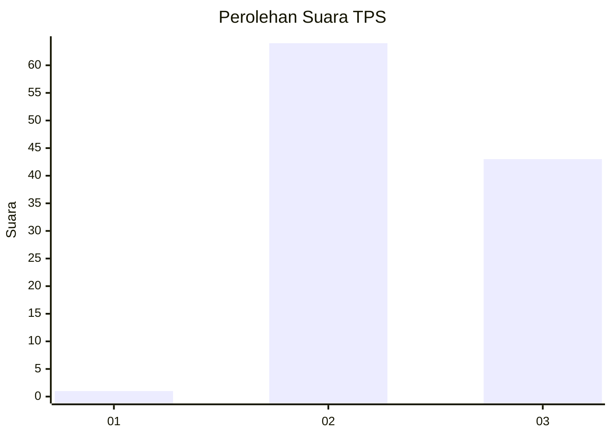
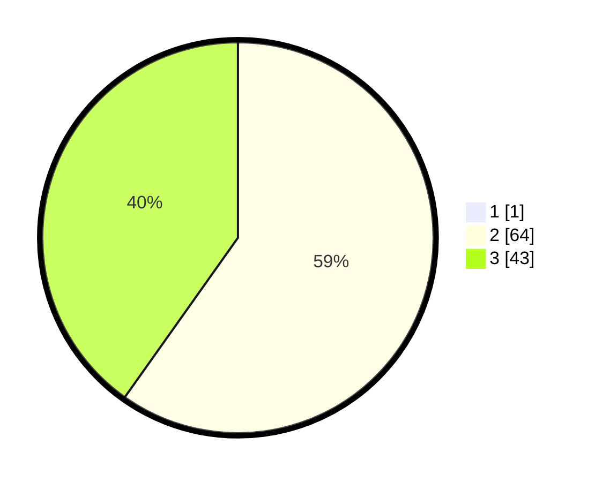

# Hasil

## Grafik

## Tabel

| No. | Nama Paslon    | Suara | Suara (raw) | Persentase |
|:--- |:-------------- | -----:| -----------:| ----------:|
| 1   | ANIES MUHAIMIN | 1     | [1][p-1]    | 0,93       |
| 2   | PRABOWO GIBRAN | 64    | [64][p-2]   | 59,26      |
| 3   | GANJAR MAHFUD  | 43    | [43][p-3]   | 39,81      |

[p-1]: https://github.com/gigit-pemilu/pemilu-2024/blob/main/pilpres/hitung-suara/sub/12-sumatera-utara/sub/04-nias/sub/27-ulugawo/sub/2013-hiligafoa/sub/002-tps/sub/paslon-1.txt
[p-2]: https://github.com/gigit-pemilu/pemilu-2024/blob/main/pilpres/hitung-suara/sub/12-sumatera-utara/sub/04-nias/sub/27-ulugawo/sub/2013-hiligafoa/sub/002-tps/sub/paslon-2.txt
[p-3]: https://github.com/gigit-pemilu/pemilu-2024/blob/main/pilpres/hitung-suara/sub/12-sumatera-utara/sub/04-nias/sub/27-ulugawo/sub/2013-hiligafoa/sub/002-tps/sub/paslon-3.txt

## Foto C Plano

https://sirekap-obj-formc.kpu.go.id/3098/pemilu/ppwp/12/04/27/20/13/1204272013002-20240217-155859--c03055ed-4f98-4942-9243-1902068de13d.jpg

https://sirekap-obj-formc.kpu.go.id/3098/pemilu/ppwp/12/04/27/20/13/1204272013002-20240217-161300--606a78af-bf8c-4d4b-8de2-a068ac3f4394.jpg

## Metadata

| Key        | Value               |
| ---------- | ------------------- |
| Time Stamp | 2024-02-25 17:00:00 |

