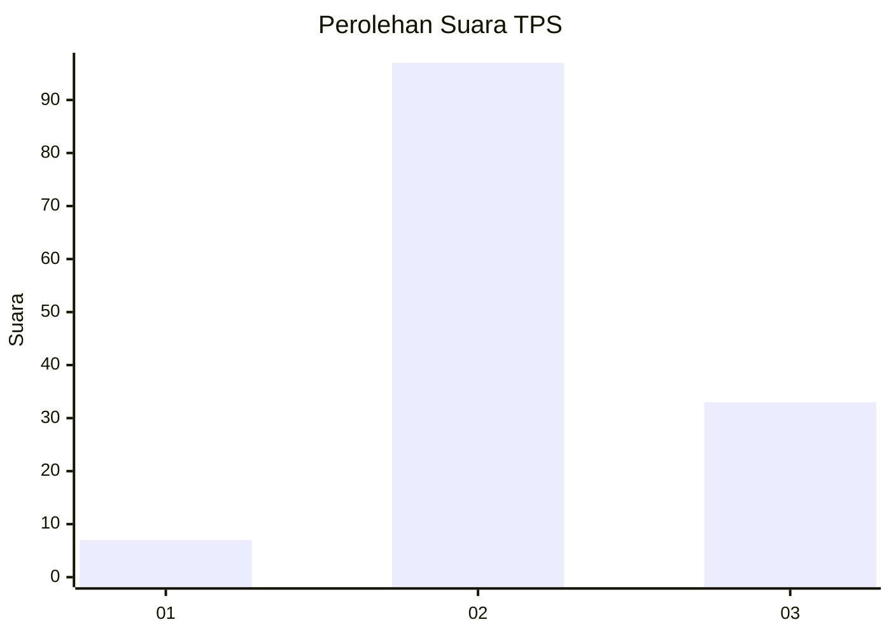
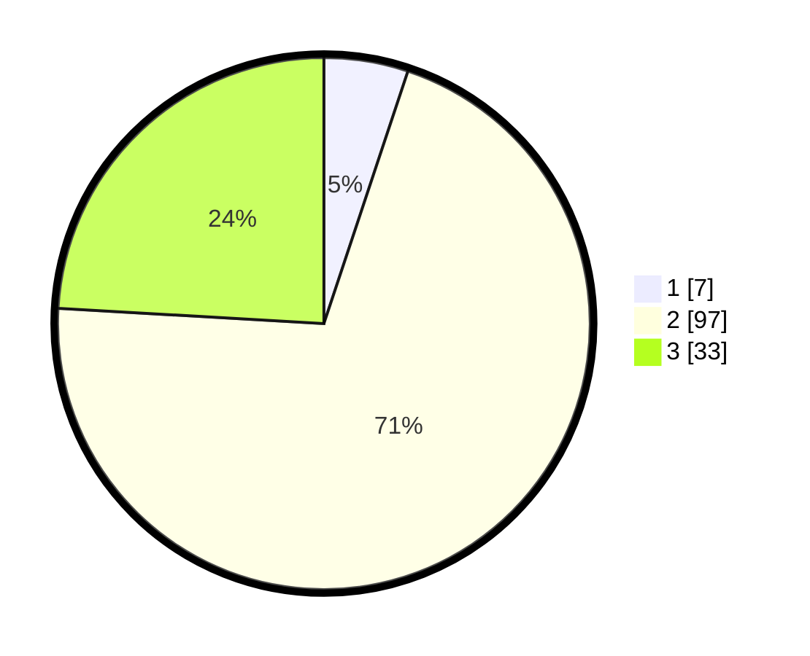

# Hasil

## Grafik

## Tabel

| No. | Nama Paslon    | Suara | Suara (raw) | Persentase |
|:--- |:-------------- | -----:| -----------:| ----------:|
| 1   | ANIES MUHAIMIN | 7     | [7][p-1]    | 5,11       |
| 2   | PRABOWO GIBRAN | 97    | [97][p-2]   | 70,80      |
| 3   | GANJAR MAHFUD  | 33    | [33][p-3]   | 24,09      |

[p-1]: https://github.com/gigit-pemilu/pemilu-2024/blob/main/pilpres/hitung-suara/sub/12-sumatera-utara/sub/04-nias/sub/28-ma'u/sub/2002-lewuoguru-ii/sub/001-tps/sub/paslon-1.txt
[p-2]: https://github.com/gigit-pemilu/pemilu-2024/blob/main/pilpres/hitung-suara/sub/12-sumatera-utara/sub/04-nias/sub/28-ma'u/sub/2002-lewuoguru-ii/sub/001-tps/sub/paslon-2.txt
[p-3]: https://github.com/gigit-pemilu/pemilu-2024/blob/main/pilpres/hitung-suara/sub/12-sumatera-utara/sub/04-nias/sub/28-ma'u/sub/2002-lewuoguru-ii/sub/001-tps/sub/paslon-3.txt

## Foto C Plano

https://sirekap-obj-formc.kpu.go.id/f546/pemilu/ppwp/12/04/28/20/02/1204282002001-20240215-090012--14119df6-6cd8-4eda-8c30-9c411e2dc010.jpg

https://sirekap-obj-formc.kpu.go.id/f546/pemilu/ppwp/12/04/28/20/02/1204282002001-20240215-090257--bd16c3a4-3a42-4cae-98f7-3bf2211edd0d.jpg

https://sirekap-obj-formc.kpu.go.id/f546/pemilu/ppwp/12/04/28/20/02/1204282002001-20240215-090535--50f48639-2899-4372-92d4-bf186c1b1f79.jpg

## Metadata

| Key        | Value               |
| ---------- | ------------------- |
| Time Stamp | 2024-02-16 00:00:26 |

