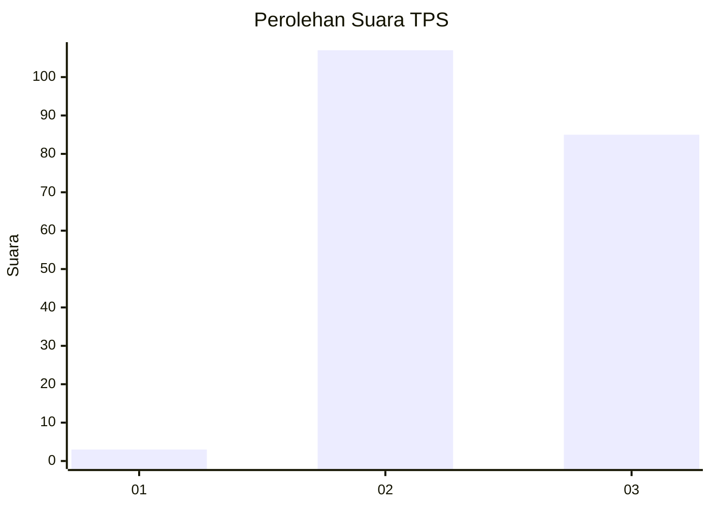
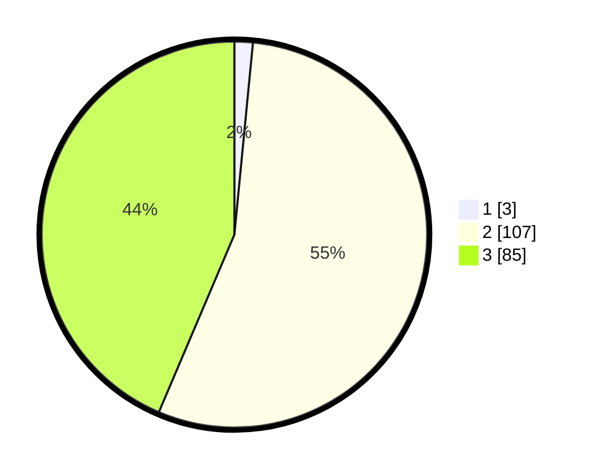

# Hasil

## Grafik

## Tabel

| No. | Nama Paslon    | Suara | Suara (raw) | Persentase |
|:--- |:-------------- | -----:| -----------:| ----------:|
| 1   | ANIES MUHAIMIN | 3     | [3][p-1]    | 1,54       |
| 2   | PRABOWO GIBRAN | 107   | [107][p-2]  | 54,87      |
| 3   | GANJAR MAHFUD  | 85    | [85][p-3]   | 43,59      |

[p-1]: https://github.com/gigit-pemilu/pemilu-2024-12-sumatera-utara/blob/main/pilpres/hitung-suara/sub/12-sumatera-utara/sub/04-nias/sub/28-ma'u/sub/2003-sihare'o-iii/sub/001-tps/sub/paslon-1.txt
[p-2]: https://github.com/gigit-pemilu/pemilu-2024-12-sumatera-utara/blob/main/pilpres/hitung-suara/sub/12-sumatera-utara/sub/04-nias/sub/28-ma'u/sub/2003-sihare'o-iii/sub/001-tps/sub/paslon-2.txt
[p-3]: https://github.com/gigit-pemilu/pemilu-2024-12-sumatera-utara/blob/main/pilpres/hitung-suara/sub/12-sumatera-utara/sub/04-nias/sub/28-ma'u/sub/2003-sihare'o-iii/sub/001-tps/sub/paslon-3.txt

## Foto C Plano

https://sirekap-obj-formc.kpu.go.id/eadc/pemilu/ppwp/12/04/28/20/03/1204282003001-20240215-093442--e13de279-358f-4508-8c08-d7def7619bb8.jpg

https://sirekap-obj-formc.kpu.go.id/eadc/pemilu/ppwp/12/04/28/20/03/1204282003001-20240215-093735--4bb0934b-875f-4083-9de0-3eb1bf313f65.jpg

https://sirekap-obj-formc.kpu.go.id/eadc/pemilu/ppwp/12/04/28/20/03/1204282003001-20240215-094053--6aa05b2e-ffa3-4c64-9403-fa78d96589c3.jpg

## Metadata

| Key        | Value               |
| ---------- | ------------------- |
| Time Stamp | 2024-02-16 00:00:26 |

