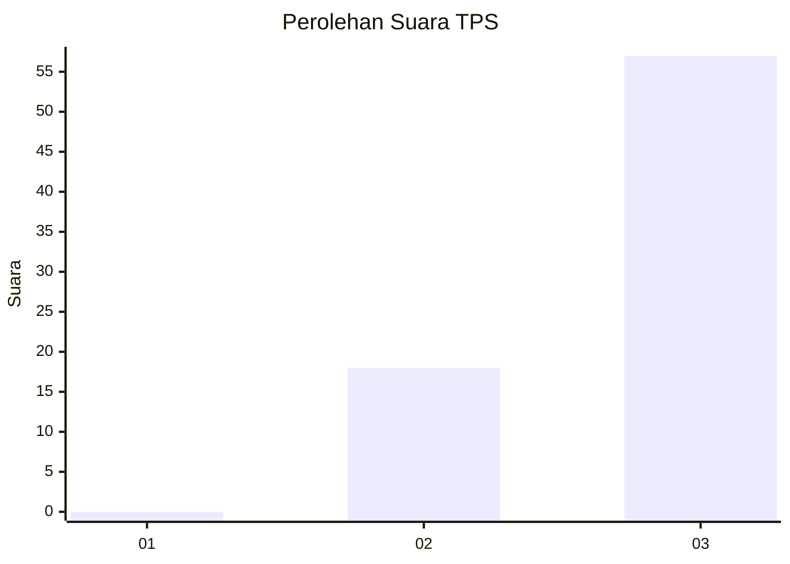
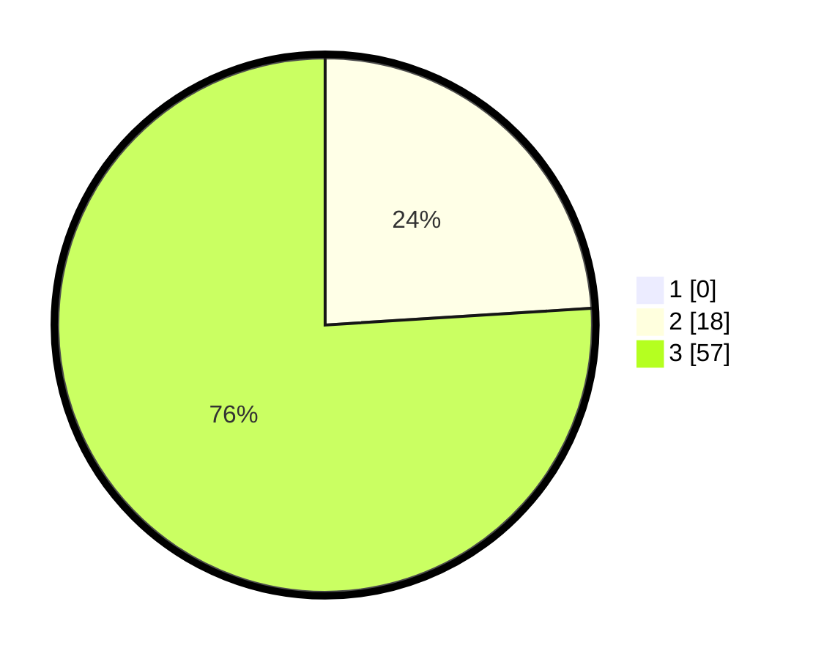

# Hasil

## Grafik

## Tabel

| No. | Nama Paslon    | Suara | Suara (raw) | Persentase |
|:--- |:-------------- | -----:| -----------:| ----------:|
| 1   | ANIES MUHAIMIN | 0     | [0][p-1]    | 0,00       |
| 2   | PRABOWO GIBRAN | 18    | [18][p-2]   | 24,00      |
| 3   | GANJAR MAHFUD  | 57    | [57][p-3]   | 76,00      |

[p-1]: https://github.com/gigit-pemilu/pemilu-2024/blob/main/pilpres/hitung-suara/sub/12-sumatera-utara/sub/04-nias/sub/28-ma'u/sub/2003-sihare'o-iii/sub/003-tps/sub/paslon-1.txt
[p-2]: https://github.com/gigit-pemilu/pemilu-2024/blob/main/pilpres/hitung-suara/sub/12-sumatera-utara/sub/04-nias/sub/28-ma'u/sub/2003-sihare'o-iii/sub/003-tps/sub/paslon-2.txt
[p-3]: https://github.com/gigit-pemilu/pemilu-2024/blob/main/pilpres/hitung-suara/sub/12-sumatera-utara/sub/04-nias/sub/28-ma'u/sub/2003-sihare'o-iii/sub/003-tps/sub/paslon-3.txt

## Foto C Plano

https://sirekap-obj-formc.kpu.go.id/cd37/pemilu/ppwp/12/04/28/20/03/1204282003003-20240215-020437--11f50b77-0b1c-4984-b9fb-e20fa96e8475.jpg

https://sirekap-obj-formc.kpu.go.id/cd37/pemilu/ppwp/12/04/28/20/03/1204282003003-20240215-020442--01ba6fe4-4ded-41a7-b2a5-c22dac659937.jpg

https://sirekap-obj-formc.kpu.go.id/cd37/pemilu/ppwp/12/04/28/20/03/1204282003003-20240215-020415--6eb7ea87-cf11-4f0a-ba02-22efe412c183.jpg

## Metadata

| Key        | Value               |
| ---------- | ------------------- |
| Time Stamp | 2024-02-16 00:00:26 |

