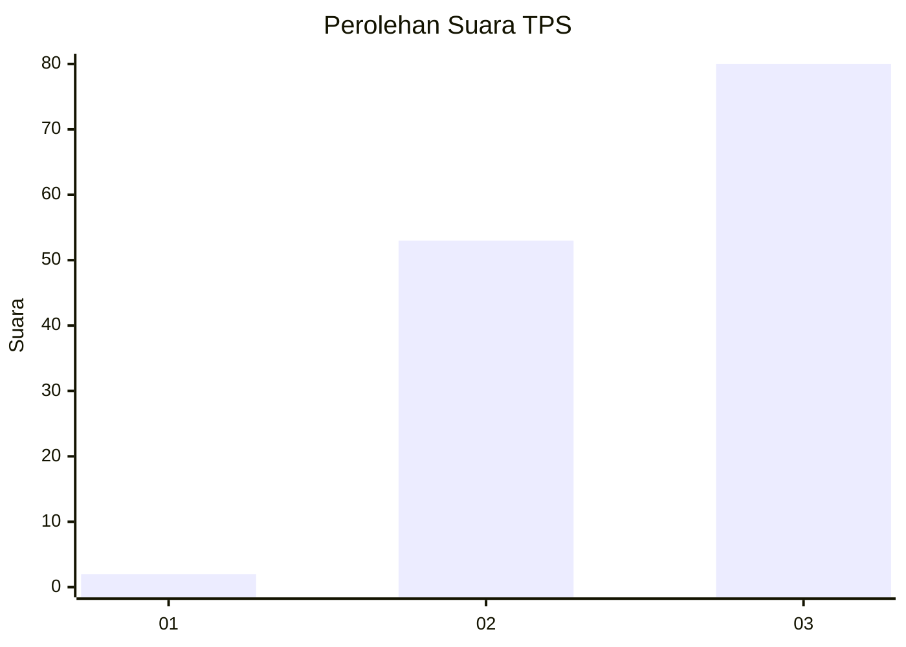
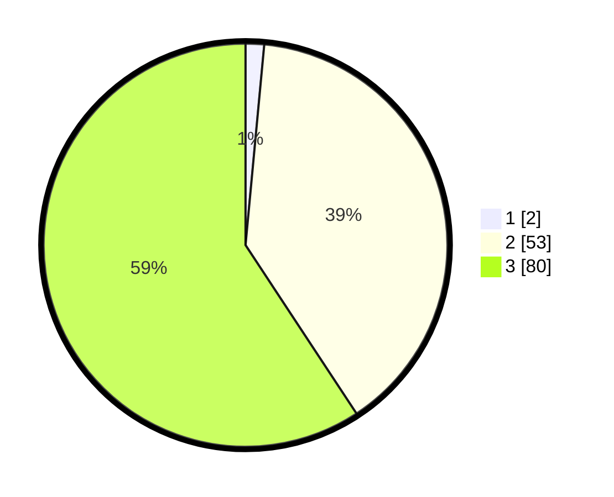

# Hasil

## Grafik

## Tabel

| No. | Nama Paslon    | Suara | Suara (raw) | Persentase |
|:--- |:-------------- | -----:| -----------:| ----------:|
| 1   | ANIES MUHAIMIN | 2     | [2][p-1]    | 1,48       |
| 2   | PRABOWO GIBRAN | 53    | [53][p-2]   | 39,26      |
| 3   | GANJAR MAHFUD  | 80    | [80][p-3]   | 59,26      |

[p-1]: https://github.com/gigit-pemilu/pemilu-2024/blob/main/pilpres/hitung-suara/sub/12-sumatera-utara/sub/04-nias/sub/28-ma'u/sub/2004-sisarahili-ma'u/sub/002-tps/sub/paslon-1.txt
[p-2]: https://github.com/gigit-pemilu/pemilu-2024/blob/main/pilpres/hitung-suara/sub/12-sumatera-utara/sub/04-nias/sub/28-ma'u/sub/2004-sisarahili-ma'u/sub/002-tps/sub/paslon-2.txt
[p-3]: https://github.com/gigit-pemilu/pemilu-2024/blob/main/pilpres/hitung-suara/sub/12-sumatera-utara/sub/04-nias/sub/28-ma'u/sub/2004-sisarahili-ma'u/sub/002-tps/sub/paslon-3.txt

## Foto C Plano

https://sirekap-obj-formc.kpu.go.id/cb28/pemilu/ppwp/12/04/28/20/04/1204282004002-20240214-215202--3ad7965a-cfbc-431a-b427-48444bc51679.jpg

https://sirekap-obj-formc.kpu.go.id/cb28/pemilu/ppwp/12/04/28/20/04/1204282004002-20240214-215823--a2585485-810e-431a-8408-d3bbe9f6233a.jpg

https://sirekap-obj-formc.kpu.go.id/cb28/pemilu/ppwp/12/04/28/20/04/1204282004002-20240214-220124--c20267ea-a849-46db-8b4d-d05a4d823c26.jpg

## Metadata

| Key        | Value               |
| ---------- | ------------------- |
| Time Stamp | 2024-02-16 00:00:26 |

