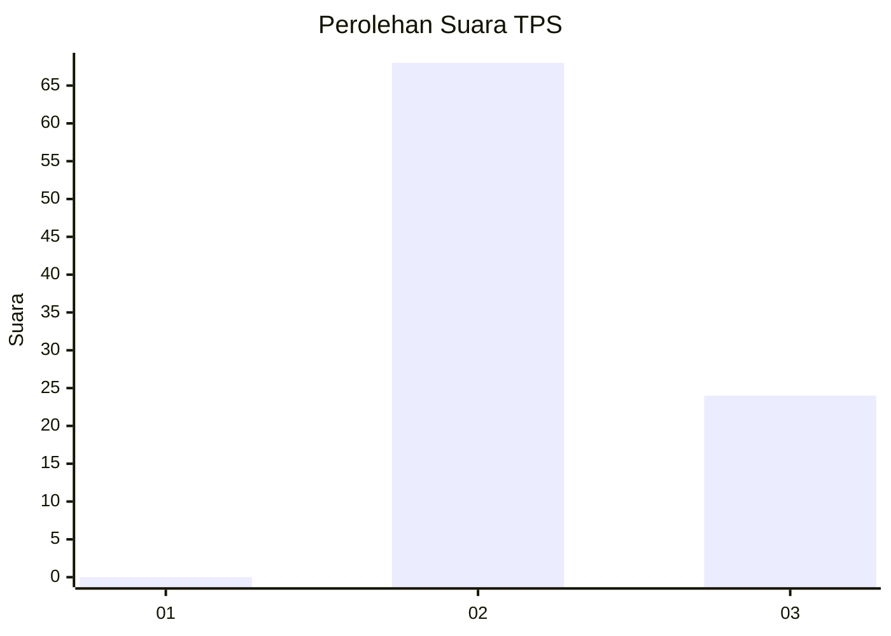
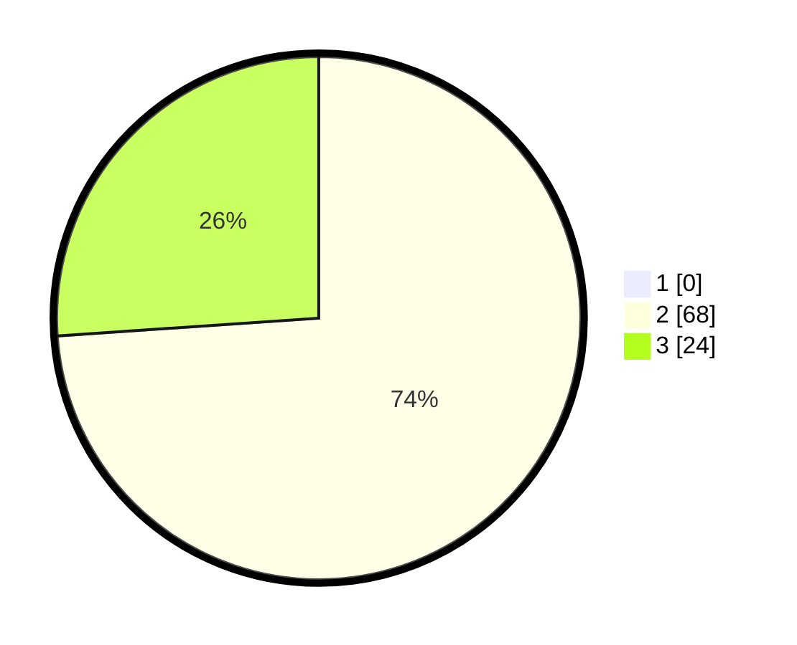

# Hasil

## Grafik

## Tabel

| No. | Nama Paslon    | Suara | Suara (raw) | Persentase |
|:--- |:-------------- | -----:| -----------:| ----------:|
| 1   | ANIES MUHAIMIN | 0     | [0][p-1]    | 0,00       |
| 2   | PRABOWO GIBRAN | 68    | [68][p-2]   | 73,91      |
| 3   | GANJAR MAHFUD  | 24    | [24][p-3]   | 26,09      |

[p-1]: https://github.com/gigit-pemilu/pemilu-2024-12-sumatera-utara/blob/main/pilpres/hitung-suara/sub/12-sumatera-utara/sub/04-nias/sub/28-ma'u/sub/2005-lasara-siwalubanua/sub/006-tps/sub/paslon-1.txt
[p-2]: https://github.com/gigit-pemilu/pemilu-2024-12-sumatera-utara/blob/main/pilpres/hitung-suara/sub/12-sumatera-utara/sub/04-nias/sub/28-ma'u/sub/2005-lasara-siwalubanua/sub/006-tps/sub/paslon-2.txt
[p-3]: https://github.com/gigit-pemilu/pemilu-2024-12-sumatera-utara/blob/main/pilpres/hitung-suara/sub/12-sumatera-utara/sub/04-nias/sub/28-ma'u/sub/2005-lasara-siwalubanua/sub/006-tps/sub/paslon-3.txt

## Foto C Plano

https://sirekap-obj-formc.kpu.go.id/2a2c/pemilu/ppwp/12/04/28/20/05/1204282005006-20240214-221327--d862de4a-9bb4-4cec-bd31-432f59f179d2.jpg

https://sirekap-obj-formc.kpu.go.id/2a2c/pemilu/ppwp/12/04/28/20/05/1204282005006-20240214-221423--4bbbb214-1622-4f4b-91c4-ee9b09d1721b.jpg

https://sirekap-obj-formc.kpu.go.id/2a2c/pemilu/ppwp/12/04/28/20/05/1204282005006-20240214-221451--73de526f-12d4-4e4c-94d3-7739eda6fd2a.jpg

## Metadata

| Key        | Value               |
| ---------- | ------------------- |
| Time Stamp | 2024-02-16 00:00:26 |

