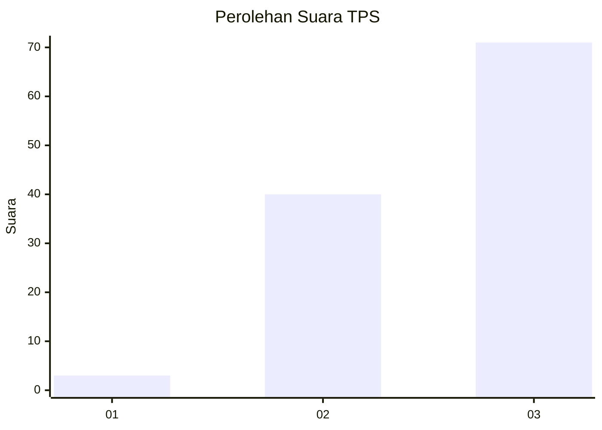
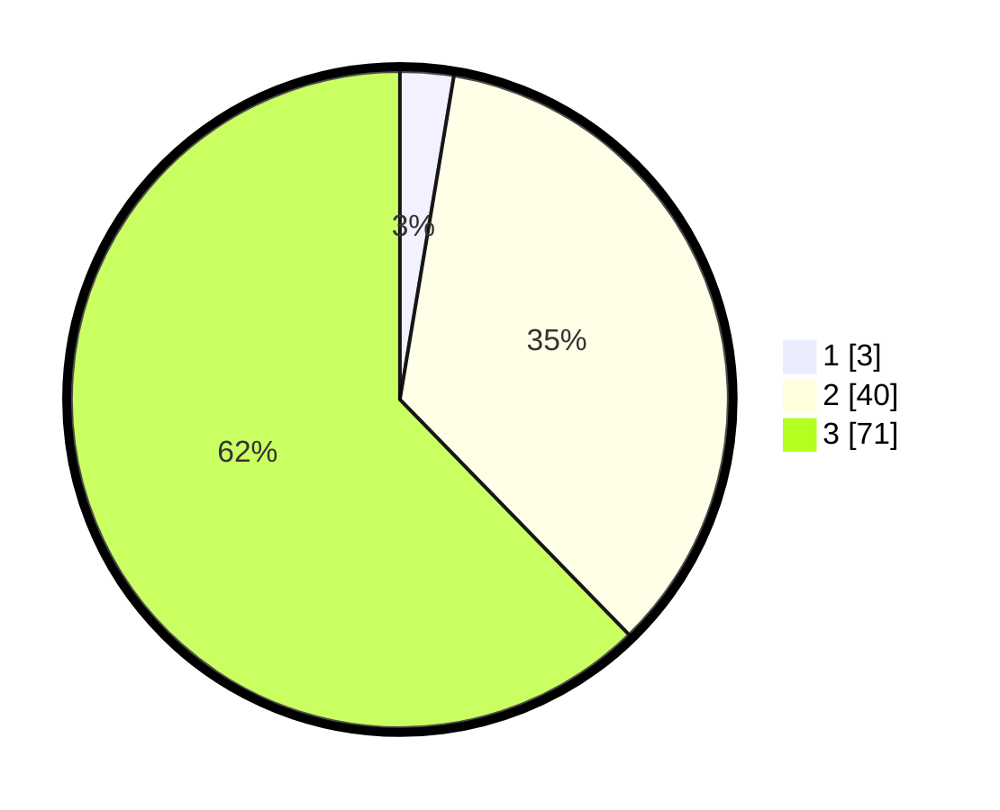

# Hasil

## Grafik

## Tabel

| No. | Nama Paslon    | Suara | Suara (raw) | Persentase |
|:--- |:-------------- | -----:| -----------:| ----------:|
| 1   | ANIES MUHAIMIN | 3     | [3][p-1]    | 2,63       |
| 2   | PRABOWO GIBRAN | 40    | [40][p-2]   | 35,09      |
| 3   | GANJAR MAHFUD  | 71    | [71][p-3]   | 62,28      |

[p-1]: https://github.com/gigit-pemilu/pemilu-2024-12-sumatera-utara/blob/main/pilpres/hitung-suara/sub/12-sumatera-utara/sub/04-nias/sub/28-ma'u/sub/2008-lewa-lewa/sub/003-tps/sub/paslon-1.txt
[p-2]: https://github.com/gigit-pemilu/pemilu-2024-12-sumatera-utara/blob/main/pilpres/hitung-suara/sub/12-sumatera-utara/sub/04-nias/sub/28-ma'u/sub/2008-lewa-lewa/sub/003-tps/sub/paslon-2.txt
[p-3]: https://github.com/gigit-pemilu/pemilu-2024-12-sumatera-utara/blob/main/pilpres/hitung-suara/sub/12-sumatera-utara/sub/04-nias/sub/28-ma'u/sub/2008-lewa-lewa/sub/003-tps/sub/paslon-3.txt

## Foto C Plano

https://sirekap-obj-formc.kpu.go.id/c976/pemilu/ppwp/12/04/28/20/08/1204282008003-20240214-221859--2d3fda61-f366-47b0-a6c1-d1c061b3cab6.jpg

https://sirekap-obj-formc.kpu.go.id/c976/pemilu/ppwp/12/04/28/20/08/1204282008003-20240214-230140--58113be0-997d-4ad6-8031-a3cc1952301b.jpg

https://sirekap-obj-formc.kpu.go.id/c976/pemilu/ppwp/12/04/28/20/08/1204282008003-20240214-221927--67d863fa-7aac-47c3-b5ce-ce816a38e432.jpg

## Metadata

| Key        | Value               |
| ---------- | ------------------- |
| Time Stamp | 2024-02-16 00:00:26 |

