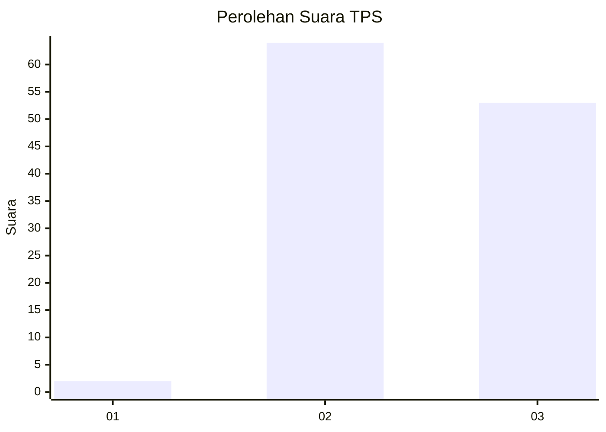
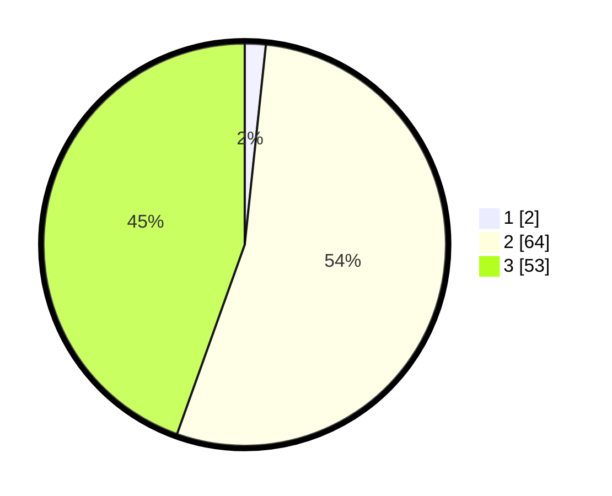

# Hasil

## Grafik

## Tabel

| No. | Nama Paslon    | Suara | Suara (raw) | Persentase |
|:--- |:-------------- | -----:| -----------:| ----------:|
| 1   | ANIES MUHAIMIN | 2     | [2][p-1]    | 1,68       |
| 2   | PRABOWO GIBRAN | 64    | [64][p-2]   | 53,78      |
| 3   | GANJAR MAHFUD  | 53    | [53][p-3]   | 44,54      |

[p-1]: https://github.com/gigit-pemilu/pemilu-2024-12-sumatera-utara/blob/main/pilpres/hitung-suara/sub/12-sumatera-utara/sub/04-nias/sub/28-ma'u/sub/2009-dekha/sub/002-tps/sub/paslon-1.txt
[p-2]: https://github.com/gigit-pemilu/pemilu-2024-12-sumatera-utara/blob/main/pilpres/hitung-suara/sub/12-sumatera-utara/sub/04-nias/sub/28-ma'u/sub/2009-dekha/sub/002-tps/sub/paslon-2.txt
[p-3]: https://github.com/gigit-pemilu/pemilu-2024-12-sumatera-utara/blob/main/pilpres/hitung-suara/sub/12-sumatera-utara/sub/04-nias/sub/28-ma'u/sub/2009-dekha/sub/002-tps/sub/paslon-3.txt

## Foto C Plano

https://sirekap-obj-formc.kpu.go.id/e20e/pemilu/ppwp/12/04/28/20/09/1204282009002-20240215-015924--ffb58b94-1db0-4cfc-8c1a-0d6d742e30cb.jpg

https://sirekap-obj-formc.kpu.go.id/e20e/pemilu/ppwp/12/04/28/20/09/1204282009002-20240215-020130--6186a287-d7f8-4042-ba74-9a6f7a42f03d.jpg

https://sirekap-obj-formc.kpu.go.id/e20e/pemilu/ppwp/12/04/28/20/09/1204282009002-20240215-020340--62afbc48-9e28-4b48-9df0-9ffd1aa92120.jpg

## Metadata

| Key        | Value               |
| ---------- | ------------------- |
| Time Stamp | 2024-02-24 22:31:28 |

