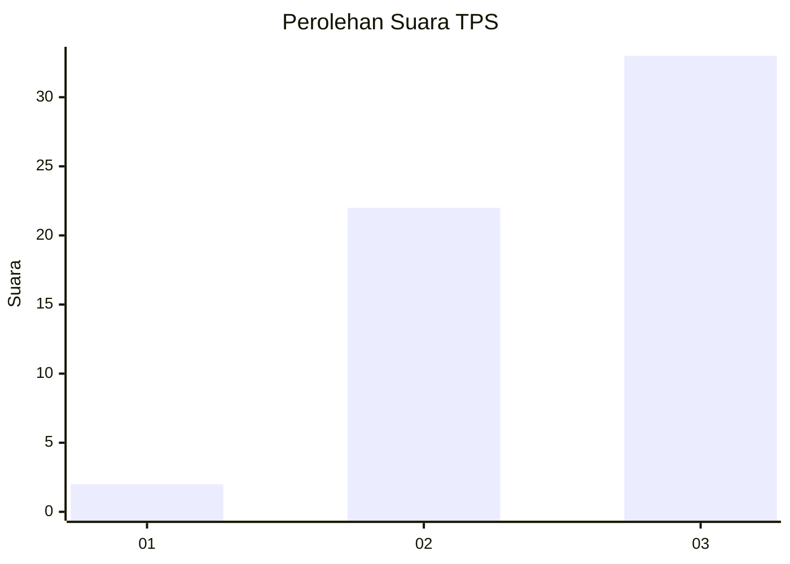
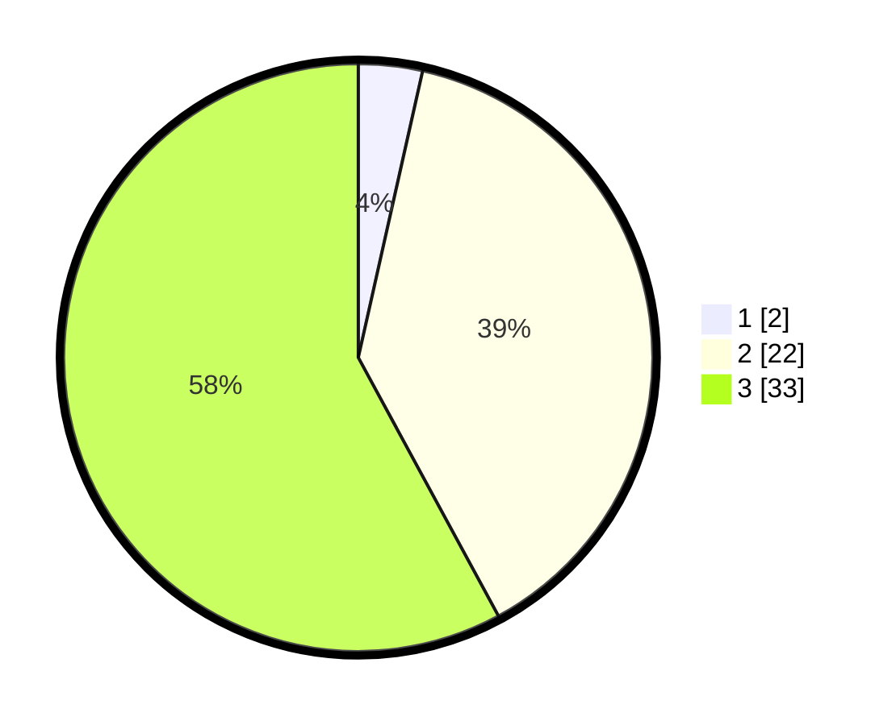

# Hasil

## Grafik

## Tabel

| No. | Nama Paslon    | Suara | Suara (raw) | Persentase |
|:--- |:-------------- | -----:| -----------:| ----------:|
| 1   | ANIES MUHAIMIN | 2     | [2][p-1]    | 3,51       |
| 2   | PRABOWO GIBRAN | 22    | [22][p-2]   | 38,60      |
| 3   | GANJAR MAHFUD  | 33    | [33][p-3]   | 57,89      |

[p-1]: https://github.com/gigit-pemilu/pemilu-2024/blob/main/pilpres/hitung-suara/sub/12-sumatera-utara/sub/04-nias/sub/28-ma'u/sub/2011-sihare'o-iii-hilibadalu/sub/001-tps/sub/paslon-1.txt
[p-2]: https://github.com/gigit-pemilu/pemilu-2024/blob/main/pilpres/hitung-suara/sub/12-sumatera-utara/sub/04-nias/sub/28-ma'u/sub/2011-sihare'o-iii-hilibadalu/sub/001-tps/sub/paslon-2.txt
[p-3]: https://github.com/gigit-pemilu/pemilu-2024/blob/main/pilpres/hitung-suara/sub/12-sumatera-utara/sub/04-nias/sub/28-ma'u/sub/2011-sihare'o-iii-hilibadalu/sub/001-tps/sub/paslon-3.txt

## Foto C Plano

https://sirekap-obj-formc.kpu.go.id/eadc/pemilu/ppwp/12/04/28/20/11/1204282011001-20240215-023437--03ac6b16-4daf-4cdf-953f-e2136d58267f.jpg

https://sirekap-obj-formc.kpu.go.id/eadc/pemilu/ppwp/12/04/28/20/11/1204282011001-20240215-024856--d1c7a996-fd8a-4ea7-8ee6-5b9fbf9aa767.jpg

https://sirekap-obj-formc.kpu.go.id/eadc/pemilu/ppwp/12/04/28/20/11/1204282011001-20240215-025101--17a90072-41f1-4a0a-911a-b953a5982379.jpg

## Metadata

| Key        | Value               |
| ---------- | ------------------- |
| Time Stamp | 2024-02-16 00:00:26 |

