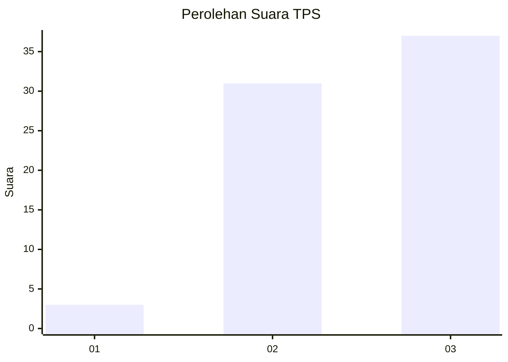
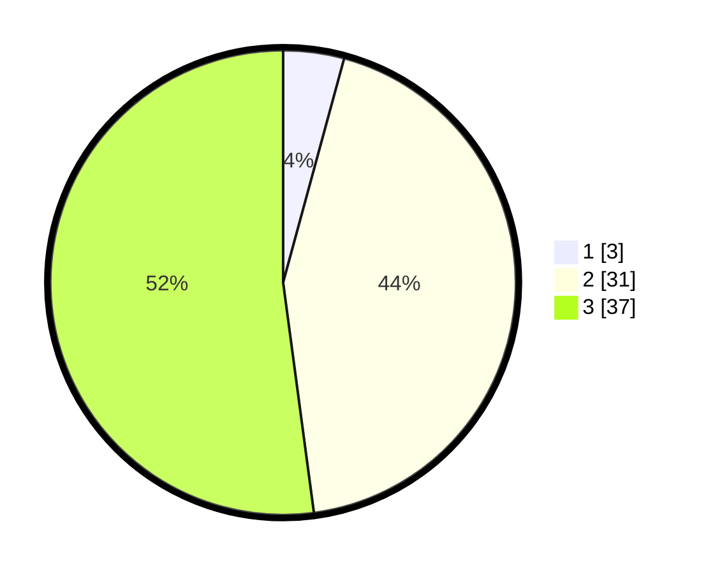

# Hasil

## Grafik

## Tabel

| No. | Nama Paslon    | Suara | Suara (raw) | Persentase |
|:--- |:-------------- | -----:| -----------:| ----------:|
| 1   | ANIES MUHAIMIN | 3     | [3][p-1]    | 4,23       |
| 2   | PRABOWO GIBRAN | 31    | [31][p-2]   | 43,66      |
| 3   | GANJAR MAHFUD  | 37    | [37][p-3]   | 52,11      |

[p-1]: https://github.com/gigit-pemilu/pemilu-2024-12-sumatera-utara/blob/main/pilpres/hitung-suara/sub/12-sumatera-utara/sub/04-nias/sub/28-ma'u/sub/2011-sihare'o-iii-hilibadalu/sub/002-tps/sub/paslon-1.txt
[p-2]: https://github.com/gigit-pemilu/pemilu-2024-12-sumatera-utara/blob/main/pilpres/hitung-suara/sub/12-sumatera-utara/sub/04-nias/sub/28-ma'u/sub/2011-sihare'o-iii-hilibadalu/sub/002-tps/sub/paslon-2.txt
[p-3]: https://github.com/gigit-pemilu/pemilu-2024-12-sumatera-utara/blob/main/pilpres/hitung-suara/sub/12-sumatera-utara/sub/04-nias/sub/28-ma'u/sub/2011-sihare'o-iii-hilibadalu/sub/002-tps/sub/paslon-3.txt

## Foto C Plano

https://sirekap-obj-formc.kpu.go.id/56ef/pemilu/ppwp/12/04/28/20/11/1204282011002-20240215-064420--639bc763-606f-44c2-9bad-a45ab25bac10.jpg

https://sirekap-obj-formc.kpu.go.id/56ef/pemilu/ppwp/12/04/28/20/11/1204282011002-20240214-213445--4069761c-da50-4076-9f9d-8f61f1b4e983.jpg

https://sirekap-obj-formc.kpu.go.id/56ef/pemilu/ppwp/12/04/28/20/11/1204282011002-20240214-213740--ac3f45ff-cec1-437c-89f9-018e025818fe.jpg

## Metadata

| Key        | Value               |
| ---------- | ------------------- |
| Time Stamp | 2024-02-16 00:00:26 |

