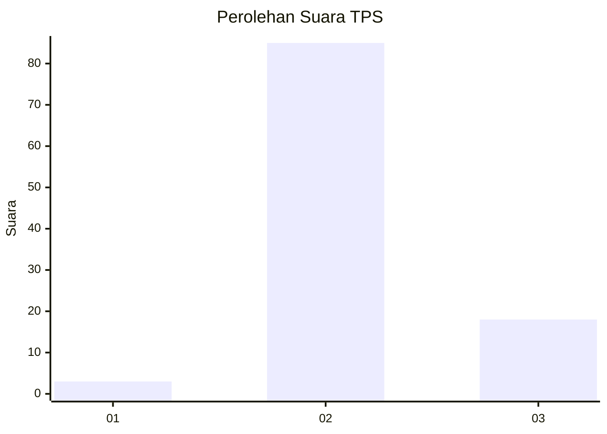
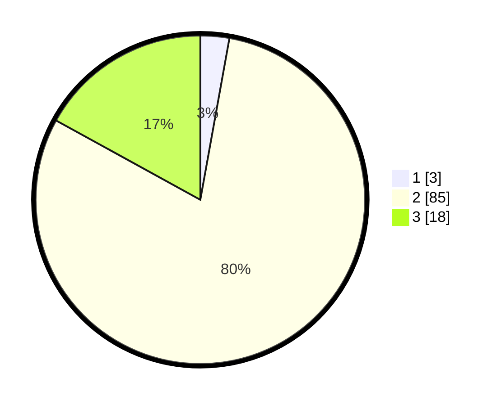

# Hasil

## Grafik

## Tabel

| No. | Nama Paslon    | Suara | Suara (raw) | Persentase |
|:--- |:-------------- | -----:| -----------:| ----------:|
| 1   | ANIES MUHAIMIN | 3     | [3][p-1]    | 2,83       |
| 2   | PRABOWO GIBRAN | 85    | [85][p-2]   | 80,19      |
| 3   | GANJAR MAHFUD  | 18    | [18][p-3]   | 16,98      |

[p-1]: https://github.com/gigit-pemilu/pemilu-2024-12-sumatera-utara/blob/main/pilpres/hitung-suara/sub/12-sumatera-utara/sub/04-nias/sub/29-somolo-molo/sub/2003-huno/sub/001-tps/sub/paslon-1.txt
[p-2]: https://github.com/gigit-pemilu/pemilu-2024-12-sumatera-utara/blob/main/pilpres/hitung-suara/sub/12-sumatera-utara/sub/04-nias/sub/29-somolo-molo/sub/2003-huno/sub/001-tps/sub/paslon-2.txt
[p-3]: https://github.com/gigit-pemilu/pemilu-2024-12-sumatera-utara/blob/main/pilpres/hitung-suara/sub/12-sumatera-utara/sub/04-nias/sub/29-somolo-molo/sub/2003-huno/sub/001-tps/sub/paslon-3.txt

## Foto C Plano

https://sirekap-obj-formc.kpu.go.id/c6af/pemilu/ppwp/12/04/29/20/03/1204292003001-20240214-233400--372d7eb7-fee0-4872-a822-ebb2354d1dd6.jpg

https://sirekap-obj-formc.kpu.go.id/c6af/pemilu/ppwp/12/04/29/20/03/1204292003001-20240214-233542--9e07633e-187f-4838-bdeb-7ad93a4d7ef4.jpg

## Metadata

| Key        | Value               |
| ---------- | ------------------- |
| Time Stamp | 2024-02-15 15:30:25 |

