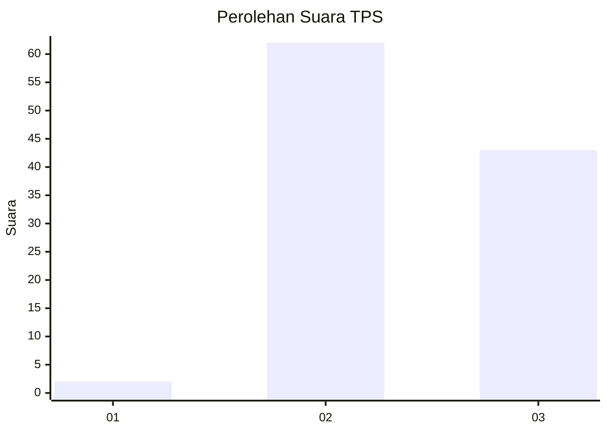
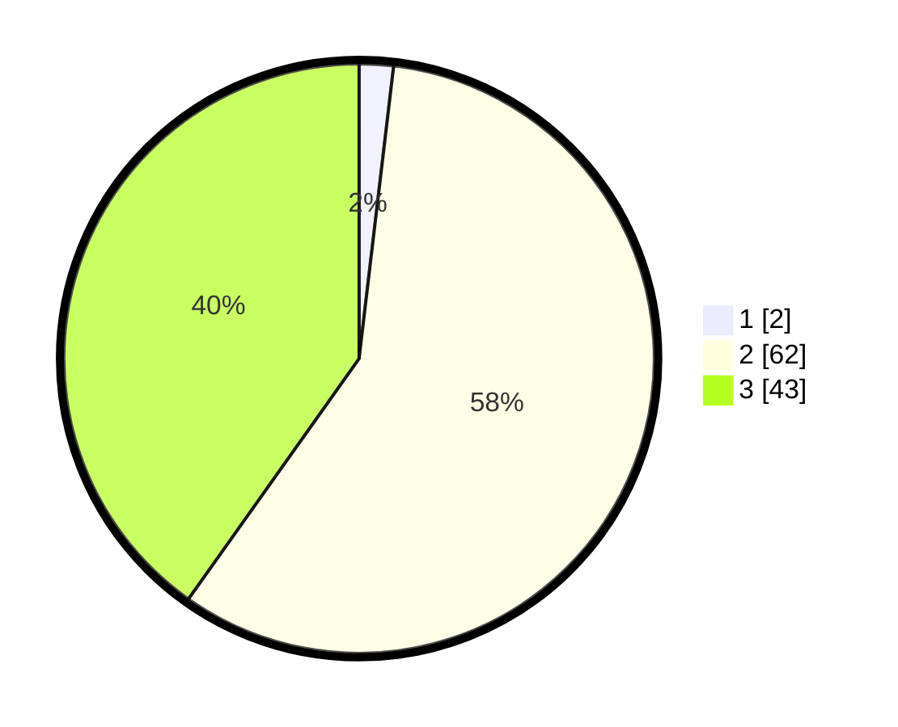

# Hasil

## Grafik

## Tabel

| No. | Nama Paslon    | Suara | Suara (raw) | Persentase |
|:--- |:-------------- | -----:| -----------:| ----------:|
| 1   | ANIES MUHAIMIN | 2     | [2][p-1]    | 1,87       |
| 2   | PRABOWO GIBRAN | 62    | [62][p-2]   | 57,94      |
| 3   | GANJAR MAHFUD  | 43    | [43][p-3]   | 40,19      |

[p-1]: https://github.com/gigit-pemilu/pemilu-2024/blob/main/pilpres/hitung-suara/sub/12-sumatera-utara/sub/04-nias/sub/29-somolo-molo/sub/2004-sisaratandrawa/sub/001-tps/sub/paslon-1.txt
[p-2]: https://github.com/gigit-pemilu/pemilu-2024/blob/main/pilpres/hitung-suara/sub/12-sumatera-utara/sub/04-nias/sub/29-somolo-molo/sub/2004-sisaratandrawa/sub/001-tps/sub/paslon-2.txt
[p-3]: https://github.com/gigit-pemilu/pemilu-2024/blob/main/pilpres/hitung-suara/sub/12-sumatera-utara/sub/04-nias/sub/29-somolo-molo/sub/2004-sisaratandrawa/sub/001-tps/sub/paslon-3.txt

## Foto C Plano

https://sirekap-obj-formc.kpu.go.id/a72e/pemilu/ppwp/12/04/29/20/04/1204292004001-20240215-035444--fab0d6ed-4956-4c65-90e7-5f592bf79dad.jpg

https://sirekap-obj-formc.kpu.go.id/a72e/pemilu/ppwp/12/04/29/20/04/1204292004001-20240215-040043--17c666ad-7166-4bdc-8517-4bf67eeb1a2a.jpg

https://sirekap-obj-formc.kpu.go.id/a72e/pemilu/ppwp/12/04/29/20/04/1204292004001-20240215-080608--ef789037-2454-4da5-9c82-4e38bbc1680b.jpg

## Metadata

| Key        | Value               |
| ---------- | ------------------- |
| Time Stamp | 2024-02-15 15:30:25 |

