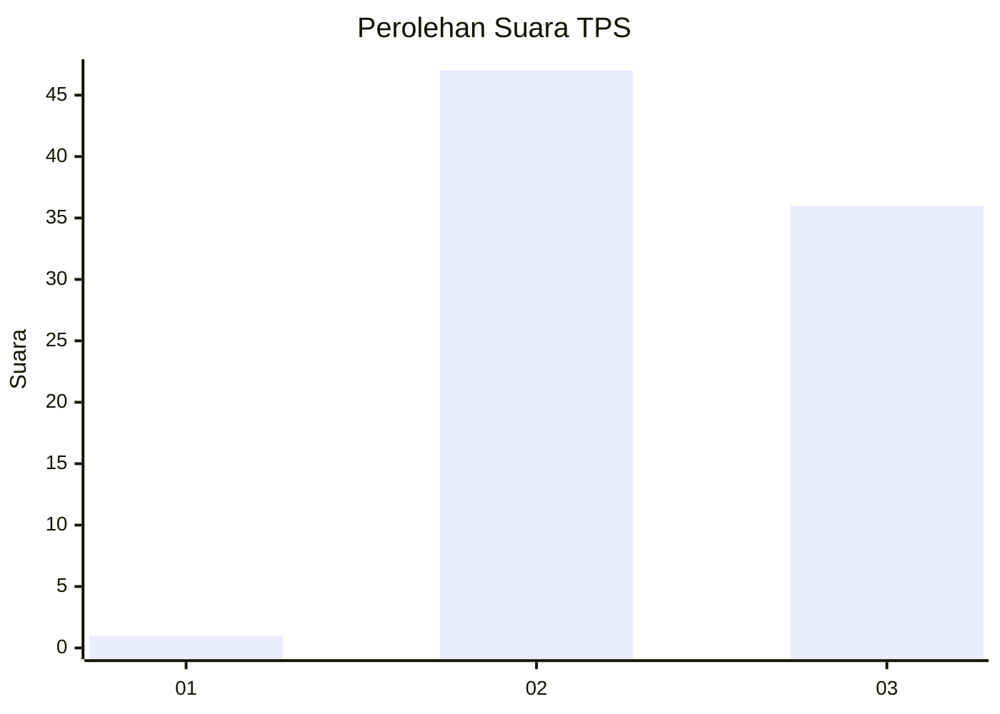
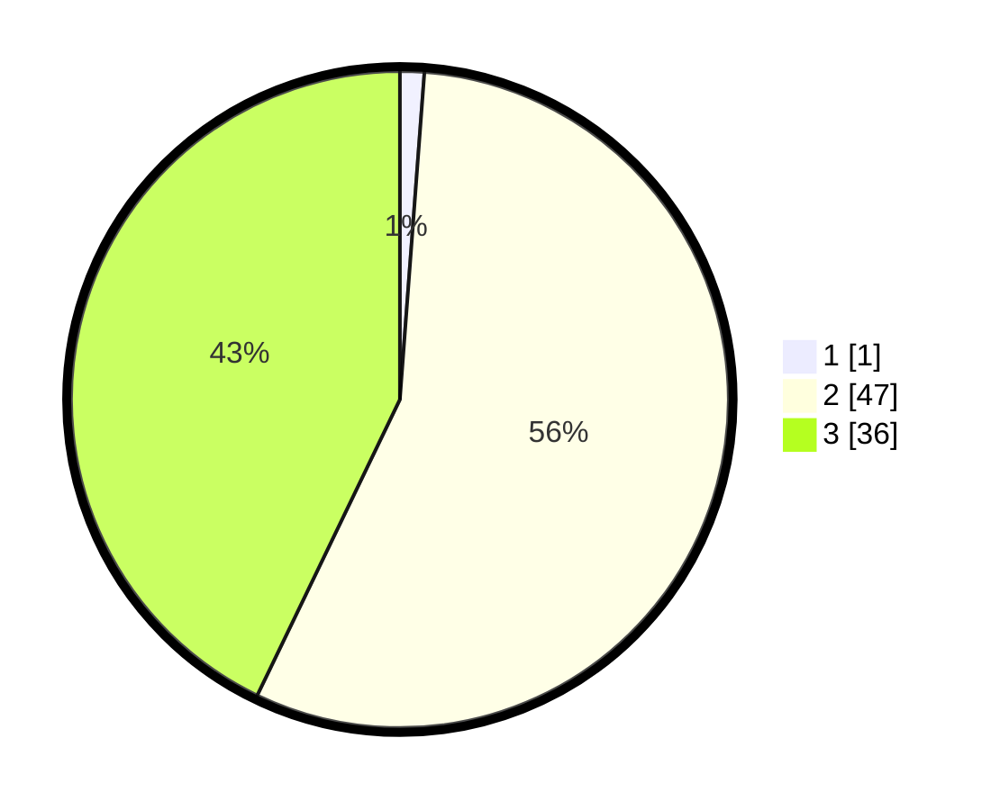

# Hasil

## Grafik

## Tabel

| No. | Nama Paslon    | Suara | Suara (raw) | Persentase |
|:--- |:-------------- | -----:| -----------:| ----------:|
| 1   | ANIES MUHAIMIN | 1     | [1][p-1]    | 1,19       |
| 2   | PRABOWO GIBRAN | 47    | [47][p-2]   | 55,95      |
| 3   | GANJAR MAHFUD  | 36    | [36][p-3]   | 42,86      |

[p-1]: https://github.com/gigit-pemilu/pemilu-2024/blob/main/pilpres/hitung-suara/sub/12-sumatera-utara/sub/04-nias/sub/29-somolo-molo/sub/2010-hilimborodano/sub/002-tps/sub/paslon-1.txt
[p-2]: https://github.com/gigit-pemilu/pemilu-2024/blob/main/pilpres/hitung-suara/sub/12-sumatera-utara/sub/04-nias/sub/29-somolo-molo/sub/2010-hilimborodano/sub/002-tps/sub/paslon-2.txt
[p-3]: https://github.com/gigit-pemilu/pemilu-2024/blob/main/pilpres/hitung-suara/sub/12-sumatera-utara/sub/04-nias/sub/29-somolo-molo/sub/2010-hilimborodano/sub/002-tps/sub/paslon-3.txt

## Foto C Plano

https://sirekap-obj-formc.kpu.go.id/d4de/pemilu/ppwp/12/04/29/20/10/1204292010002-20240215-022552--e96b49ee-c9f2-4509-b53b-1de33c7e85dc.jpg

https://sirekap-obj-formc.kpu.go.id/d4de/pemilu/ppwp/12/04/29/20/10/1204292010002-20240215-022625--27d053d7-0313-453a-89f3-3116080a1ea8.jpg

https://sirekap-obj-formc.kpu.go.id/d4de/pemilu/ppwp/12/04/29/20/10/1204292010002-20240215-022648--a584130f-270a-4be1-9532-3312503f0ebe.jpg

## Metadata

| Key        | Value               |
| ---------- | ------------------- |
| Time Stamp | 2024-02-16 00:00:26 |

