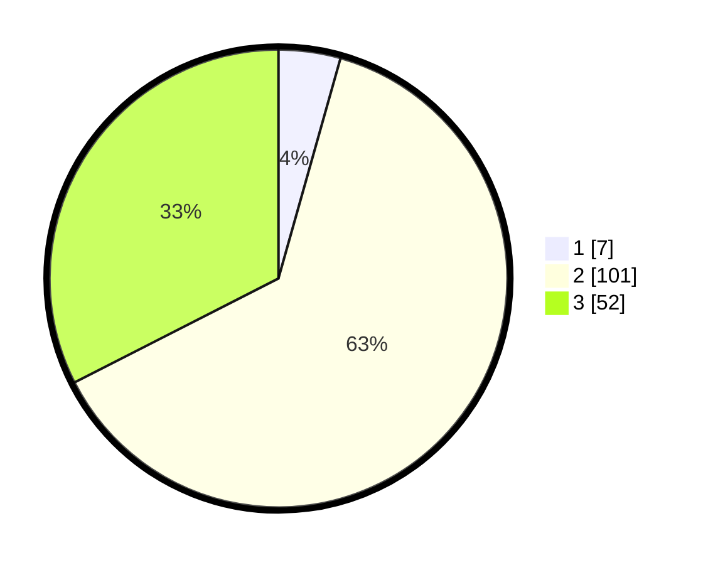

# Hasil

## Grafik

## Tabel

| No. | Nama Paslon    | Suara | Suara (raw) | Persentase |
|:--- |:-------------- | -----:| -----------:| ----------:|
| 1   | ANIES MUHAIMIN | 7     | [7][p-1]    | 4,38       |
| 2   | PRABOWO GIBRAN | 101   | [101][p-2]  | 63,13      |
| 3   | GANJAR MAHFUD  | 52    | [52][p-3]   | 32,50      |

[p-1]: https://github.com/gigit-pemilu/pemilu-2024-12-sumatera-utara/blob/main/pilpres/hitung-suara/sub/12-sumatera-utara/sub/04-nias/sub/35-sogae'adu/sub/2001-tuhembuasi/sub/001-tps/sub/paslon-1.txt
[p-2]: https://github.com/gigit-pemilu/pemilu-2024-12-sumatera-utara/blob/main/pilpres/hitung-suara/sub/12-sumatera-utara/sub/04-nias/sub/35-sogae'adu/sub/2001-tuhembuasi/sub/001-tps/sub/paslon-2.txt
[p-3]: https://github.com/gigit-pemilu/pemilu-2024-12-sumatera-utara/blob/main/pilpres/hitung-suara/sub/12-sumatera-utara/sub/04-nias/sub/35-sogae'adu/sub/2001-tuhembuasi/sub/001-tps/sub/paslon-3.txt

## Foto C Plano

https://sirekap-obj-formc.kpu.go.id/0244/pemilu/ppwp/12/04/35/20/01/1204352001001-20240226-153257--dbb50b4a-66b2-49aa-b43c-ff3f3e0ff508.jpg

https://sirekap-obj-formc.kpu.go.id/0244/pemilu/ppwp/12/04/35/20/01/1204352001001-20240226-153317--fb34db64-bdf9-4f5e-80c1-0b129a4e39f6.jpg

https://sirekap-obj-formc.kpu.go.id/0244/pemilu/ppwp/12/04/35/20/01/1204352001001-20240226-153334--ff53bab9-a4bb-41f2-af8c-1d4823fff3ad.jpg

## Metadata

| Key        | Value               |
| ---------- | ------------------- |
| Time Stamp | 2024-02-28 20:00:00 |

