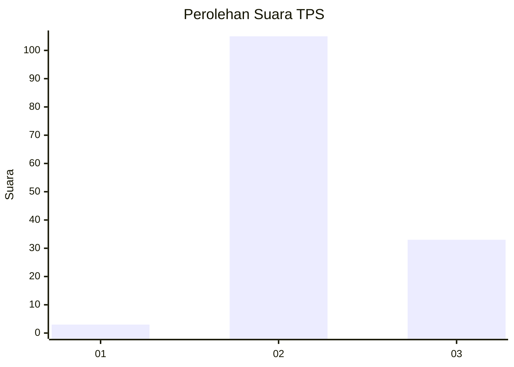
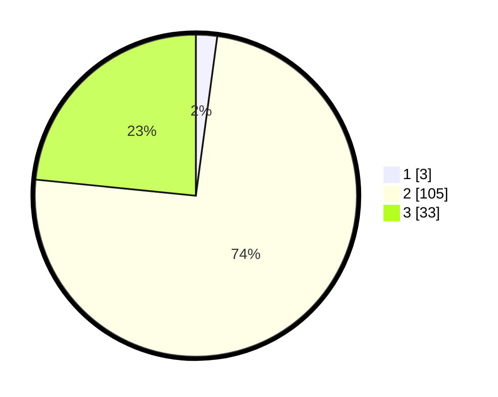

# Hasil

## Grafik

## Tabel

| No. | Nama Paslon    | Suara | Suara (raw) | Persentase |
|:--- |:-------------- | -----:| -----------:| ----------:|
| 1   | ANIES MUHAIMIN | 3     | [3][p-1]    | 2,13       |
| 2   | PRABOWO GIBRAN | 105   | [105][p-2]  | 74,47      |
| 3   | GANJAR MAHFUD  | 33    | [33][p-3]   | 23,40      |

[p-1]: https://github.com/gigit-pemilu/pemilu-2024-12-sumatera-utara/blob/main/pilpres/hitung-suara/sub/12-sumatera-utara/sub/04-nias/sub/35-sogae'adu/sub/2001-tuhembuasi/sub/002-tps/sub/paslon-1.txt
[p-2]: https://github.com/gigit-pemilu/pemilu-2024-12-sumatera-utara/blob/main/pilpres/hitung-suara/sub/12-sumatera-utara/sub/04-nias/sub/35-sogae'adu/sub/2001-tuhembuasi/sub/002-tps/sub/paslon-2.txt
[p-3]: https://github.com/gigit-pemilu/pemilu-2024-12-sumatera-utara/blob/main/pilpres/hitung-suara/sub/12-sumatera-utara/sub/04-nias/sub/35-sogae'adu/sub/2001-tuhembuasi/sub/002-tps/sub/paslon-3.txt

## Foto C Plano

https://sirekap-obj-formc.kpu.go.id/ee89/pemilu/ppwp/12/04/35/20/01/1204352001002-20240226-163044--d3ca75ea-ccab-4cd4-853c-3d084a85bd25.jpg

https://sirekap-obj-formc.kpu.go.id/ee89/pemilu/ppwp/12/04/35/20/01/1204352001002-20240226-163100--6bd1bc31-b51d-4e74-b2ce-575274eb227d.jpg

https://sirekap-obj-formc.kpu.go.id/ee89/pemilu/ppwp/12/04/35/20/01/1204352001002-20240226-163116--561946cf-feee-4665-8712-6b9c28eaf645.jpg

## Metadata

| Key        | Value               |
| ---------- | ------------------- |
| Time Stamp | 2024-02-28 19:00:00 |

