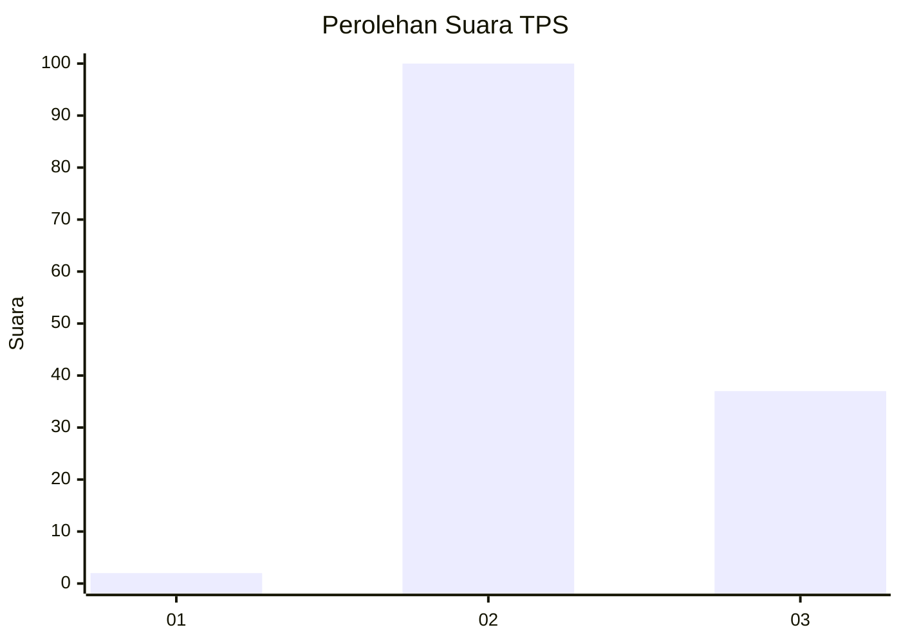
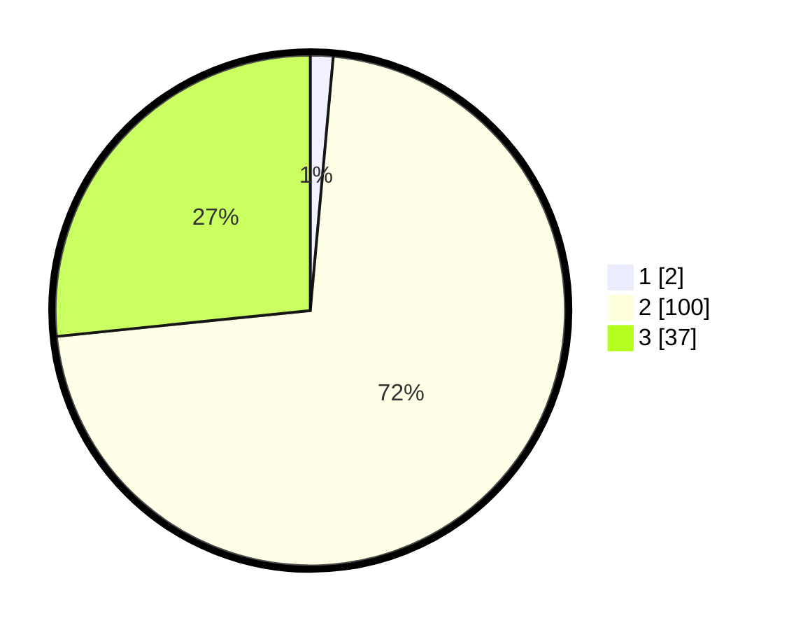

# Hasil

## Grafik

## Tabel

| No. | Nama Paslon    | Suara | Suara (raw) | Persentase |
|:--- |:-------------- | -----:| -----------:| ----------:|
| 1   | ANIES MUHAIMIN | 2     | [2][p-1]    | 1,44       |
| 2   | PRABOWO GIBRAN | 100   | [100][p-2]  | 71,94      |
| 3   | GANJAR MAHFUD  | 37    | [37][p-3]   | 26,62      |

[p-1]: https://github.com/gigit-pemilu/pemilu-2024-12-sumatera-utara/blob/main/pilpres/hitung-suara/sub/12-sumatera-utara/sub/04-nias/sub/35-sogae'adu/sub/2001-tuhembuasi/sub/003-tps/sub/paslon-1.txt
[p-2]: https://github.com/gigit-pemilu/pemilu-2024-12-sumatera-utara/blob/main/pilpres/hitung-suara/sub/12-sumatera-utara/sub/04-nias/sub/35-sogae'adu/sub/2001-tuhembuasi/sub/003-tps/sub/paslon-2.txt
[p-3]: https://github.com/gigit-pemilu/pemilu-2024-12-sumatera-utara/blob/main/pilpres/hitung-suara/sub/12-sumatera-utara/sub/04-nias/sub/35-sogae'adu/sub/2001-tuhembuasi/sub/003-tps/sub/paslon-3.txt

## Foto C Plano

https://sirekap-obj-formc.kpu.go.id/bc08/pemilu/ppwp/12/04/35/20/01/1204352001003-20240226-183347--88adf1bb-88db-4b16-9fed-17a18bb52c01.jpg

https://sirekap-obj-formc.kpu.go.id/bc08/pemilu/ppwp/12/04/35/20/01/1204352001003-20240226-183404--5b19ae4b-67f5-482a-b6dd-adb3582e441b.jpg

https://sirekap-obj-formc.kpu.go.id/bc08/pemilu/ppwp/12/04/35/20/01/1204352001003-20240226-183422--80729b46-7779-4852-b0e9-4a217723bafd.jpg

## Metadata

| Key        | Value               |
| ---------- | ------------------- |
| Time Stamp | 2024-02-28 19:00:00 |

