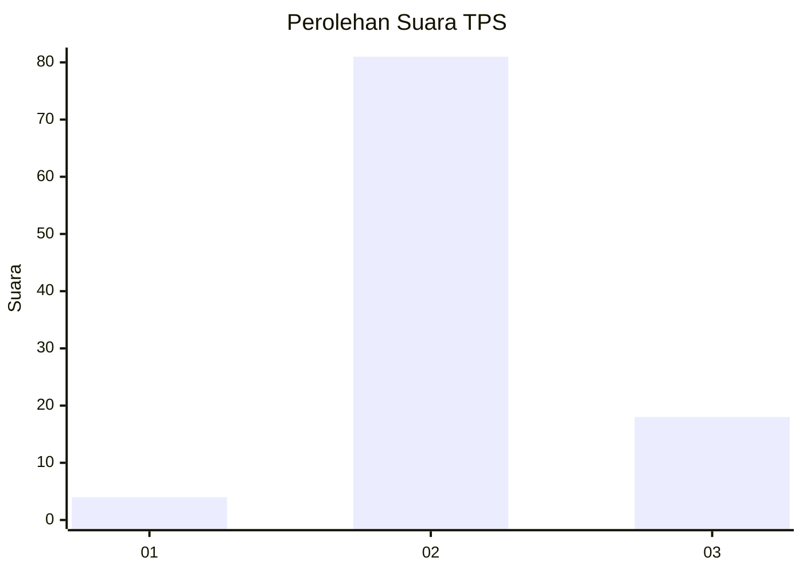
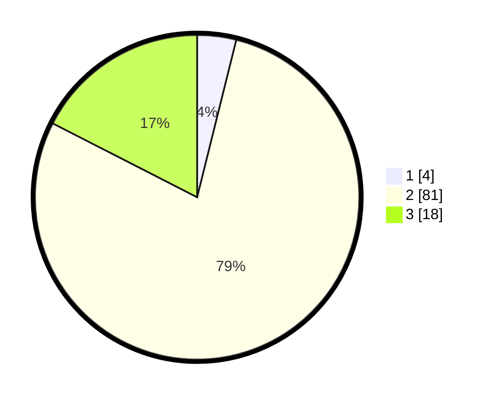

# Hasil

## Grafik

## Tabel

| No. | Nama Paslon    | Suara | Suara (raw) | Persentase |
|:--- |:-------------- | -----:| -----------:| ----------:|
| 1   | ANIES MUHAIMIN | 4     | [4][p-1]    | 3,88       |
| 2   | PRABOWO GIBRAN | 81    | [81][p-2]   | 78,64      |
| 3   | GANJAR MAHFUD  | 18    | [18][p-3]   | 17,48      |

[p-1]: https://github.com/gigit-pemilu/pemilu-2024-12-sumatera-utara/blob/main/pilpres/hitung-suara/sub/12-sumatera-utara/sub/04-nias/sub/35-sogae'adu/sub/2001-tuhembuasi/sub/004-tps/sub/paslon-1.txt
[p-2]: https://github.com/gigit-pemilu/pemilu-2024-12-sumatera-utara/blob/main/pilpres/hitung-suara/sub/12-sumatera-utara/sub/04-nias/sub/35-sogae'adu/sub/2001-tuhembuasi/sub/004-tps/sub/paslon-2.txt
[p-3]: https://github.com/gigit-pemilu/pemilu-2024-12-sumatera-utara/blob/main/pilpres/hitung-suara/sub/12-sumatera-utara/sub/04-nias/sub/35-sogae'adu/sub/2001-tuhembuasi/sub/004-tps/sub/paslon-3.txt

## Foto C Plano

https://sirekap-obj-formc.kpu.go.id/3097/pemilu/ppwp/12/04/35/20/01/1204352001004-20240226-190301--f7f61202-f47b-40fe-99fc-2ab467a23d5e.jpg

https://sirekap-obj-formc.kpu.go.id/3097/pemilu/ppwp/12/04/35/20/01/1204352001004-20240226-190317--deffee02-1f55-433d-abfb-d4373874c955.jpg

https://sirekap-obj-formc.kpu.go.id/3097/pemilu/ppwp/12/04/35/20/01/1204352001004-20240226-190342--e7ac78bb-7484-4f53-9fe0-80af36eb0446.jpg

## Metadata

| Key        | Value               |
| ---------- | ------------------- |
| Time Stamp | 2024-02-28 19:00:00 |

