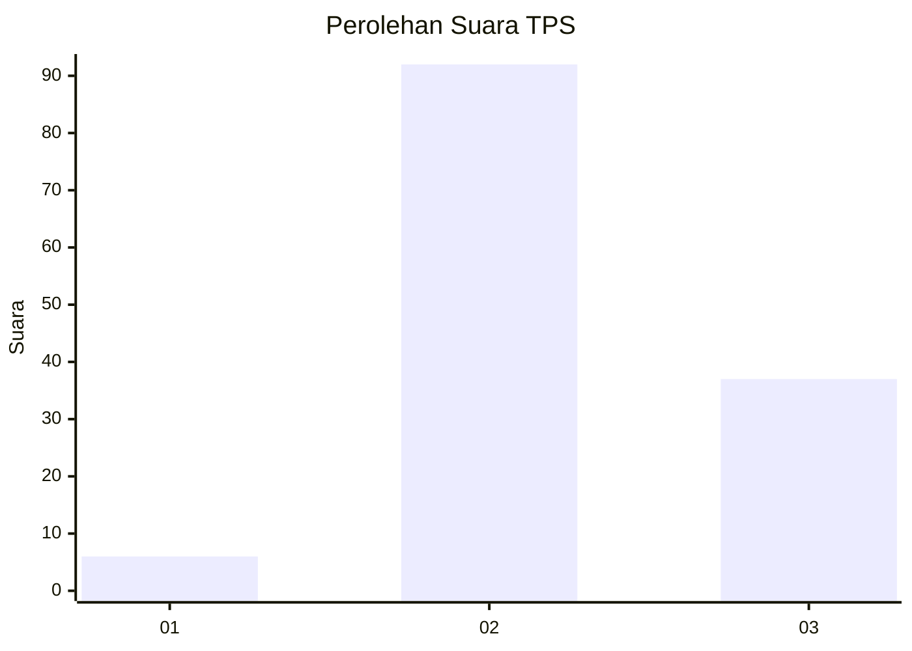
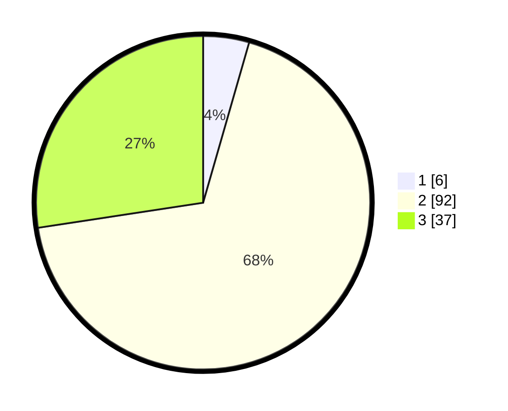

# Hasil

## Grafik

## Tabel

| No. | Nama Paslon    | Suara | Suara (raw) | Persentase |
|:--- |:-------------- | -----:| -----------:| ----------:|
| 1   | ANIES MUHAIMIN | 6     | [6][p-1]    | 4,44       |
| 2   | PRABOWO GIBRAN | 92    | [92][p-2]   | 68,15      |
| 3   | GANJAR MAHFUD  | 37    | [37][p-3]   | 27,41      |

[p-1]: https://github.com/gigit-pemilu/pemilu-2024-12-sumatera-utara/blob/main/pilpres/hitung-suara/sub/12-sumatera-utara/sub/04-nias/sub/35-sogae'adu/sub/2002-hilibadalu/sub/001-tps/sub/paslon-1.txt
[p-2]: https://github.com/gigit-pemilu/pemilu-2024-12-sumatera-utara/blob/main/pilpres/hitung-suara/sub/12-sumatera-utara/sub/04-nias/sub/35-sogae'adu/sub/2002-hilibadalu/sub/001-tps/sub/paslon-2.txt
[p-3]: https://github.com/gigit-pemilu/pemilu-2024-12-sumatera-utara/blob/main/pilpres/hitung-suara/sub/12-sumatera-utara/sub/04-nias/sub/35-sogae'adu/sub/2002-hilibadalu/sub/001-tps/sub/paslon-3.txt

## Foto C Plano

https://sirekap-obj-formc.kpu.go.id/03bc/pemilu/ppwp/12/04/35/20/02/1204352002001-20240221-104155--83f781b1-8e0a-4734-9dd6-270e2339e0f1.jpg

https://sirekap-obj-formc.kpu.go.id/03bc/pemilu/ppwp/12/04/35/20/02/1204352002001-20240221-103902--5cbc879b-2460-4573-8764-796e56c7da6c.jpg

https://sirekap-obj-formc.kpu.go.id/03bc/pemilu/ppwp/12/04/35/20/02/1204352002001-20240221-104402--aa6b1ca7-a44c-4eb3-ae8e-3c50196c091c.jpg

## Metadata

| Key        | Value               |
| ---------- | ------------------- |
| Time Stamp | 2024-02-25 11:00:00 |

