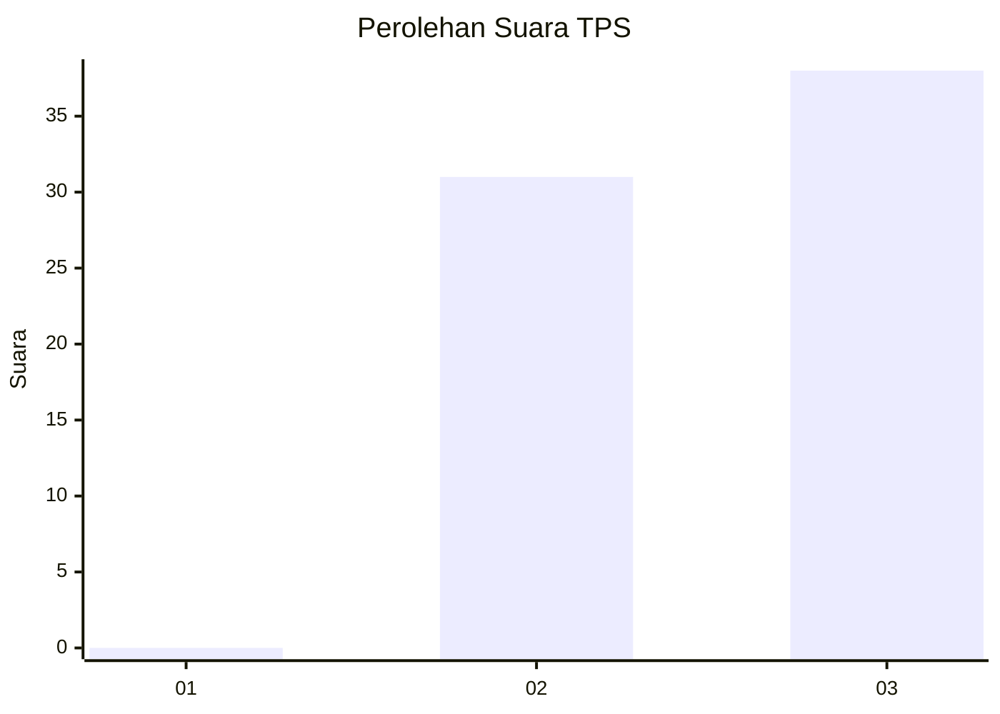
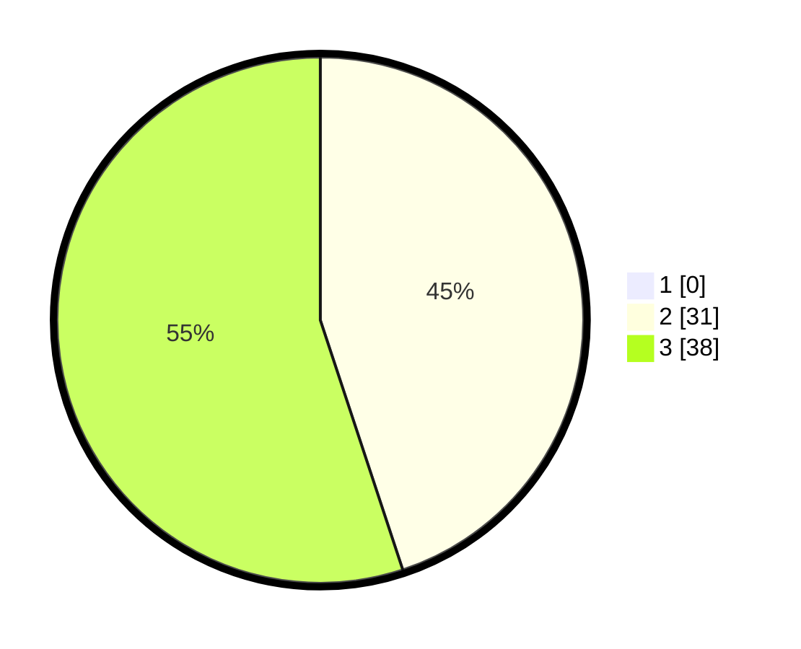

# Hasil

## Grafik

## Tabel

| No. | Nama Paslon    | Suara | Suara (raw) | Persentase |
|:--- |:-------------- | -----:| -----------:| ----------:|
| 1   | ANIES MUHAIMIN | 0     | [0][p-1]    | 0,00       |
| 2   | PRABOWO GIBRAN | 31    | [31][p-2]   | 44,93      |
| 3   | GANJAR MAHFUD  | 38    | [38][p-3]   | 55,07      |

[p-1]: https://github.com/gigit-pemilu/pemilu-2024/blob/main/pilpres/hitung-suara/sub/12-sumatera-utara/sub/04-nias/sub/35-sogae'adu/sub/2003-la'uri/sub/003-tps/sub/paslon-1.txt
[p-2]: https://github.com/gigit-pemilu/pemilu-2024/blob/main/pilpres/hitung-suara/sub/12-sumatera-utara/sub/04-nias/sub/35-sogae'adu/sub/2003-la'uri/sub/003-tps/sub/paslon-2.txt
[p-3]: https://github.com/gigit-pemilu/pemilu-2024/blob/main/pilpres/hitung-suara/sub/12-sumatera-utara/sub/04-nias/sub/35-sogae'adu/sub/2003-la'uri/sub/003-tps/sub/paslon-3.txt

## Foto C Plano

https://sirekap-obj-formc.kpu.go.id/af55/pemilu/ppwp/12/04/35/20/03/1204352003003-20240214-234634--30936c07-f821-4244-8558-70426b0f5695.jpg

https://sirekap-obj-formc.kpu.go.id/af55/pemilu/ppwp/12/04/35/20/03/1204352003003-20240214-234504--118e6ef7-4a8a-476f-83e9-320cb5a51f57.jpg

https://sirekap-obj-formc.kpu.go.id/af55/pemilu/ppwp/12/04/35/20/03/1204352003003-20240214-234823--09be62f1-b854-48f8-8caa-290cab513e99.jpg

## Metadata

| Key        | Value               |
| ---------- | ------------------- |
| Time Stamp | 2024-02-16 00:00:26 |

