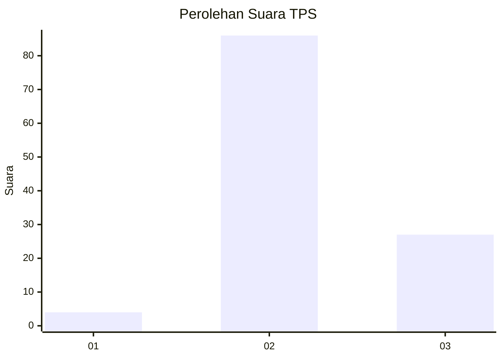
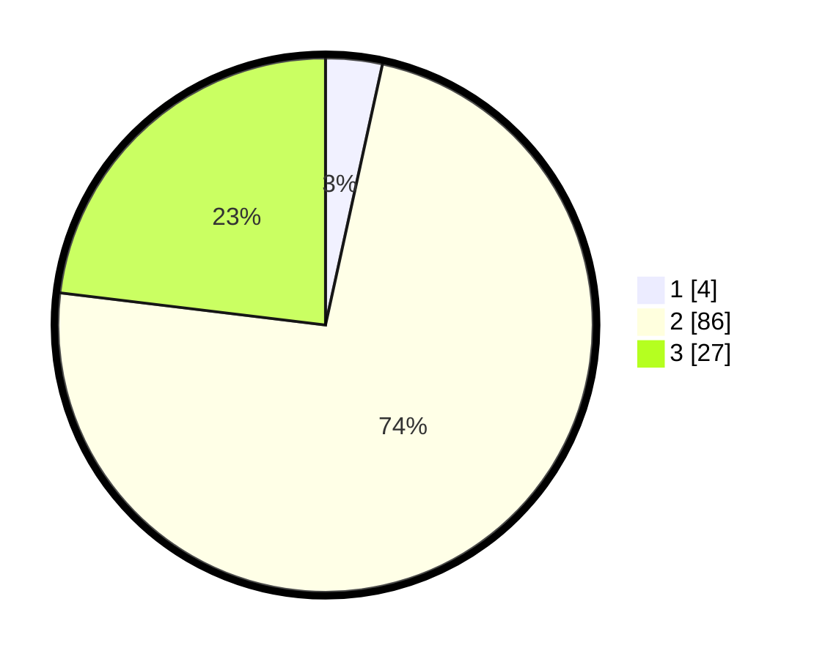

# Hasil

## Grafik

## Tabel

| No. | Nama Paslon    | Suara | Suara (raw) | Persentase |
|:--- |:-------------- | -----:| -----------:| ----------:|
| 1   | ANIES MUHAIMIN | 4     | [4][p-1]    | 3,42       |
| 2   | PRABOWO GIBRAN | 86    | [86][p-2]   | 73,50      |
| 3   | GANJAR MAHFUD  | 27    | [27][p-3]   | 23,08      |

[p-1]: https://github.com/gigit-pemilu/pemilu-2024-12-sumatera-utara/blob/main/pilpres/hitung-suara/sub/12-sumatera-utara/sub/04-nias/sub/35-sogae'adu/sub/2004-hilimbana/sub/002-tps/sub/paslon-1.txt
[p-2]: https://github.com/gigit-pemilu/pemilu-2024-12-sumatera-utara/blob/main/pilpres/hitung-suara/sub/12-sumatera-utara/sub/04-nias/sub/35-sogae'adu/sub/2004-hilimbana/sub/002-tps/sub/paslon-2.txt
[p-3]: https://github.com/gigit-pemilu/pemilu-2024-12-sumatera-utara/blob/main/pilpres/hitung-suara/sub/12-sumatera-utara/sub/04-nias/sub/35-sogae'adu/sub/2004-hilimbana/sub/002-tps/sub/paslon-3.txt

## Foto C Plano

https://sirekap-obj-formc.kpu.go.id/d9e3/pemilu/ppwp/12/04/35/20/04/1204352004002-20240214-202914--769470be-c494-4601-8231-d412c750986c.jpg

https://sirekap-obj-formc.kpu.go.id/d9e3/pemilu/ppwp/12/04/35/20/04/1204352004002-20240214-202956--cba66b5a-503c-424f-8904-33d036d6043e.jpg

https://sirekap-obj-formc.kpu.go.id/d9e3/pemilu/ppwp/12/04/35/20/04/1204352004002-20240214-203023--df214cf9-c9c5-4bca-8662-d805c5d5f818.jpg

## Metadata

| Key        | Value               |
| ---------- | ------------------- |
| Time Stamp | 2024-02-15 15:30:25 |

