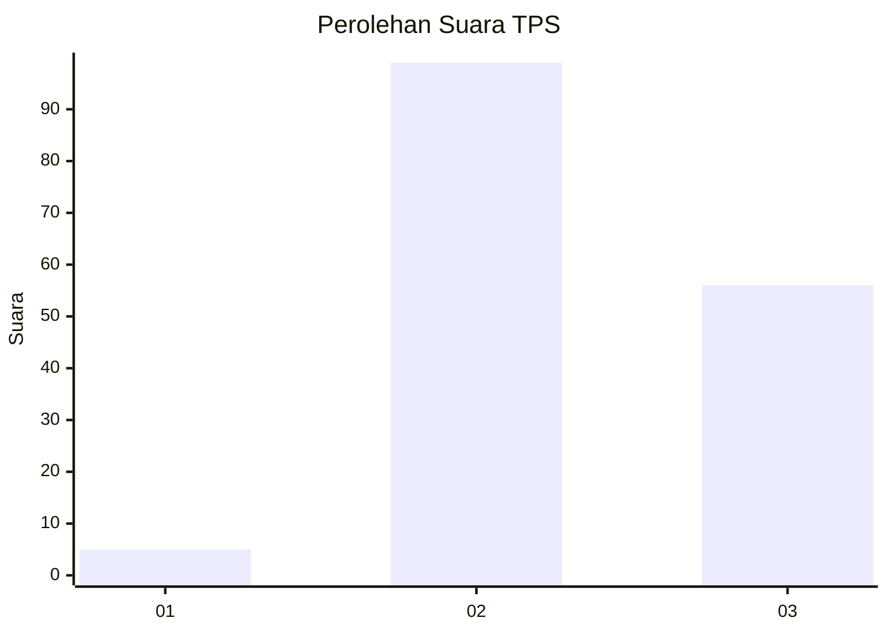
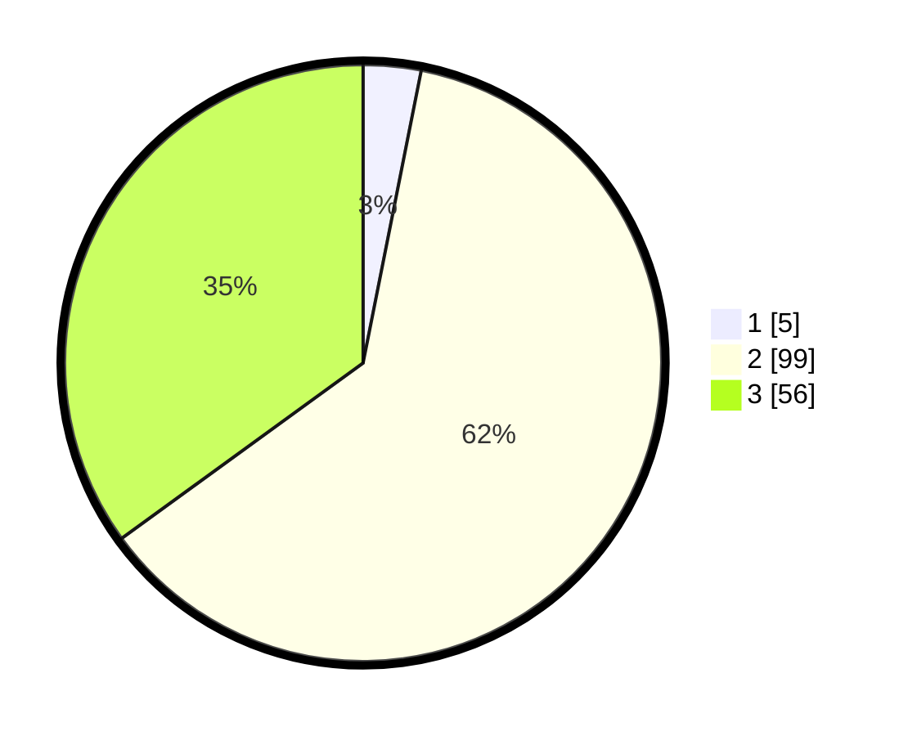

# Hasil

## Grafik

## Tabel

| No. | Nama Paslon    | Suara | Suara (raw) | Persentase |
|:--- |:-------------- | -----:| -----------:| ----------:|
| 1   | ANIES MUHAIMIN | 5     | [5][p-1]    | 3,13       |
| 2   | PRABOWO GIBRAN | 99    | [99][p-2]   | 61,88      |
| 3   | GANJAR MAHFUD  | 56    | [56][p-3]   | 35,00      |

[p-1]: https://github.com/gigit-pemilu/pemilu-2024/blob/main/pilpres/hitung-suara/sub/12-sumatera-utara/sub/04-nias/sub/35-sogae'adu/sub/2005-saitagaramba/sub/001-tps/sub/paslon-1.txt
[p-2]: https://github.com/gigit-pemilu/pemilu-2024/blob/main/pilpres/hitung-suara/sub/12-sumatera-utara/sub/04-nias/sub/35-sogae'adu/sub/2005-saitagaramba/sub/001-tps/sub/paslon-2.txt
[p-3]: https://github.com/gigit-pemilu/pemilu-2024/blob/main/pilpres/hitung-suara/sub/12-sumatera-utara/sub/04-nias/sub/35-sogae'adu/sub/2005-saitagaramba/sub/001-tps/sub/paslon-3.txt

## Foto C Plano

https://sirekap-obj-formc.kpu.go.id/006f/pemilu/ppwp/12/04/35/20/05/1204352005001-20240215-014113--72291e71-c499-4e7f-9d54-a7cf24f99dff.jpg

https://sirekap-obj-formc.kpu.go.id/006f/pemilu/ppwp/12/04/35/20/05/1204352005001-20240215-014203--bde9309a-83fa-494e-b6fe-b79df5f170a1.jpg

https://sirekap-obj-formc.kpu.go.id/006f/pemilu/ppwp/12/04/35/20/05/1204352005001-20240215-014244--0b895f1b-31cd-4d8c-8d07-6fdc661de143.jpg

## Metadata

| Key        | Value               |
| ---------- | ------------------- |
| Time Stamp | 2024-02-16 00:00:26 |

