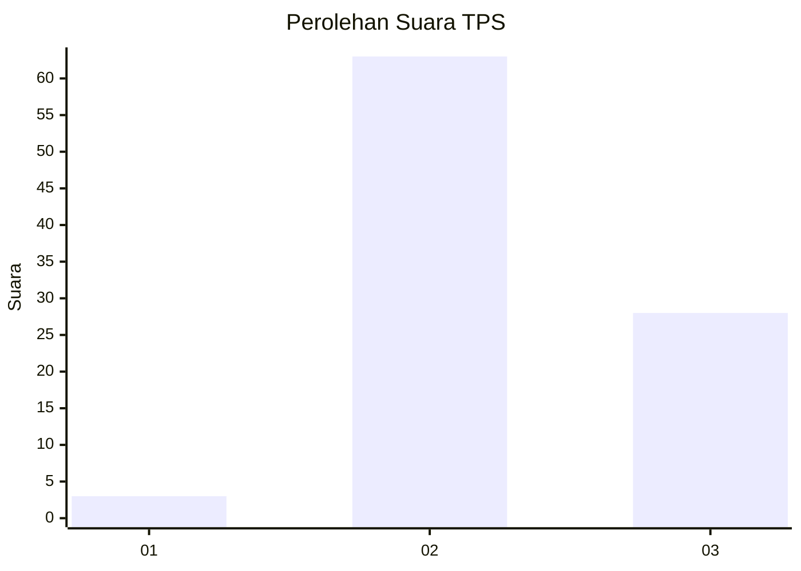
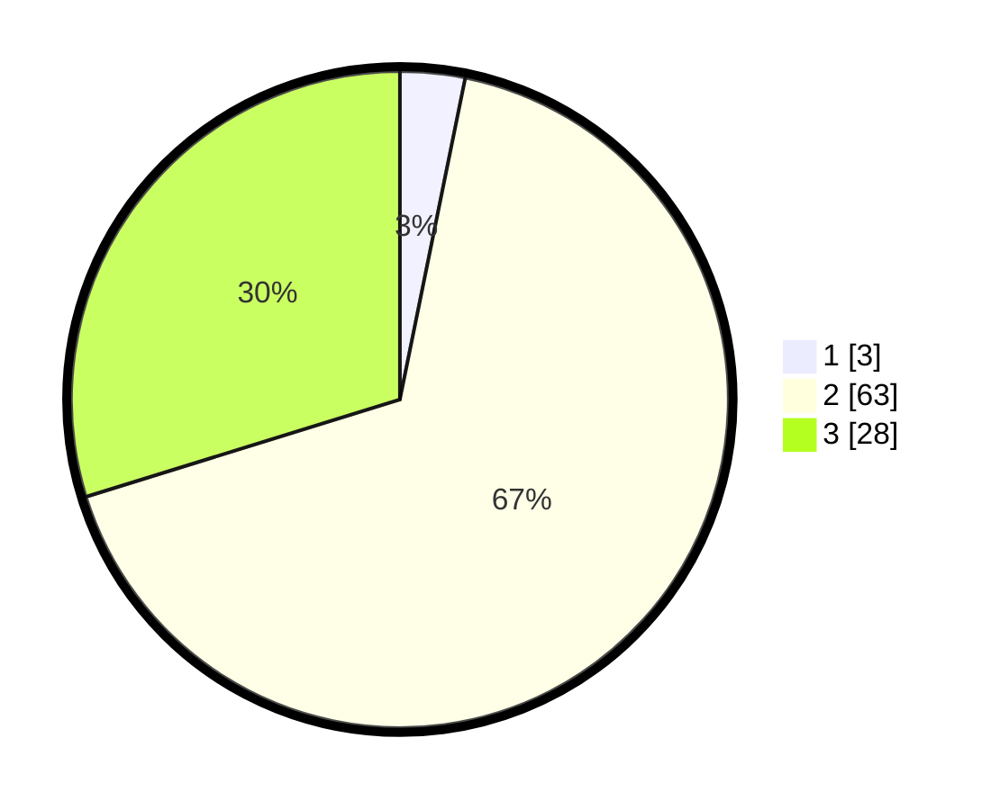

# Hasil

## Grafik

## Tabel

| No. | Nama Paslon    | Suara | Suara (raw) | Persentase |
|:--- |:-------------- | -----:| -----------:| ----------:|
| 1   | ANIES MUHAIMIN | 3     | [3][p-1]    | 3,19       |
| 2   | PRABOWO GIBRAN | 63    | [63][p-2]   | 67,02      |
| 3   | GANJAR MAHFUD  | 28    | [28][p-3]   | 29,79      |

[p-1]: https://github.com/gigit-pemilu/pemilu-2024-12-sumatera-utara/blob/main/pilpres/hitung-suara/sub/12-sumatera-utara/sub/04-nias/sub/35-sogae'adu/sub/2005-saitagaramba/sub/002-tps/sub/paslon-1.txt
[p-2]: https://github.com/gigit-pemilu/pemilu-2024-12-sumatera-utara/blob/main/pilpres/hitung-suara/sub/12-sumatera-utara/sub/04-nias/sub/35-sogae'adu/sub/2005-saitagaramba/sub/002-tps/sub/paslon-2.txt
[p-3]: https://github.com/gigit-pemilu/pemilu-2024-12-sumatera-utara/blob/main/pilpres/hitung-suara/sub/12-sumatera-utara/sub/04-nias/sub/35-sogae'adu/sub/2005-saitagaramba/sub/002-tps/sub/paslon-3.txt

## Foto C Plano

https://sirekap-obj-formc.kpu.go.id/83ee/pemilu/ppwp/12/04/35/20/05/1204352005002-20240215-040649--6a94c609-1dab-43e9-aa7a-f16f8eadd3a3.jpg

https://sirekap-obj-formc.kpu.go.id/83ee/pemilu/ppwp/12/04/35/20/05/1204352005002-20240215-022944--0084cf96-b01c-4585-9605-949434d5852a.jpg

https://sirekap-obj-formc.kpu.go.id/83ee/pemilu/ppwp/12/04/35/20/05/1204352005002-20240215-043815--c468c4f1-0f47-41fa-b331-8b16ac3c82e5.jpg

## Metadata

| Key        | Value               |
| ---------- | ------------------- |
| Time Stamp | 2024-02-15 15:30:25 |

