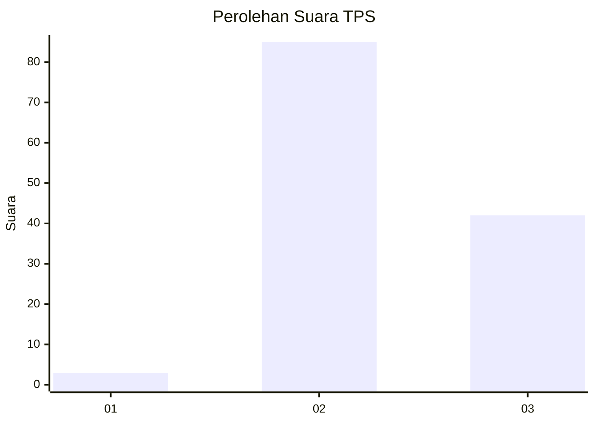
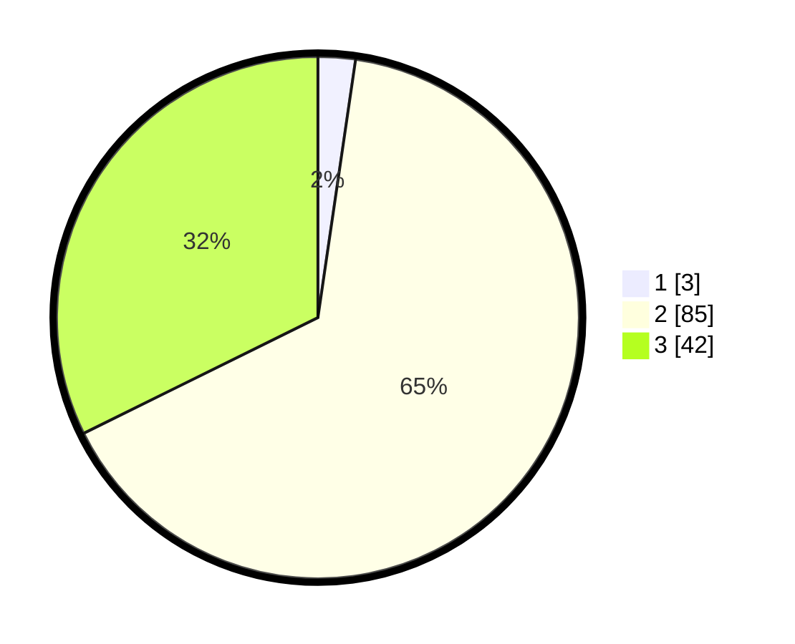

# Hasil

## Grafik

## Tabel

| No. | Nama Paslon    | Suara | Suara (raw) | Persentase |
|:--- |:-------------- | -----:| -----------:| ----------:|
| 1   | ANIES MUHAIMIN | 3     | [3][p-1]    | 2,31       |
| 2   | PRABOWO GIBRAN | 85    | [85][p-2]   | 65,38      |
| 3   | GANJAR MAHFUD  | 42    | [42][p-3]   | 32,31      |

[p-1]: https://github.com/gigit-pemilu/pemilu-2024/blob/main/pilpres/hitung-suara/sub/12-sumatera-utara/sub/04-nias/sub/35-sogae'adu/sub/2009-sisarahili-sogae'adu/sub/001-tps/sub/paslon-1.txt
[p-2]: https://github.com/gigit-pemilu/pemilu-2024/blob/main/pilpres/hitung-suara/sub/12-sumatera-utara/sub/04-nias/sub/35-sogae'adu/sub/2009-sisarahili-sogae'adu/sub/001-tps/sub/paslon-2.txt
[p-3]: https://github.com/gigit-pemilu/pemilu-2024/blob/main/pilpres/hitung-suara/sub/12-sumatera-utara/sub/04-nias/sub/35-sogae'adu/sub/2009-sisarahili-sogae'adu/sub/001-tps/sub/paslon-3.txt

## Foto C Plano

https://sirekap-obj-formc.kpu.go.id/af46/pemilu/ppwp/12/04/35/20/09/1204352009001-20240215-012450--5965f9bd-da55-46e4-be54-a09b4801fff1.jpg

https://sirekap-obj-formc.kpu.go.id/af46/pemilu/ppwp/12/04/35/20/09/1204352009001-20240215-012511--2ea4593d-0b94-4c79-aa8f-2c950ae61bda.jpg

https://sirekap-obj-formc.kpu.go.id/af46/pemilu/ppwp/12/04/35/20/09/1204352009001-20240215-012530--6245e295-57b8-4553-9602-cc7e92166a6a.jpg

## Metadata

| Key        | Value               |
| ---------- | ------------------- |
| Time Stamp | 2024-02-16 00:00:26 |

