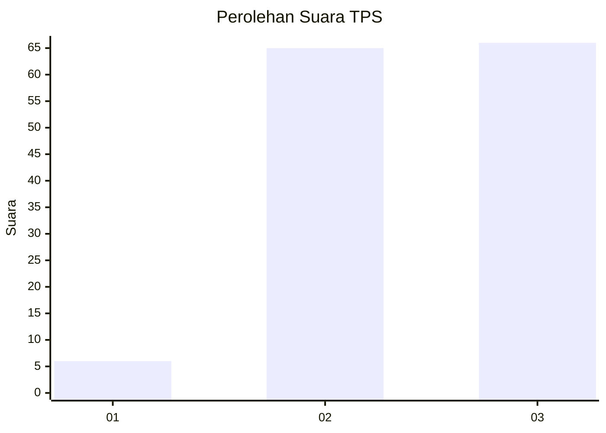
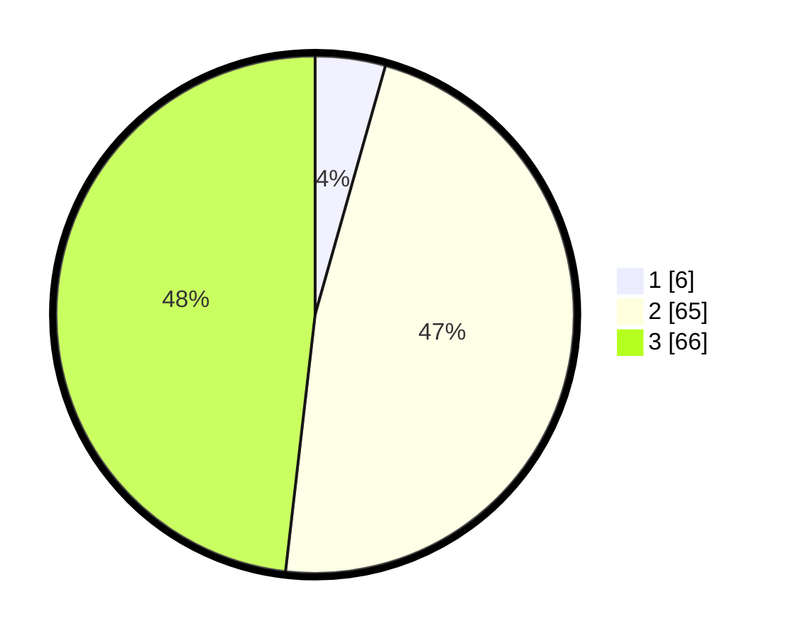

# Hasil

## Grafik

## Tabel

| No. | Nama Paslon    | Suara | Suara (raw) | Persentase |
|:--- |:-------------- | -----:| -----------:| ----------:|
| 1   | ANIES MUHAIMIN | 6     | [6][p-1]    | 4,38       |
| 2   | PRABOWO GIBRAN | 65    | [65][p-2]   | 47,45      |
| 3   | GANJAR MAHFUD  | 66    | [66][p-3]   | 48,18      |

[p-1]: https://github.com/gigit-pemilu/pemilu-2024/blob/main/pilpres/hitung-suara/sub/12-sumatera-utara/sub/04-nias/sub/35-sogae'adu/sub/2011-sihare'o-sogae'adu/sub/003-tps/sub/paslon-1.txt
[p-2]: https://github.com/gigit-pemilu/pemilu-2024/blob/main/pilpres/hitung-suara/sub/12-sumatera-utara/sub/04-nias/sub/35-sogae'adu/sub/2011-sihare'o-sogae'adu/sub/003-tps/sub/paslon-2.txt
[p-3]: https://github.com/gigit-pemilu/pemilu-2024/blob/main/pilpres/hitung-suara/sub/12-sumatera-utara/sub/04-nias/sub/35-sogae'adu/sub/2011-sihare'o-sogae'adu/sub/003-tps/sub/paslon-3.txt

## Foto C Plano

https://sirekap-obj-formc.kpu.go.id/cc21/pemilu/ppwp/12/04/35/20/11/1204352011003-20240215-012548--c1f74778-f33d-47b1-98ae-e152df606c97.jpg

https://sirekap-obj-formc.kpu.go.id/cc21/pemilu/ppwp/12/04/35/20/11/1204352011003-20240215-012724--1366264a-e3b7-43ee-887e-22e7db04c1ce.jpg

https://sirekap-obj-formc.kpu.go.id/cc21/pemilu/ppwp/12/04/35/20/11/1204352011003-20240215-080708--a753a054-e8ab-4fde-b3bf-6a41895ace13.jpg

## Metadata

| Key        | Value               |
| ---------- | ------------------- |
| Time Stamp | 2024-02-16 00:00:26 |

