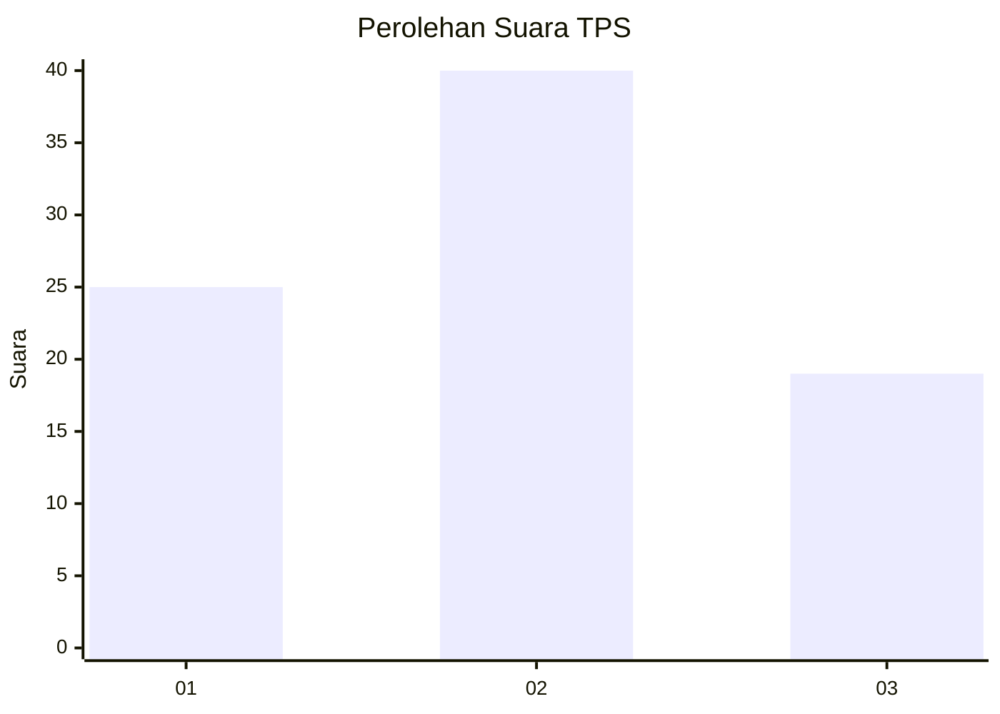
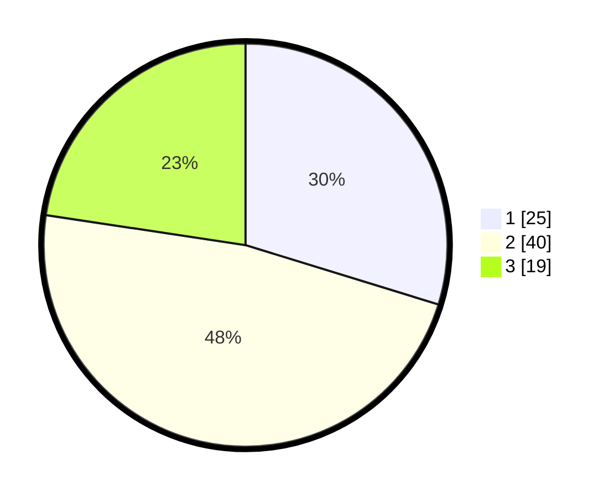

# Hasil

## Grafik

## Tabel

| No. | Nama Paslon    | Suara | Suara (raw) | Persentase |
|:--- |:-------------- | -----:| -----------:| ----------:|
| 1   | ANIES MUHAIMIN | 25    | [25][p-1]   | 29,76      |
| 2   | PRABOWO GIBRAN | 40    | [40][p-2]   | 47,62      |
| 3   | GANJAR MAHFUD  | 19    | [19][p-3]   | 22,62      |

[p-1]: https://github.com/gigit-pemilu/pemilu-2024-12-sumatera-utara/blob/main/pilpres/hitung-suara/sub/12-sumatera-utara/sub/05-langkat/sub/02-salapian/sub/1007-tanjung-langkat/sub/005-tps/sub/paslon-1.txt
[p-2]: https://github.com/gigit-pemilu/pemilu-2024-12-sumatera-utara/blob/main/pilpres/hitung-suara/sub/12-sumatera-utara/sub/05-langkat/sub/02-salapian/sub/1007-tanjung-langkat/sub/005-tps/sub/paslon-2.txt
[p-3]: https://github.com/gigit-pemilu/pemilu-2024-12-sumatera-utara/blob/main/pilpres/hitung-suara/sub/12-sumatera-utara/sub/05-langkat/sub/02-salapian/sub/1007-tanjung-langkat/sub/005-tps/sub/paslon-3.txt

## Foto C Plano

https://sirekap-obj-formc.kpu.go.id/826d/pemilu/ppwp/12/05/02/10/07/1205021007005-20240219-151954--19635fdd-cdbd-4ed4-ac6a-9c05d2096596.jpg

https://sirekap-obj-formc.kpu.go.id/826d/pemilu/ppwp/12/05/02/10/07/1205021007005-20240219-152059--aef07ce8-9082-451f-9b37-3b981d5a4417.jpg

https://sirekap-obj-formc.kpu.go.id/826d/pemilu/ppwp/12/05/02/10/07/1205021007005-20240219-152231--bde7ac01-5a1d-4c28-85de-8c70cb687c42.jpg

## Metadata

| Key        | Value               |
| ---------- | ------------------- |
| Time Stamp | 2024-02-19 16:00:00 |

## DATA PEMILIH TETAP

Jumlah pemilih dalam DPT: **183**.
 * L: **88**.
 * P: **100**.

## DATA PENGGUNA HAK PILIH

Jumlah pengguna hak pilih dalam DPT: **142**.
 * L: **67**.
 * P: **75**.

Jumlah pengguna hak pilih dalam DPTb: **8**.
 * L: **0**.
 * P: **0**.

Jumlah pengguna hak pilih dalam DPK: **1**.
 * L: **0**.
 * P: **7**.

Jumlah pengguna hak pilih: **143**.
 * L: **467**.
 * P: **76**.

## JUMLAH SUARA SAH DAN TIDAK SAH

JUMLAH SELURUH SUARA SAH: **141**.

JUMLAH SUARA TIDAK SAH: **2**.

JUMLAH SELURUH SUARA SAH DAN SUARA TIDAK SAH: **143**.

