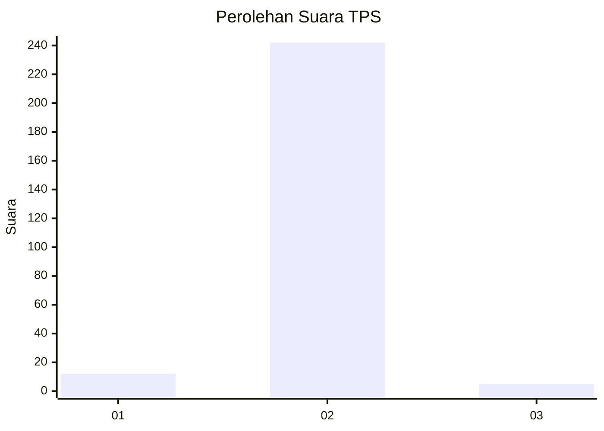
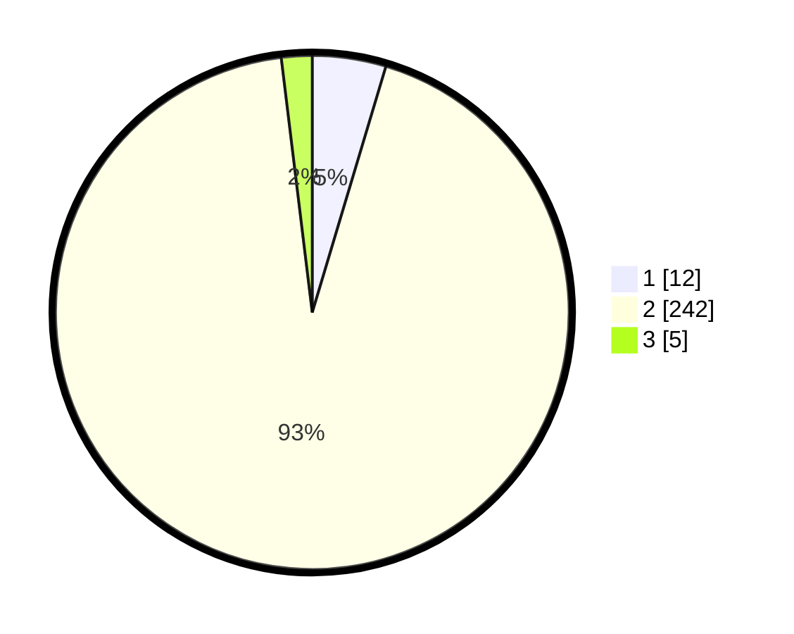

# Hasil

## Grafik

## Tabel

| No. | Nama Paslon    | Suara | Suara (raw) | Persentase |
|:--- |:-------------- | -----:| -----------:| ----------:|
| 1   | ANIES MUHAIMIN | 12    | [12][p-1]   | 4,63       |
| 2   | PRABOWO GIBRAN | 242   | [242][p-2]  | 93,44      |
| 3   | GANJAR MAHFUD  | 5     | [5][p-3]    | 1,93       |

[p-1]: https://github.com/gigit-pemilu/pemilu-2024/blob/main/pilpres/hitung-suara/sub/12-sumatera-utara/sub/05-langkat/sub/03-kuala/sub/2009-raja-tengah/sub/004-tps/sub/paslon-1.txt
[p-2]: https://github.com/gigit-pemilu/pemilu-2024/blob/main/pilpres/hitung-suara/sub/12-sumatera-utara/sub/05-langkat/sub/03-kuala/sub/2009-raja-tengah/sub/004-tps/sub/paslon-2.txt
[p-3]: https://github.com/gigit-pemilu/pemilu-2024/blob/main/pilpres/hitung-suara/sub/12-sumatera-utara/sub/05-langkat/sub/03-kuala/sub/2009-raja-tengah/sub/004-tps/sub/paslon-3.txt

## Foto C Plano

https://sirekap-obj-formc.kpu.go.id/cee4/pemilu/ppwp/12/05/03/20/09/1205032009004-20240223-170517--ac846fc9-500d-4bad-a3e8-38d6599415d2.jpg

https://sirekap-obj-formc.kpu.go.id/cee4/pemilu/ppwp/12/05/03/20/09/1205032009004-20240223-170712--90d8ff55-c794-4ca7-a9d5-7717cb33b574.jpg

https://sirekap-obj-formc.kpu.go.id/cee4/pemilu/ppwp/12/05/03/20/09/1205032009004-20240223-170834--2d360b8d-91a5-40ec-872f-ce3bbdb05438.jpg

## Metadata

| Key        | Value               |
| ---------- | ------------------- |
| Time Stamp | 2024-02-24 22:31:28 |

