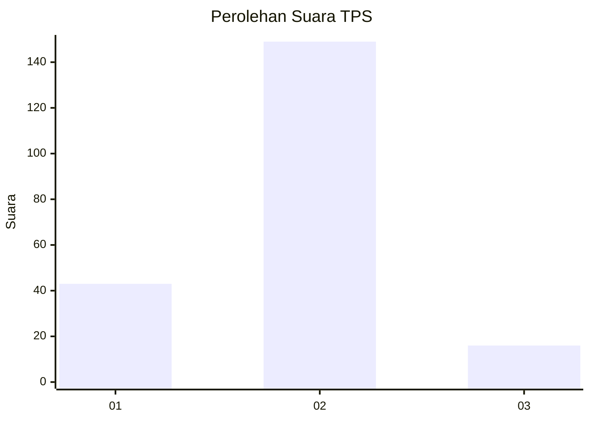
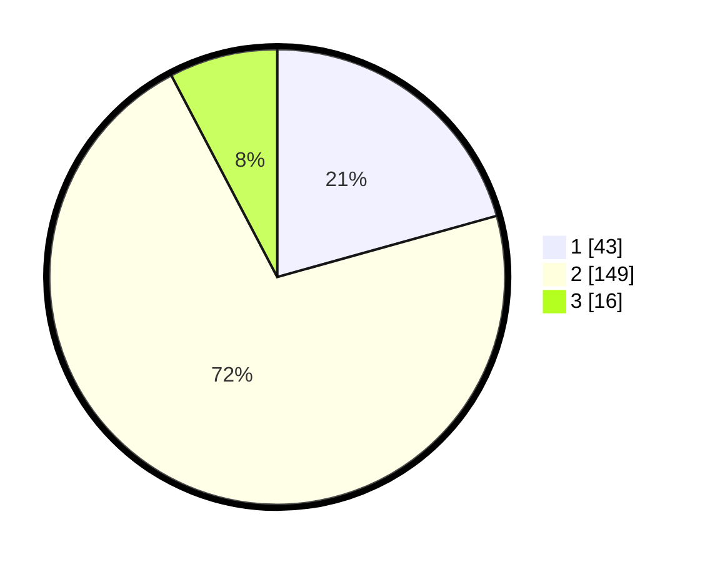

# Hasil

## Grafik

## Tabel

| No. | Nama Paslon    | Suara | Suara (raw) | Persentase |
|:--- |:-------------- | -----:| -----------:| ----------:|
| 1   | ANIES MUHAIMIN | 43    | [43][p-1]   | 20,67      |
| 2   | PRABOWO GIBRAN | 149   | [149][p-2]  | 71,63      |
| 3   | GANJAR MAHFUD  | 16    | [16][p-3]   | 7,69       |

[p-1]: https://github.com/gigit-pemilu/pemilu-2024-12-sumatera-utara/blob/main/pilpres/hitung-suara/sub/12-sumatera-utara/sub/05-langkat/sub/04-sei-bingai/sub/2008-pasar-vi-kwala-mencirim/sub/002-tps/sub/paslon-1.txt
[p-2]: https://github.com/gigit-pemilu/pemilu-2024-12-sumatera-utara/blob/main/pilpres/hitung-suara/sub/12-sumatera-utara/sub/05-langkat/sub/04-sei-bingai/sub/2008-pasar-vi-kwala-mencirim/sub/002-tps/sub/paslon-2.txt
[p-3]: https://github.com/gigit-pemilu/pemilu-2024-12-sumatera-utara/blob/main/pilpres/hitung-suara/sub/12-sumatera-utara/sub/05-langkat/sub/04-sei-bingai/sub/2008-pasar-vi-kwala-mencirim/sub/002-tps/sub/paslon-3.txt

## Foto C Plano

https://sirekap-obj-formc.kpu.go.id/f3fa/pemilu/ppwp/12/05/04/20/08/1205042008002-20240217-205139--7b704edb-5b65-48fd-a38b-138b86dfb06a.jpg

https://sirekap-obj-formc.kpu.go.id/f3fa/pemilu/ppwp/12/05/04/20/08/1205042008002-20240215-011504--df9f733c-d0c6-4e39-a4f8-a7608cb9c0d5.jpg

https://sirekap-obj-formc.kpu.go.id/f3fa/pemilu/ppwp/12/05/04/20/08/1205042008002-20240215-011542--4b355116-b824-441b-a649-f1913ca1aeb8.jpg

## Metadata

| Key        | Value               |
| ---------- | ------------------- |
| Time Stamp | 2024-02-19 06:16:00 |

