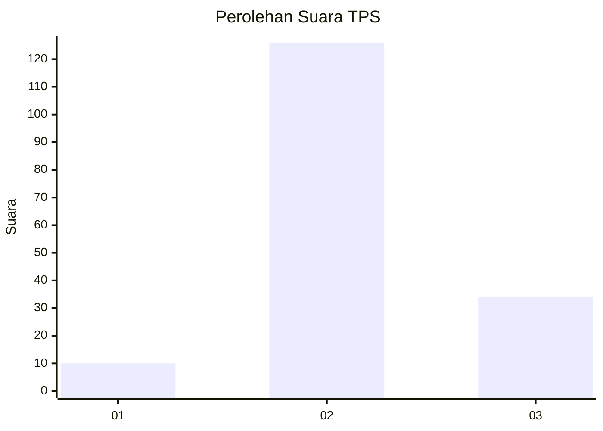

# Hasil

## Grafik

## Tabel

| No. | Nama Paslon    | Suara | Suara (raw) | Persentase |
|:--- |:-------------- | -----:| -----------:| ----------:|
| 1   | ANIES MUHAIMIN | 10    | [10][p-1]   | 5,88       |
| 2   | PRABOWO GIBRAN | 126   | [126][p-2]  | 74,12      |
| 3   | GANJAR MAHFUD  | 34    | [34][p-3]   | 20,00      |

[p-1]: https://github.com/gigit-pemilu/pemilu-2024/blob/main/pilpres/hitung-suara/sub/12-sumatera-utara/sub/05-langkat/sub/04-sei-bingai/sub/2008-pasar-vi-kwala-mencirim/sub/004-tps/sub/paslon-1.txt
[p-2]: https://github.com/gigit-pemilu/pemilu-2024/blob/main/pilpres/hitung-suara/sub/12-sumatera-utara/sub/05-langkat/sub/04-sei-bingai/sub/2008-pasar-vi-kwala-mencirim/sub/004-tps/sub/paslon-2.txt
[p-3]: https://github.com/gigit-pemilu/pemilu-2024/blob/main/pilpres/hitung-suara/sub/12-sumatera-utara/sub/05-langkat/sub/04-sei-bingai/sub/2008-pasar-vi-kwala-mencirim/sub/004-tps/sub/paslon-3.txt

## Foto C Plano

https://sirekap-obj-formc.kpu.go.id/d345/pemilu/ppwp/12/05/04/20/08/1205042008004-20240215-000305--37c5af4f-2231-4ceb-969a-a371578dac8a.jpg

https://sirekap-obj-formc.kpu.go.id/d345/pemilu/ppwp/12/05/04/20/08/1205042008004-20240214-205623--fb7690fe-01f3-45e1-a323-a4e93502349f.jpg

https://sirekap-obj-formc.kpu.go.id/d345/pemilu/ppwp/12/05/04/20/08/1205042008004-20240214-205735--b0d86704-e70c-459d-a326-f5099aed4f33.jpg

## Metadata

| Key        | Value               |
| ---------- | ------------------- |
| Time Stamp | 2024-02-16 21:01:00 |

