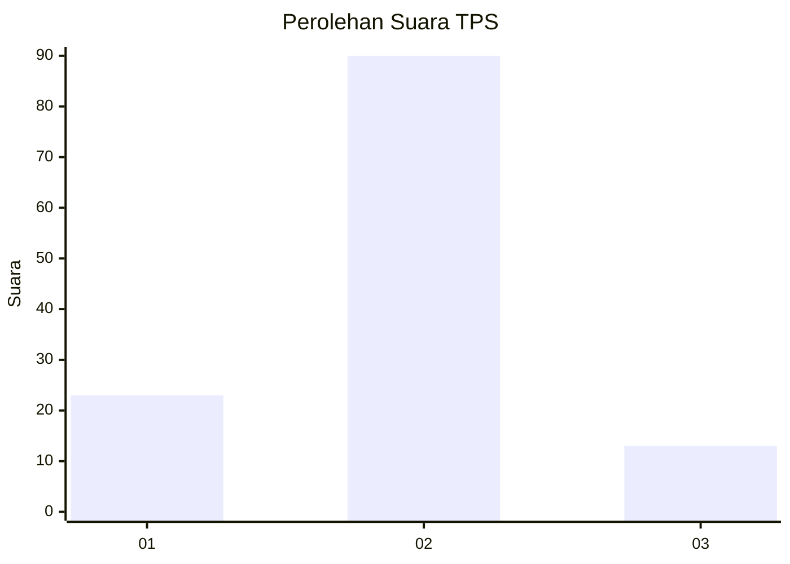
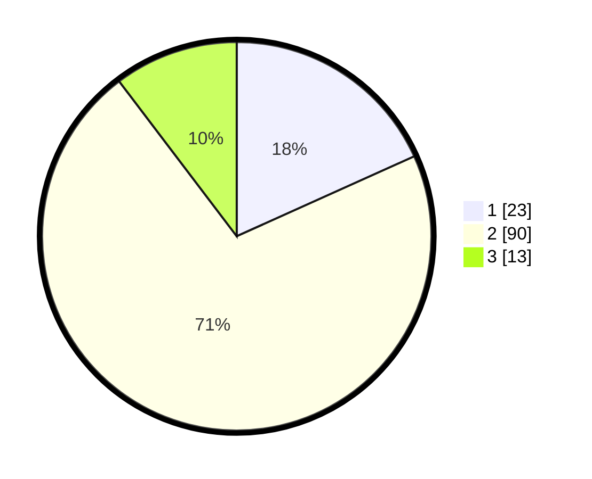

# Hasil

## Grafik

## Tabel

| No. | Nama Paslon    | Suara | Suara (raw) | Persentase |
|:--- |:-------------- | -----:| -----------:| ----------:|
| 1   | ANIES MUHAIMIN | 23    | [23][p-1]   | 18,25      |
| 2   | PRABOWO GIBRAN | 90    | [90][p-2]   | 71,43      |
| 3   | GANJAR MAHFUD  | 13    | [13][p-3]   | 10,32      |

[p-1]: https://github.com/gigit-pemilu/pemilu-2024-12-sumatera-utara/blob/main/pilpres/hitung-suara/sub/12-sumatera-utara/sub/05-langkat/sub/04-sei-bingai/sub/2009-emplasmen-kwala-mencirim/sub/003-tps/sub/paslon-1.txt
[p-2]: https://github.com/gigit-pemilu/pemilu-2024-12-sumatera-utara/blob/main/pilpres/hitung-suara/sub/12-sumatera-utara/sub/05-langkat/sub/04-sei-bingai/sub/2009-emplasmen-kwala-mencirim/sub/003-tps/sub/paslon-2.txt
[p-3]: https://github.com/gigit-pemilu/pemilu-2024-12-sumatera-utara/blob/main/pilpres/hitung-suara/sub/12-sumatera-utara/sub/05-langkat/sub/04-sei-bingai/sub/2009-emplasmen-kwala-mencirim/sub/003-tps/sub/paslon-3.txt

## Foto C Plano

https://sirekap-obj-formc.kpu.go.id/2ec1/pemilu/ppwp/12/05/04/20/09/1205042009003-20240215-102138--5812bb55-70f4-4fca-b27c-d50f79e92654.jpg

https://sirekap-obj-formc.kpu.go.id/2ec1/pemilu/ppwp/12/05/04/20/09/1205042009003-20240215-102229--c8e709a4-817e-433c-9711-2823050a75eb.jpg

https://sirekap-obj-formc.kpu.go.id/2ec1/pemilu/ppwp/12/05/04/20/09/1205042009003-20240215-102149--c17dff11-8187-46dc-9373-53d30635a807.jpg

## Metadata

| Key        | Value               |
| ---------- | ------------------- |
| Time Stamp | 2024-02-15 22:30:27 |

