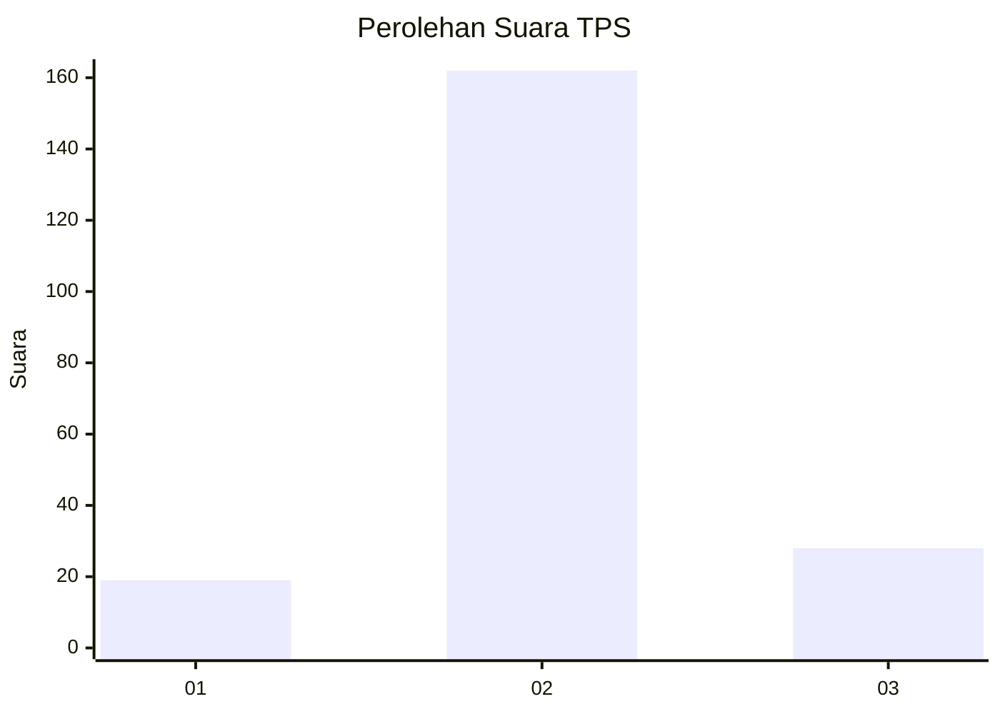
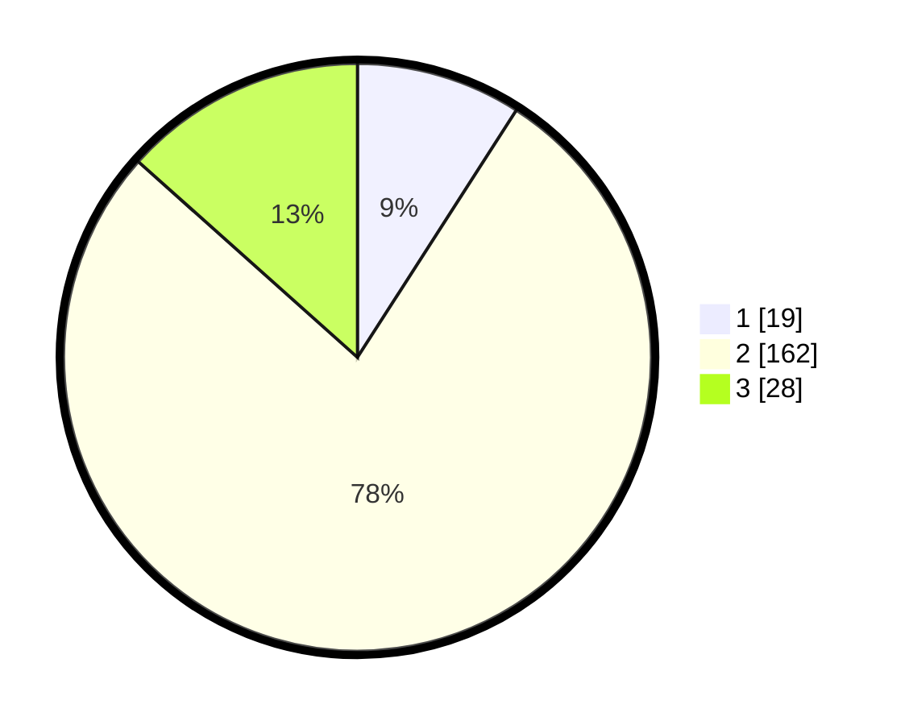

# Hasil

## Grafik

## Tabel

| No. | Nama Paslon    | Suara | Suara (raw) | Persentase |
|:--- |:-------------- | -----:| -----------:| ----------:|
| 1   | ANIES MUHAIMIN | 19    | [19][p-1]   | 9,09       |
| 2   | PRABOWO GIBRAN | 162   | [162][p-2]  | 77,51      |
| 3   | GANJAR MAHFUD  | 28    | [28][p-3]   | 13,40      |

[p-1]: https://github.com/gigit-pemilu/pemilu-2024/blob/main/pilpres/hitung-suara/sub/12-sumatera-utara/sub/05-langkat/sub/04-sei-bingai/sub/2011-pasar-iv-namo-terasi/sub/003-tps/sub/paslon-1.txt
[p-2]: https://github.com/gigit-pemilu/pemilu-2024/blob/main/pilpres/hitung-suara/sub/12-sumatera-utara/sub/05-langkat/sub/04-sei-bingai/sub/2011-pasar-iv-namo-terasi/sub/003-tps/sub/paslon-2.txt
[p-3]: https://github.com/gigit-pemilu/pemilu-2024/blob/main/pilpres/hitung-suara/sub/12-sumatera-utara/sub/05-langkat/sub/04-sei-bingai/sub/2011-pasar-iv-namo-terasi/sub/003-tps/sub/paslon-3.txt

## Foto C Plano

https://sirekap-obj-formc.kpu.go.id/ed4f/pemilu/ppwp/12/05/04/20/11/1205042011003-20240215-004809--071bf89a-ca01-4c0d-8229-76b438208bf0.jpg

https://sirekap-obj-formc.kpu.go.id/ed4f/pemilu/ppwp/12/05/04/20/11/1205042011003-20240215-015007--f3068fcb-2180-4c64-8ba9-46514fd0c279.jpg

https://sirekap-obj-formc.kpu.go.id/ed4f/pemilu/ppwp/12/05/04/20/11/1205042011003-20240215-015100--6abc9cb3-fdd3-4384-bcf2-622384a63b68.jpg

## Metadata

| Key        | Value               |
| ---------- | ------------------- |
| Time Stamp | 2024-02-15 17:00:25 |

