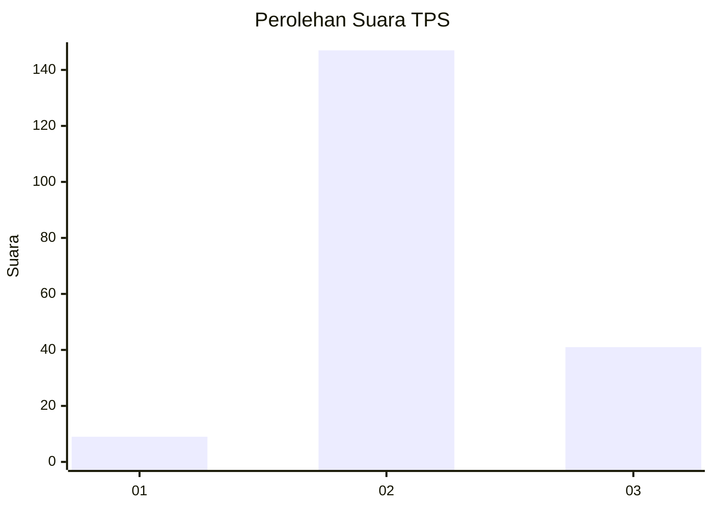

# Hasil

## Grafik

## Tabel

| No. | Nama Paslon    | Suara | Suara (raw) | Persentase |
|:--- |:-------------- | -----:| -----------:| ----------:|
| 1   | ANIES MUHAIMIN | 9     | [9][p-1]    | 4,57       |
| 2   | PRABOWO GIBRAN | 147   | [147][p-2]  | 74,62      |
| 3   | GANJAR MAHFUD  | 41    | [41][p-3]   | 20,81      |

[p-1]: https://github.com/gigit-pemilu/pemilu-2024/blob/main/pilpres/hitung-suara/sub/12-sumatera-utara/sub/05-langkat/sub/04-sei-bingai/sub/2013-durian-lingga/sub/001-tps/sub/paslon-1.txt
[p-2]: https://github.com/gigit-pemilu/pemilu-2024/blob/main/pilpres/hitung-suara/sub/12-sumatera-utara/sub/05-langkat/sub/04-sei-bingai/sub/2013-durian-lingga/sub/001-tps/sub/paslon-2.txt
[p-3]: https://github.com/gigit-pemilu/pemilu-2024/blob/main/pilpres/hitung-suara/sub/12-sumatera-utara/sub/05-langkat/sub/04-sei-bingai/sub/2013-durian-lingga/sub/001-tps/sub/paslon-3.txt

## Foto C Plano

https://sirekap-obj-formc.kpu.go.id/7a38/pemilu/ppwp/12/05/04/20/13/1205042013001-20240215-003938--c0c3573a-ae1c-4e8e-8fe2-f1fe1704e5e1.jpg

https://sirekap-obj-formc.kpu.go.id/7a38/pemilu/ppwp/12/05/04/20/13/1205042013001-20240215-003959--508d6e4d-f7d8-4530-802e-e7d72158accc.jpg

https://sirekap-obj-formc.kpu.go.id/7a38/pemilu/ppwp/12/05/04/20/13/1205042013001-20240215-004020--656a3baa-456b-40e7-9f77-e178094af7f6.jpg

## Metadata

| Key        | Value               |
| ---------- | ------------------- |
| Time Stamp | 2024-02-15 09:00:24 |

