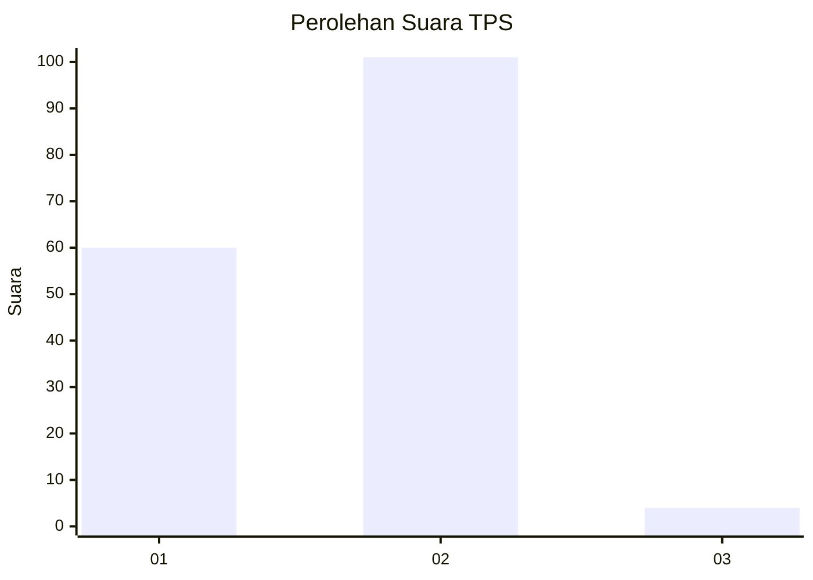
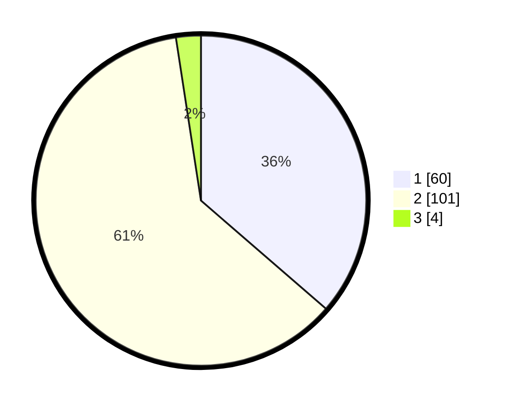

# Hasil

## Grafik

## Tabel

| No. | Nama Paslon    | Suara | Suara (raw) | Persentase |
|:--- |:-------------- | -----:| -----------:| ----------:|
| 1   | ANIES MUHAIMIN | 60    | [60][p-1]   | 36,36      |
| 2   | PRABOWO GIBRAN | 101   | [101][p-2]  | 61,21      |
| 3   | GANJAR MAHFUD  | 4     | [4][p-3]    | 2,42       |

[p-1]: https://github.com/gigit-pemilu/pemilu-2024/blob/main/pilpres/hitung-suara/sub/12-sumatera-utara/sub/05-langkat/sub/06-selesai/sub/1001-pekan-selesai/sub/008-tps/sub/paslon-1.txt
[p-2]: https://github.com/gigit-pemilu/pemilu-2024/blob/main/pilpres/hitung-suara/sub/12-sumatera-utara/sub/05-langkat/sub/06-selesai/sub/1001-pekan-selesai/sub/008-tps/sub/paslon-2.txt
[p-3]: https://github.com/gigit-pemilu/pemilu-2024/blob/main/pilpres/hitung-suara/sub/12-sumatera-utara/sub/05-langkat/sub/06-selesai/sub/1001-pekan-selesai/sub/008-tps/sub/paslon-3.txt

## Foto C Plano

https://sirekap-obj-formc.kpu.go.id/583b/pemilu/ppwp/12/05/06/10/01/1205061001008-20240223-220546--aa13e579-50d7-4f3a-996c-1c8c804e559e.jpg

https://sirekap-obj-formc.kpu.go.id/583b/pemilu/ppwp/12/05/06/10/01/1205061001008-20240223-221203--1e88eda2-0d63-40d1-9853-f0ff868a5eb9.jpg

https://sirekap-obj-formc.kpu.go.id/583b/pemilu/ppwp/12/05/06/10/01/1205061001008-20240223-221509--2b099e64-eaa0-451e-9290-2c5faa62aedb.jpg

## Metadata

| Key        | Value               |
| ---------- | ------------------- |
| Time Stamp | 2024-02-25 16:00:00 |

