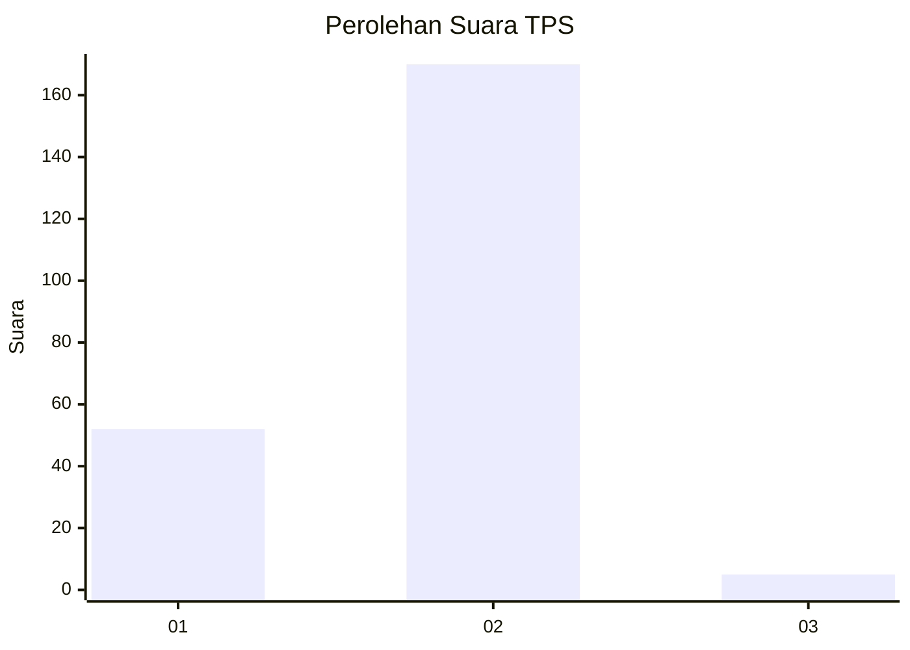
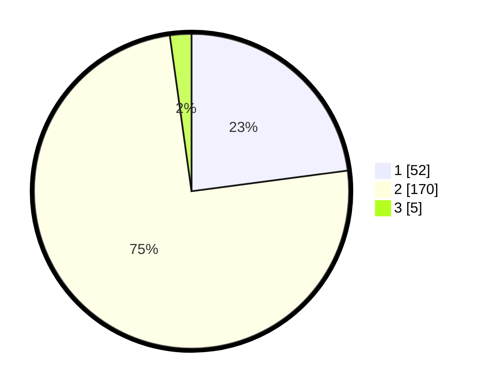

# Hasil

## Grafik

## Tabel

| No. | Nama Paslon    | Suara | Suara (raw) | Persentase |
|:--- |:-------------- | -----:| -----------:| ----------:|
| 1   | ANIES MUHAIMIN | 52    | [52][p-1]   | 22,91      |
| 2   | PRABOWO GIBRAN | 170   | [170][p-2]  | 74,89      |
| 3   | GANJAR MAHFUD  | 5     | [5][p-3]    | 2,20       |

[p-1]: https://github.com/gigit-pemilu/pemilu-2024/blob/main/pilpres/hitung-suara/sub/12-sumatera-utara/sub/05-langkat/sub/06-selesai/sub/2003-padang-brahrang/sub/010-tps/sub/paslon-1.txt
[p-2]: https://github.com/gigit-pemilu/pemilu-2024/blob/main/pilpres/hitung-suara/sub/12-sumatera-utara/sub/05-langkat/sub/06-selesai/sub/2003-padang-brahrang/sub/010-tps/sub/paslon-2.txt
[p-3]: https://github.com/gigit-pemilu/pemilu-2024/blob/main/pilpres/hitung-suara/sub/12-sumatera-utara/sub/05-langkat/sub/06-selesai/sub/2003-padang-brahrang/sub/010-tps/sub/paslon-3.txt

## Foto C Plano

https://sirekap-obj-formc.kpu.go.id/96e3/pemilu/ppwp/12/05/06/20/03/1205062003010-20240214-201108--0e8d037e-b44c-41f0-8b5d-0d814755a0e7.jpg

https://sirekap-obj-formc.kpu.go.id/96e3/pemilu/ppwp/12/05/06/20/03/1205062003010-20240214-201438--965b3f7d-240f-4947-b8aa-c8939c37b63a.jpg

https://sirekap-obj-formc.kpu.go.id/96e3/pemilu/ppwp/12/05/06/20/03/1205062003010-20240214-201611--4c857578-598f-438e-a2fc-9ec81970c986.jpg

## Metadata

| Key        | Value               |
| ---------- | ------------------- |
| Time Stamp | 2024-02-15 00:41:44 |

