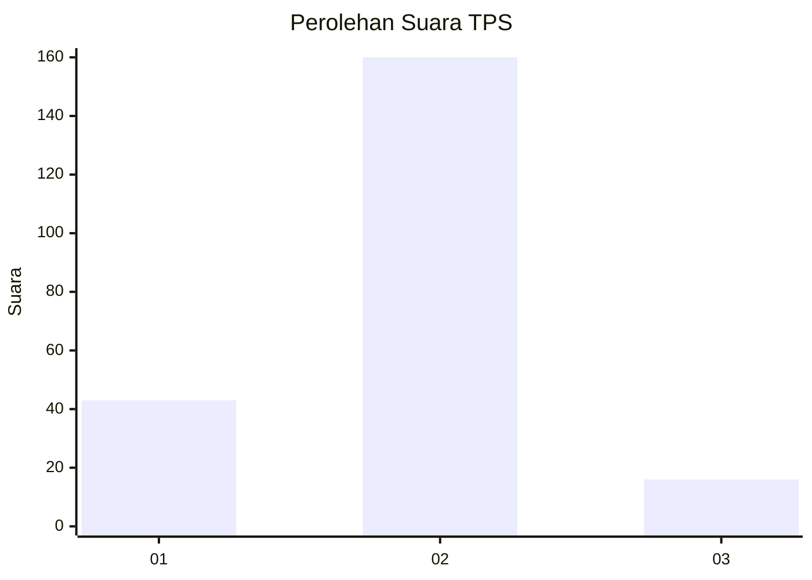
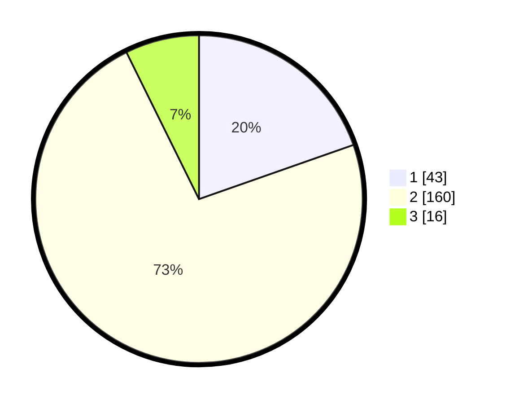

# Hasil

## Grafik

## Tabel

| No. | Nama Paslon    | Suara | Suara (raw) | Persentase |
|:--- |:-------------- | -----:| -----------:| ----------:|
| 1   | ANIES MUHAIMIN | 43    | [43][p-1]   | 19,63      |
| 2   | PRABOWO GIBRAN | 160   | [160][p-2]  | 73,06      |
| 3   | GANJAR MAHFUD  | 16    | [16][p-3]   | 7,31       |

[p-1]: https://github.com/gigit-pemilu/pemilu-2024/blob/main/pilpres/hitung-suara/sub/12-sumatera-utara/sub/05-langkat/sub/06-selesai/sub/2003-padang-brahrang/sub/012-tps/sub/paslon-1.txt
[p-2]: https://github.com/gigit-pemilu/pemilu-2024/blob/main/pilpres/hitung-suara/sub/12-sumatera-utara/sub/05-langkat/sub/06-selesai/sub/2003-padang-brahrang/sub/012-tps/sub/paslon-2.txt
[p-3]: https://github.com/gigit-pemilu/pemilu-2024/blob/main/pilpres/hitung-suara/sub/12-sumatera-utara/sub/05-langkat/sub/06-selesai/sub/2003-padang-brahrang/sub/012-tps/sub/paslon-3.txt

## Foto C Plano

https://sirekap-obj-formc.kpu.go.id/fa97/pemilu/ppwp/12/05/06/20/03/1205062003012-20240214-204052--debaba91-e679-4068-b3f9-338af5ae0254.jpg

https://sirekap-obj-formc.kpu.go.id/fa97/pemilu/ppwp/12/05/06/20/03/1205062003012-20240214-204613--e97fc8ad-8c2c-4feb-8eac-e94dbb3a2e19.jpg

https://sirekap-obj-formc.kpu.go.id/fa97/pemilu/ppwp/12/05/06/20/03/1205062003012-20240214-204717--9502285c-ee89-47cd-8886-30c5a57fa4c1.jpg

## Metadata

| Key        | Value               |
| ---------- | ------------------- |
| Time Stamp | 2024-02-15 00:41:44 |

