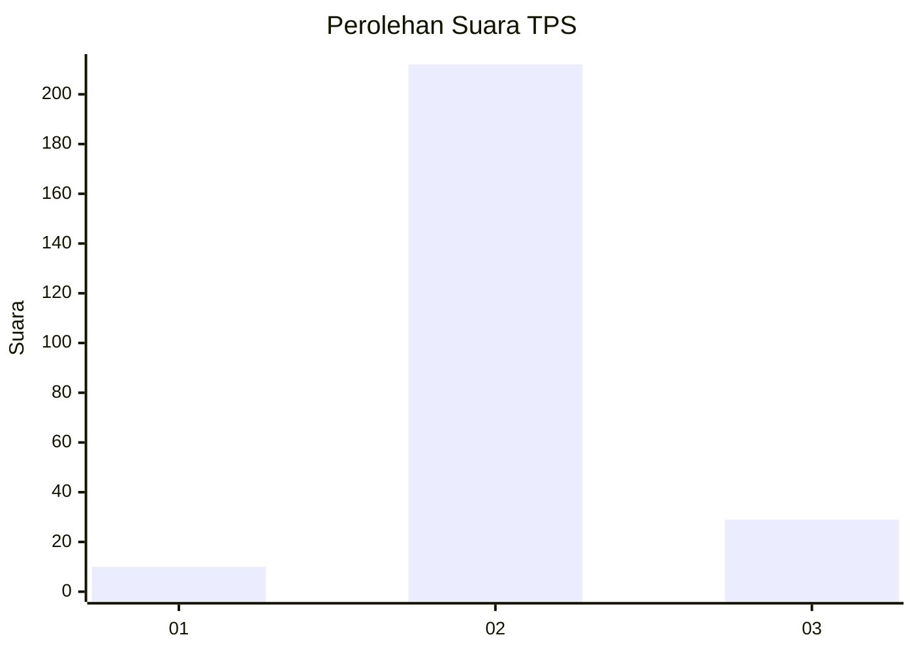
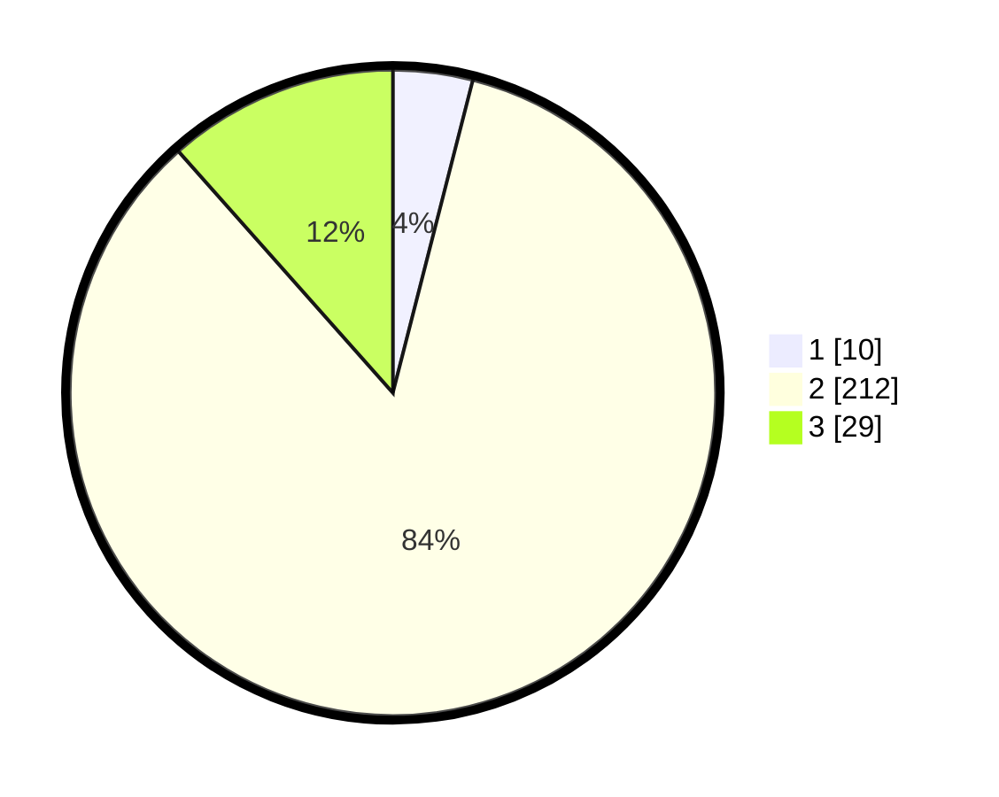

# Hasil

## Grafik

## Tabel

| No. | Nama Paslon    | Suara | Suara (raw) | Persentase |
|:--- |:-------------- | -----:| -----------:| ----------:|
| 1   | ANIES MUHAIMIN | 10    | [10][p-1]   | 3,98       |
| 2   | PRABOWO GIBRAN | 212   | [212][p-2]  | 84,46      |
| 3   | GANJAR MAHFUD  | 29    | [29][p-3]   | 11,55      |

[p-1]: https://github.com/gigit-pemilu/pemilu-2024-12-sumatera-utara/blob/main/pilpres/hitung-suara/sub/12-sumatera-utara/sub/05-langkat/sub/06-selesai/sub/2004-tanjung-merahe/sub/005-tps/sub/paslon-1.txt
[p-2]: https://github.com/gigit-pemilu/pemilu-2024-12-sumatera-utara/blob/main/pilpres/hitung-suara/sub/12-sumatera-utara/sub/05-langkat/sub/06-selesai/sub/2004-tanjung-merahe/sub/005-tps/sub/paslon-2.txt
[p-3]: https://github.com/gigit-pemilu/pemilu-2024-12-sumatera-utara/blob/main/pilpres/hitung-suara/sub/12-sumatera-utara/sub/05-langkat/sub/06-selesai/sub/2004-tanjung-merahe/sub/005-tps/sub/paslon-3.txt

## Foto C Plano

https://sirekap-obj-formc.kpu.go.id/cfd9/pemilu/ppwp/12/05/06/20/04/1205062004005-20240215-030855--4b4108ff-cb35-4901-98eb-eb8b75646fbc.jpg

https://sirekap-obj-formc.kpu.go.id/cfd9/pemilu/ppwp/12/05/06/20/04/1205062004005-20240215-031036--3b35fd41-178c-4db0-b7d2-f9152884e62b.jpg

https://sirekap-obj-formc.kpu.go.id/cfd9/pemilu/ppwp/12/05/06/20/04/1205062004005-20240215-031138--ca3f70c7-8fad-4cc9-a6a9-d179239fa5fa.jpg

## Metadata

| Key        | Value               |
| ---------- | ------------------- |
| Time Stamp | 2024-02-15 12:00:28 |

