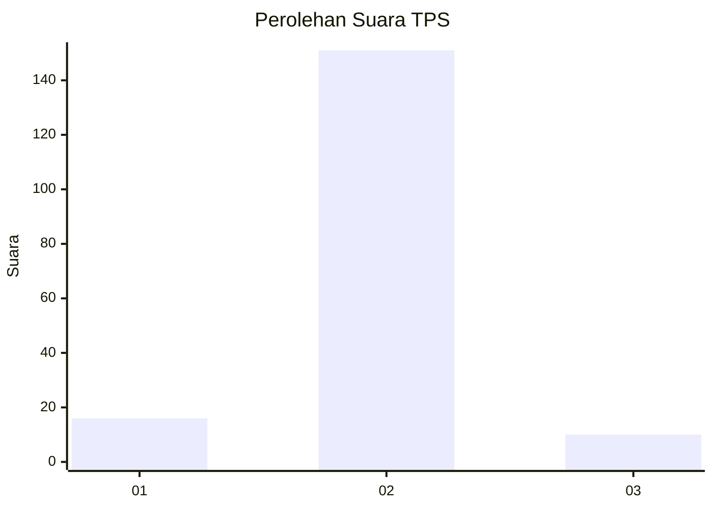
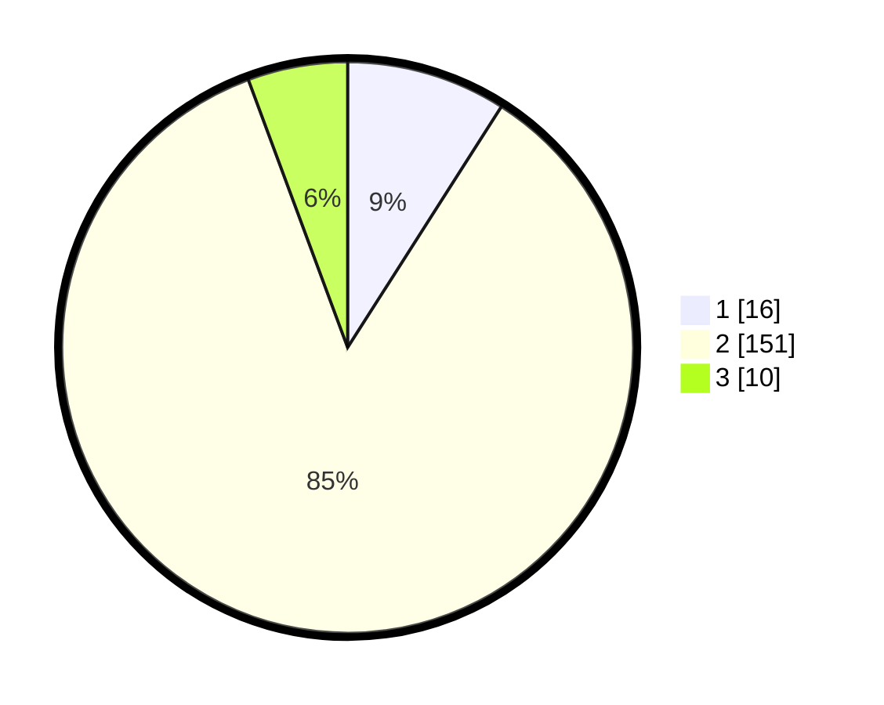

# Hasil

## Grafik

## Tabel

| No. | Nama Paslon    | Suara | Suara (raw) | Persentase |
|:--- |:-------------- | -----:| -----------:| ----------:|
| 1   | ANIES MUHAIMIN | 16    | [16][p-1]   | 9,04       |
| 2   | PRABOWO GIBRAN | 151   | [151][p-2]  | 85,31      |
| 3   | GANJAR MAHFUD  | 10    | [10][p-3]   | 5,65       |

[p-1]: https://github.com/gigit-pemilu/pemilu-2024-12-sumatera-utara/blob/main/pilpres/hitung-suara/sub/12-sumatera-utara/sub/05-langkat/sub/06-selesai/sub/2006-lau-mulgap/sub/006-tps/sub/paslon-1.txt
[p-2]: https://github.com/gigit-pemilu/pemilu-2024-12-sumatera-utara/blob/main/pilpres/hitung-suara/sub/12-sumatera-utara/sub/05-langkat/sub/06-selesai/sub/2006-lau-mulgap/sub/006-tps/sub/paslon-2.txt
[p-3]: https://github.com/gigit-pemilu/pemilu-2024-12-sumatera-utara/blob/main/pilpres/hitung-suara/sub/12-sumatera-utara/sub/05-langkat/sub/06-selesai/sub/2006-lau-mulgap/sub/006-tps/sub/paslon-3.txt

## Foto C Plano

https://sirekap-obj-formc.kpu.go.id/ef4f/pemilu/ppwp/12/05/06/20/06/1205062006006-20240215-064445--9035d7a7-a652-45b3-844a-07c8c7a8652a.jpg

https://sirekap-obj-formc.kpu.go.id/ef4f/pemilu/ppwp/12/05/06/20/06/1205062006006-20240215-065002--e0707a98-e4fe-4cb9-8da8-645a936fc5b6.jpg

https://sirekap-obj-formc.kpu.go.id/ef4f/pemilu/ppwp/12/05/06/20/06/1205062006006-20240215-065051--7cc344f9-3ee0-4e89-b8ee-0d15215dd9c6.jpg

## Metadata

| Key        | Value               |
| ---------- | ------------------- |
| Time Stamp | 2024-02-16 14:00:34 |

