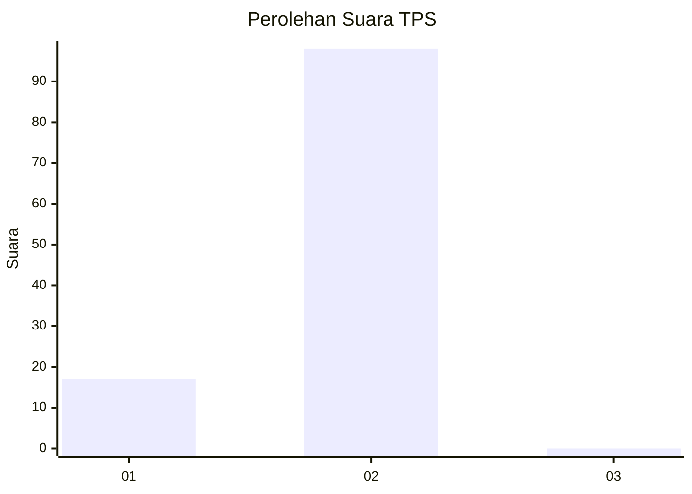
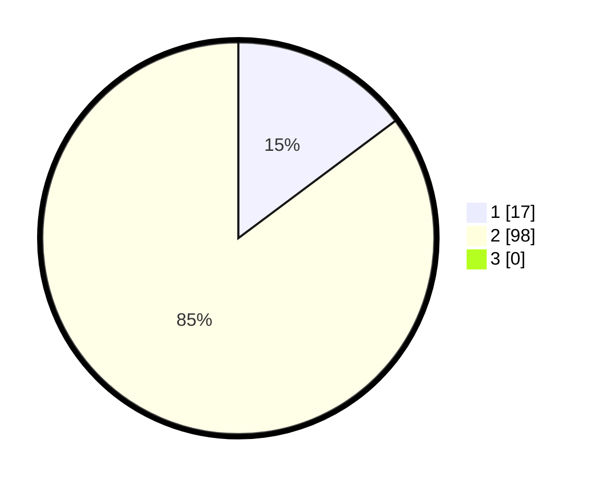

# Hasil

## Grafik

## Tabel

| No. | Nama Paslon    | Suara | Suara (raw) | Persentase |
|:--- |:-------------- | -----:| -----------:| ----------:|
| 1   | ANIES MUHAIMIN | 17    | [17][p-1]   | 14,78      |
| 2   | PRABOWO GIBRAN | 98    | [98][p-2]   | 85,22      |
| 3   | GANJAR MAHFUD  | 0     | [0][p-3]    | 0,00       |

[p-1]: https://github.com/gigit-pemilu/pemilu-2024-12-sumatera-utara/blob/main/pilpres/hitung-suara/sub/12-sumatera-utara/sub/05-langkat/sub/06-selesai/sub/2007-kuta-parit/sub/006-tps/sub/paslon-1.txt
[p-2]: https://github.com/gigit-pemilu/pemilu-2024-12-sumatera-utara/blob/main/pilpres/hitung-suara/sub/12-sumatera-utara/sub/05-langkat/sub/06-selesai/sub/2007-kuta-parit/sub/006-tps/sub/paslon-2.txt
[p-3]: https://github.com/gigit-pemilu/pemilu-2024-12-sumatera-utara/blob/main/pilpres/hitung-suara/sub/12-sumatera-utara/sub/05-langkat/sub/06-selesai/sub/2007-kuta-parit/sub/006-tps/sub/paslon-3.txt

## Foto C Plano

https://sirekap-obj-formc.kpu.go.id/947b/pemilu/ppwp/12/05/06/20/07/1205062007006-20240214-220731--87856b7d-ec1d-493d-a5e9-3a6ca64a0a68.jpg

https://sirekap-obj-formc.kpu.go.id/947b/pemilu/ppwp/12/05/06/20/07/1205062007006-20240220-100936--a4493bce-740f-411d-b826-19c7c3fb7672.jpg

https://sirekap-obj-formc.kpu.go.id/947b/pemilu/ppwp/12/05/06/20/07/1205062007006-20240214-193645--71d67ec5-2b12-4d11-9a86-d045a8dc6ed0.jpg

## Metadata

| Key        | Value               |
| ---------- | ------------------- |
| Time Stamp | 2024-02-25 15:00:00 |

