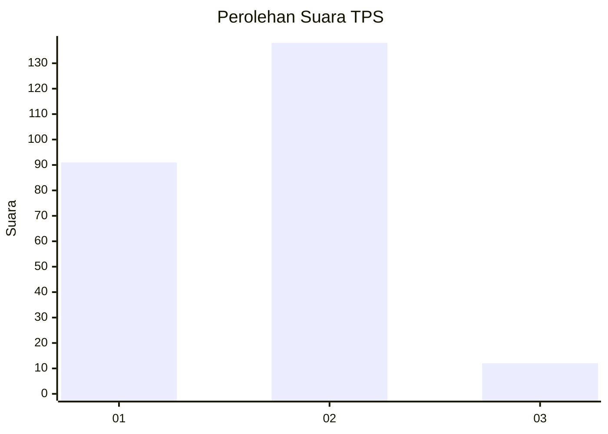
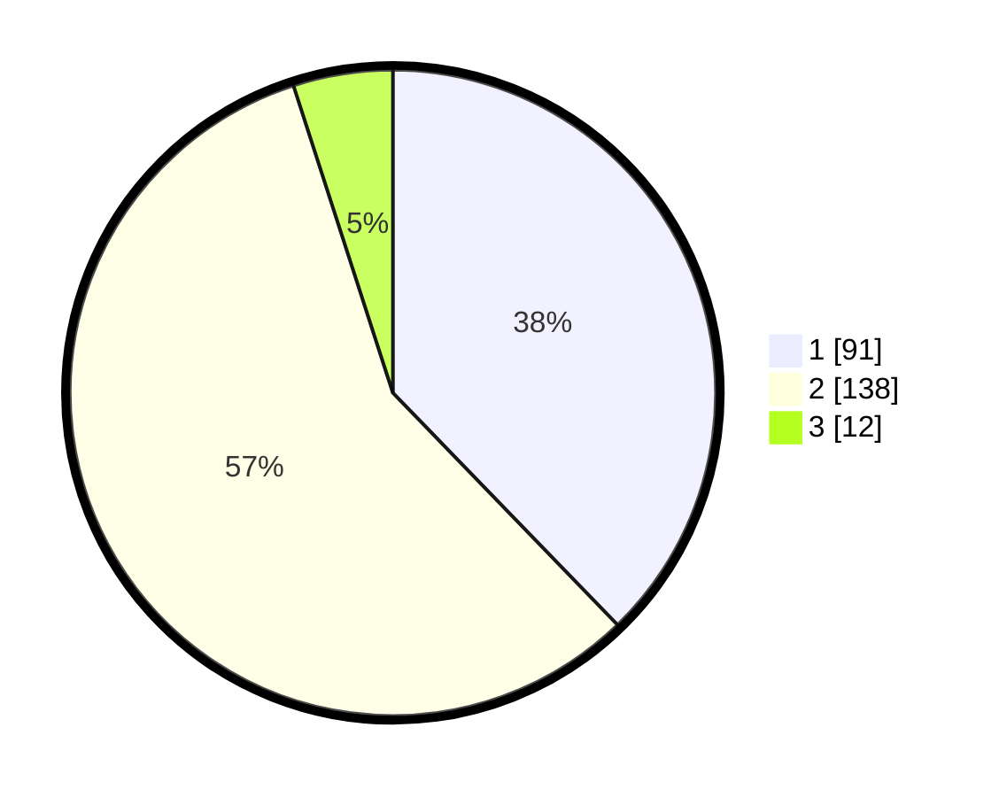

# Hasil

## Grafik

## Tabel

| No. | Nama Paslon    | Suara | Suara (raw) | Persentase |
|:--- |:-------------- | -----:| -----------:| ----------:|
| 1   | ANIES MUHAIMIN | 91    | [91][p-1]   | 37,76      |
| 2   | PRABOWO GIBRAN | 138   | [138][p-2]  | 57,26      |
| 3   | GANJAR MAHFUD  | 12    | [12][p-3]   | 4,98       |

[p-1]: https://github.com/gigit-pemilu/pemilu-2024-12-sumatera-utara/blob/main/pilpres/hitung-suara/sub/12-sumatera-utara/sub/05-langkat/sub/07-stabat/sub/1004-perdamaian/sub/001-tps/sub/paslon-1.txt
[p-2]: https://github.com/gigit-pemilu/pemilu-2024-12-sumatera-utara/blob/main/pilpres/hitung-suara/sub/12-sumatera-utara/sub/05-langkat/sub/07-stabat/sub/1004-perdamaian/sub/001-tps/sub/paslon-2.txt
[p-3]: https://github.com/gigit-pemilu/pemilu-2024-12-sumatera-utara/blob/main/pilpres/hitung-suara/sub/12-sumatera-utara/sub/05-langkat/sub/07-stabat/sub/1004-perdamaian/sub/001-tps/sub/paslon-3.txt

## Foto C Plano

https://sirekap-obj-formc.kpu.go.id/9a55/pemilu/ppwp/12/05/07/10/04/1205071004001-20240214-220553--d9b03867-e7e3-421a-a69a-5feeb15d6891.jpg

https://sirekap-obj-formc.kpu.go.id/9a55/pemilu/ppwp/12/05/07/10/04/1205071004001-20240215-005443--2faea1d8-bae0-4c6b-9b48-8ea2b14f5e3b.jpg

https://sirekap-obj-formc.kpu.go.id/9a55/pemilu/ppwp/12/05/07/10/04/1205071004001-20240215-005835--b5e64abc-2255-4bb5-b089-86118b42f53b.jpg

## Metadata

| Key        | Value               |
| ---------- | ------------------- |
| Time Stamp | 2024-02-16 12:51:22 |

