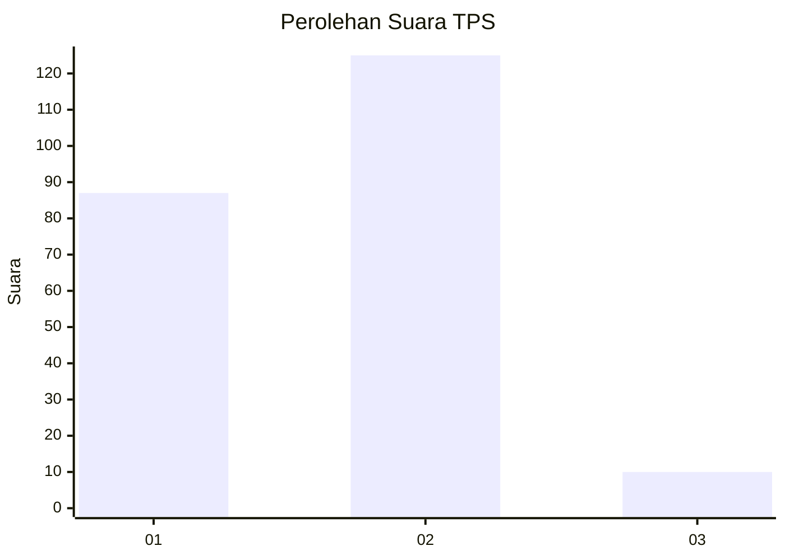
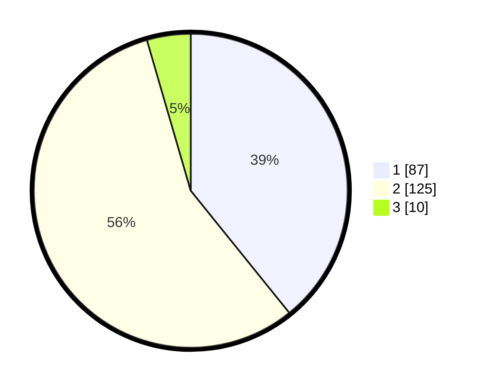

# Hasil

## Grafik

## Tabel

| No. | Nama Paslon    | Suara | Suara (raw) | Persentase |
|:--- |:-------------- | -----:| -----------:| ----------:|
| 1   | ANIES MUHAIMIN | 87    | [87][p-1]   | 39,19      |
| 2   | PRABOWO GIBRAN | 125   | [125][p-2]  | 56,31      |
| 3   | GANJAR MAHFUD  | 10    | [10][p-3]   | 4,50       |

[p-1]: https://github.com/gigit-pemilu/pemilu-2024-12-sumatera-utara/blob/main/pilpres/hitung-suara/sub/12-sumatera-utara/sub/05-langkat/sub/07-stabat/sub/1004-perdamaian/sub/002-tps/sub/paslon-1.txt
[p-2]: https://github.com/gigit-pemilu/pemilu-2024-12-sumatera-utara/blob/main/pilpres/hitung-suara/sub/12-sumatera-utara/sub/05-langkat/sub/07-stabat/sub/1004-perdamaian/sub/002-tps/sub/paslon-2.txt
[p-3]: https://github.com/gigit-pemilu/pemilu-2024-12-sumatera-utara/blob/main/pilpres/hitung-suara/sub/12-sumatera-utara/sub/05-langkat/sub/07-stabat/sub/1004-perdamaian/sub/002-tps/sub/paslon-3.txt

## Foto C Plano

https://sirekap-obj-formc.kpu.go.id/7afb/pemilu/ppwp/12/05/07/10/04/1205071004002-20240214-235810--7c669bc7-7259-4b78-baf6-d2d9eb65a2f3.jpg

https://sirekap-obj-formc.kpu.go.id/7afb/pemilu/ppwp/12/05/07/10/04/1205071004002-20240215-000045--224959a0-845e-4cc3-91e3-37d4dc8c5eca.jpg

https://sirekap-obj-formc.kpu.go.id/7afb/pemilu/ppwp/12/05/07/10/04/1205071004002-20240215-000153--415d557d-165d-47dc-8d0d-5e41dc445abb.jpg

## Metadata

| Key        | Value               |
| ---------- | ------------------- |
| Time Stamp | 2024-02-15 17:30:25 |

