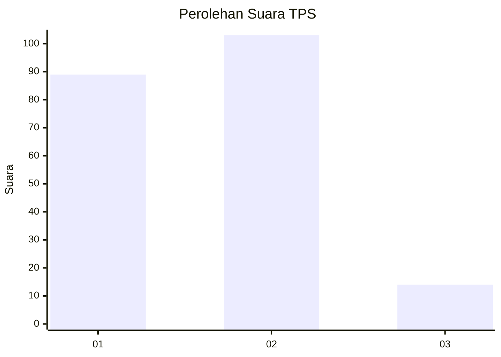
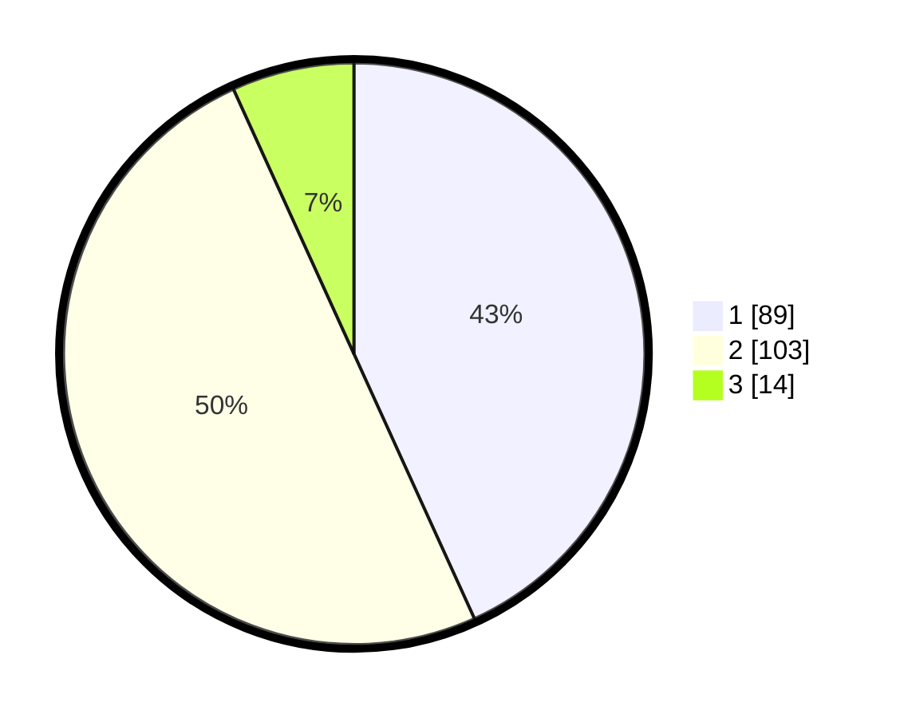

# Hasil

## Grafik

## Tabel

| No. | Nama Paslon    | Suara | Suara (raw) | Persentase |
|:--- |:-------------- | -----:| -----------:| ----------:|
| 1   | ANIES MUHAIMIN | 89    | [89][p-1]   | 43,20      |
| 2   | PRABOWO GIBRAN | 103   | [103][p-2]  | 50,00      |
| 3   | GANJAR MAHFUD  | 14    | [14][p-3]   | 6,80       |

[p-1]: https://github.com/gigit-pemilu/pemilu-2024-12-sumatera-utara/blob/main/pilpres/hitung-suara/sub/12-sumatera-utara/sub/05-langkat/sub/07-stabat/sub/1004-perdamaian/sub/003-tps/sub/paslon-1.txt
[p-2]: https://github.com/gigit-pemilu/pemilu-2024-12-sumatera-utara/blob/main/pilpres/hitung-suara/sub/12-sumatera-utara/sub/05-langkat/sub/07-stabat/sub/1004-perdamaian/sub/003-tps/sub/paslon-2.txt
[p-3]: https://github.com/gigit-pemilu/pemilu-2024-12-sumatera-utara/blob/main/pilpres/hitung-suara/sub/12-sumatera-utara/sub/05-langkat/sub/07-stabat/sub/1004-perdamaian/sub/003-tps/sub/paslon-3.txt

## Foto C Plano

https://sirekap-obj-formc.kpu.go.id/59db/pemilu/ppwp/12/05/07/10/04/1205071004003-20240214-234012--87874917-d1b0-4ac7-99bd-0ffc27dec2f0.jpg

https://sirekap-obj-formc.kpu.go.id/59db/pemilu/ppwp/12/05/07/10/04/1205071004003-20240214-214456--f3ac5af1-5197-4e28-b71f-51d020b8d0cd.jpg

https://sirekap-obj-formc.kpu.go.id/59db/pemilu/ppwp/12/05/07/10/04/1205071004003-20240214-214537--b5b4ab02-1bd6-4260-8156-3698c1f41999.jpg

## Metadata

| Key        | Value               |
| ---------- | ------------------- |
| Time Stamp | 2024-02-15 18:30:25 |

