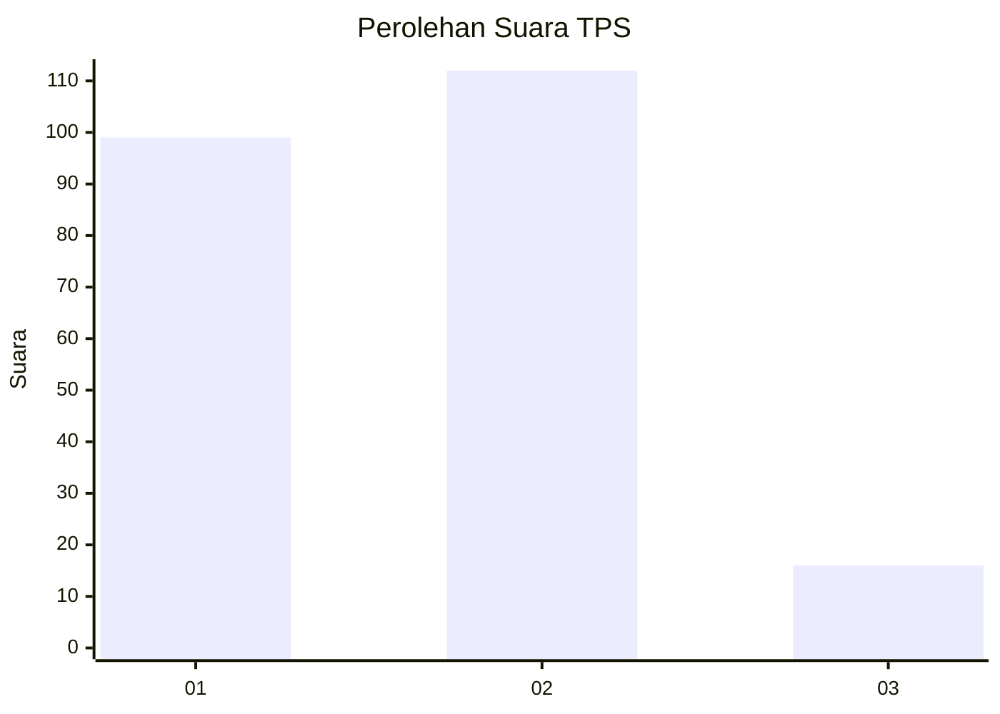
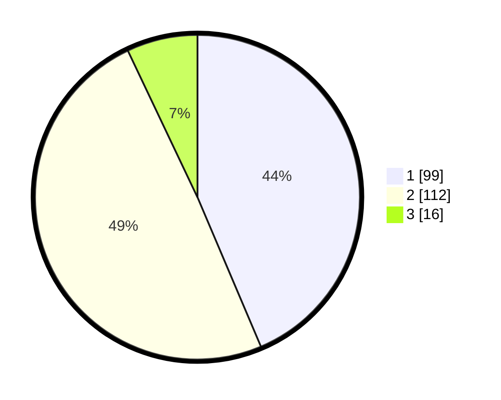

# Hasil

## Grafik

## Tabel

| No. | Nama Paslon    | Suara | Suara (raw) | Persentase |
|:--- |:-------------- | -----:| -----------:| ----------:|
| 1   | ANIES MUHAIMIN | 99    | [99][p-1]   | 43,61      |
| 2   | PRABOWO GIBRAN | 112   | [112][p-2]  | 49,34      |
| 3   | GANJAR MAHFUD  | 16    | [16][p-3]   | 7,05       |

[p-1]: https://github.com/gigit-pemilu/pemilu-2024/blob/main/pilpres/hitung-suara/sub/12-sumatera-utara/sub/05-langkat/sub/07-stabat/sub/1004-perdamaian/sub/005-tps/sub/paslon-1.txt
[p-2]: https://github.com/gigit-pemilu/pemilu-2024/blob/main/pilpres/hitung-suara/sub/12-sumatera-utara/sub/05-langkat/sub/07-stabat/sub/1004-perdamaian/sub/005-tps/sub/paslon-2.txt
[p-3]: https://github.com/gigit-pemilu/pemilu-2024/blob/main/pilpres/hitung-suara/sub/12-sumatera-utara/sub/05-langkat/sub/07-stabat/sub/1004-perdamaian/sub/005-tps/sub/paslon-3.txt

## Foto C Plano

https://sirekap-obj-formc.kpu.go.id/5eae/pemilu/ppwp/12/05/07/10/04/1205071004005-20240215-024544--f563ae94-56ee-4ace-8b68-f373d3b72b87.jpg

https://sirekap-obj-formc.kpu.go.id/5eae/pemilu/ppwp/12/05/07/10/04/1205071004005-20240215-024653--b280cf1c-0d5f-48c2-a10d-30d5c96efa30.jpg

https://sirekap-obj-formc.kpu.go.id/5eae/pemilu/ppwp/12/05/07/10/04/1205071004005-20240215-024816--ba8042f0-e28f-491b-858c-f1856d2fb87c.jpg

## Metadata

| Key        | Value               |
| ---------- | ------------------- |
| Time Stamp | 2024-02-15 15:00:29 |

