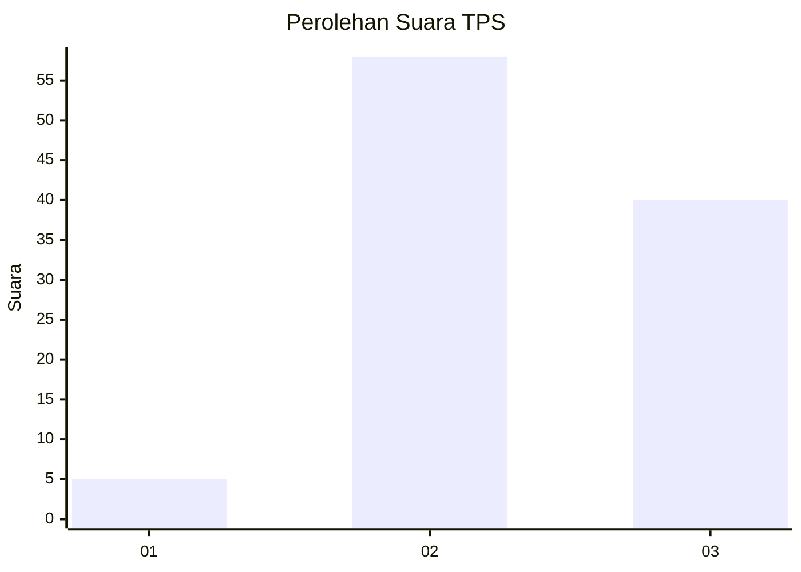
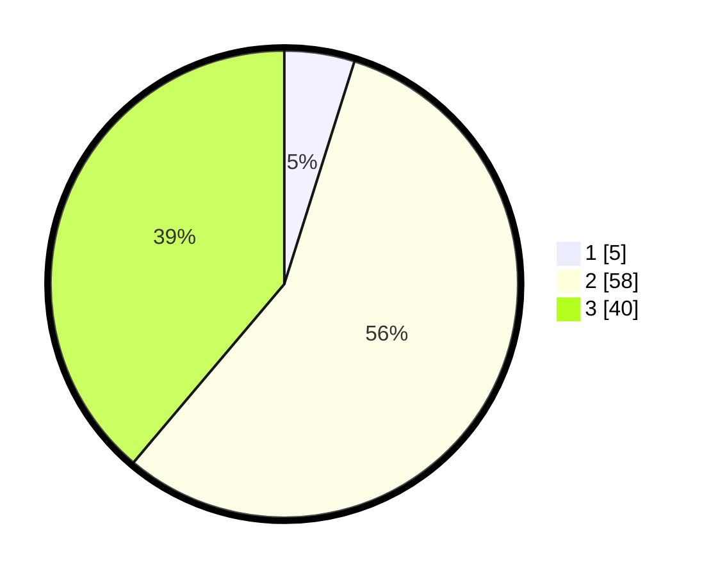

# Hasil

## Grafik

## Tabel

| No. | Nama Paslon    | Suara | Suara (raw) | Persentase |
|:--- |:-------------- | -----:| -----------:| ----------:|
| 1   | ANIES MUHAIMIN | 5     | [5][p-1]    | 4,85       |
| 2   | PRABOWO GIBRAN | 58    | [58][p-2]   | 56,31      |
| 3   | GANJAR MAHFUD  | 40    | [40][p-3]   | 38,83      |

[p-1]: https://github.com/gigit-pemilu/pemilu-2024/blob/main/pilpres/hitung-suara/sub/12-sumatera-utara/sub/05-langkat/sub/07-stabat/sub/1004-perdamaian/sub/032-tps/sub/paslon-1.txt
[p-2]: https://github.com/gigit-pemilu/pemilu-2024/blob/main/pilpres/hitung-suara/sub/12-sumatera-utara/sub/05-langkat/sub/07-stabat/sub/1004-perdamaian/sub/032-tps/sub/paslon-2.txt
[p-3]: https://github.com/gigit-pemilu/pemilu-2024/blob/main/pilpres/hitung-suara/sub/12-sumatera-utara/sub/05-langkat/sub/07-stabat/sub/1004-perdamaian/sub/032-tps/sub/paslon-3.txt

## Foto C Plano

https://sirekap-obj-formc.kpu.go.id/b9eb/pemilu/ppwp/12/05/07/10/04/1205071004032-20240214-214841--0c85eb84-18ec-4377-843c-2ceccdabf2d3.jpg

https://sirekap-obj-formc.kpu.go.id/b9eb/pemilu/ppwp/12/05/07/10/04/1205071004032-20240214-160139--2d0a12a6-22c4-484a-a556-c6a1b3024264.jpg

https://sirekap-obj-formc.kpu.go.id/b9eb/pemilu/ppwp/12/05/07/10/04/1205071004032-20240214-214858--2a6a5c53-9928-4aee-a0de-578bab751b9f.jpg

## Metadata

| Key        | Value               |
| ---------- | ------------------- |
| Time Stamp | 2024-02-15 09:00:24 |

