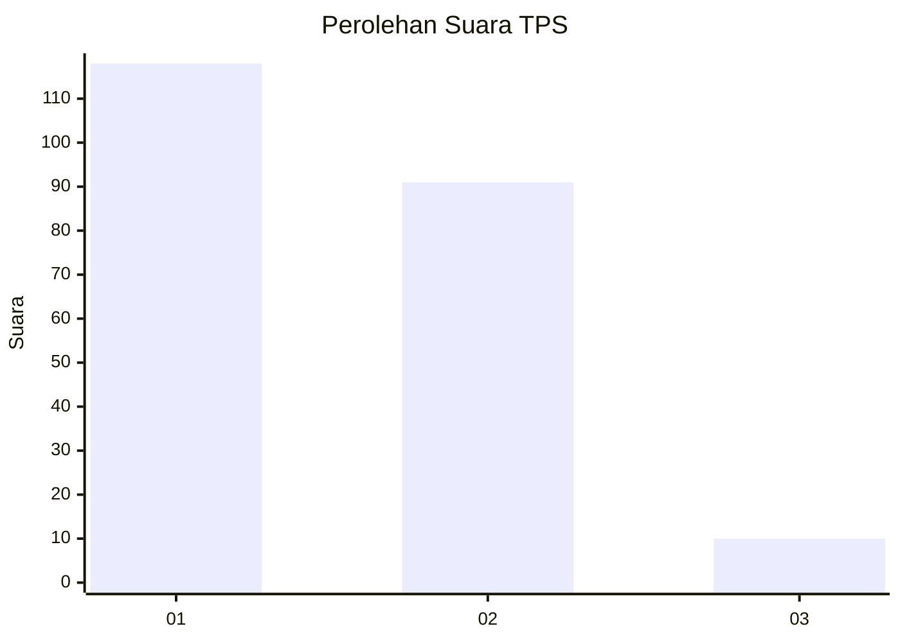
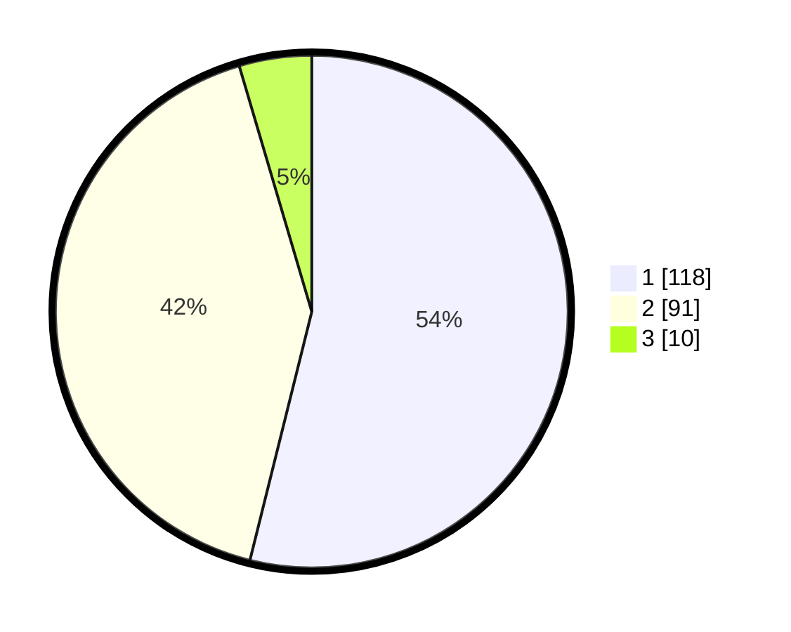

# Hasil

## Grafik

## Tabel

| No. | Nama Paslon    | Suara | Suara (raw) | Persentase |
|:--- |:-------------- | -----:| -----------:| ----------:|
| 1   | ANIES MUHAIMIN | 118   | [118][p-1]  | 53,88      |
| 2   | PRABOWO GIBRAN | 91    | [91][p-2]   | 41,55      |
| 3   | GANJAR MAHFUD  | 10    | [10][p-3]   | 4,57       |

[p-1]: https://github.com/gigit-pemilu/pemilu-2024/blob/main/pilpres/hitung-suara/sub/12-sumatera-utara/sub/05-langkat/sub/07-stabat/sub/1005-kwala-bingai/sub/002-tps/sub/paslon-1.txt
[p-2]: https://github.com/gigit-pemilu/pemilu-2024/blob/main/pilpres/hitung-suara/sub/12-sumatera-utara/sub/05-langkat/sub/07-stabat/sub/1005-kwala-bingai/sub/002-tps/sub/paslon-2.txt
[p-3]: https://github.com/gigit-pemilu/pemilu-2024/blob/main/pilpres/hitung-suara/sub/12-sumatera-utara/sub/05-langkat/sub/07-stabat/sub/1005-kwala-bingai/sub/002-tps/sub/paslon-3.txt

## Foto C Plano

https://sirekap-obj-formc.kpu.go.id/198a/pemilu/ppwp/12/05/07/10/05/1205071005002-20240214-203627--ac1a102d-ce7a-496e-b27c-ef062ae66e59.jpg

https://sirekap-obj-formc.kpu.go.id/198a/pemilu/ppwp/12/05/07/10/05/1205071005002-20240214-203632--5847cca0-5325-4f1b-838c-1b2ed8453f59.jpg

https://sirekap-obj-formc.kpu.go.id/198a/pemilu/ppwp/12/05/07/10/05/1205071005002-20240214-194126--9f459ae9-a7ff-4085-9d9b-f210f728584e.jpg

## Metadata

| Key        | Value               |
| ---------- | ------------------- |
| Time Stamp | 2024-02-15 00:41:44 |

