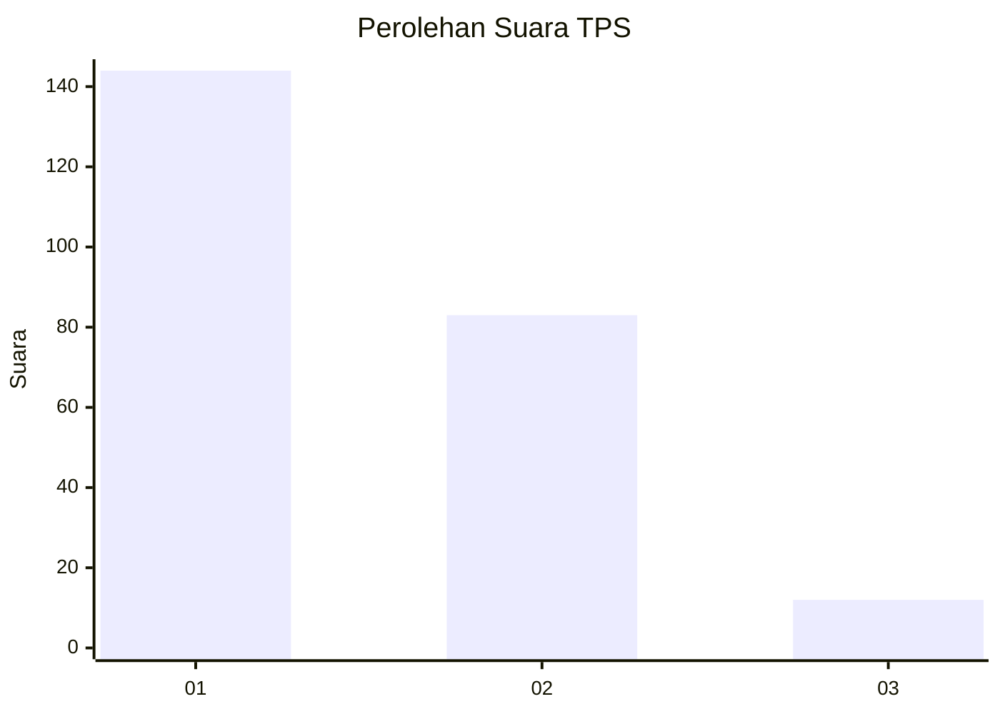
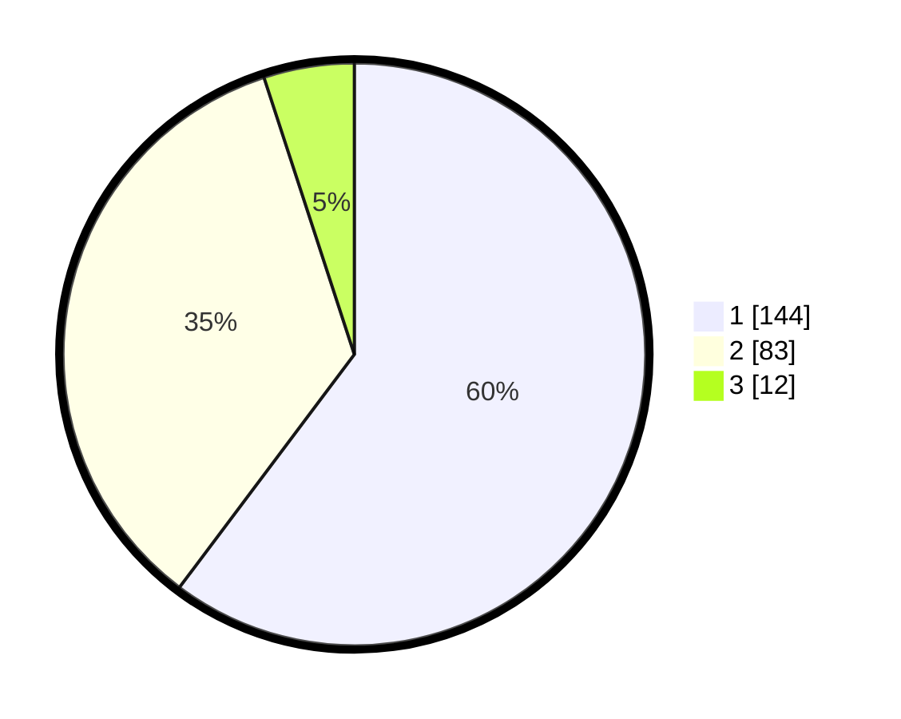

# Hasil

## Grafik

## Tabel

| No. | Nama Paslon    | Suara | Suara (raw) | Persentase |
|:--- |:-------------- | -----:| -----------:| ----------:|
| 1   | ANIES MUHAIMIN | 144   | [144][p-1]  | 60,25      |
| 2   | PRABOWO GIBRAN | 83    | [83][p-2]   | 34,73      |
| 3   | GANJAR MAHFUD  | 12    | [12][p-3]   | 5,02       |

[p-1]: https://github.com/gigit-pemilu/pemilu-2024-12-sumatera-utara/blob/main/pilpres/hitung-suara/sub/12-sumatera-utara/sub/05-langkat/sub/07-stabat/sub/1005-kwala-bingai/sub/003-tps/sub/paslon-1.txt
[p-2]: https://github.com/gigit-pemilu/pemilu-2024-12-sumatera-utara/blob/main/pilpres/hitung-suara/sub/12-sumatera-utara/sub/05-langkat/sub/07-stabat/sub/1005-kwala-bingai/sub/003-tps/sub/paslon-2.txt
[p-3]: https://github.com/gigit-pemilu/pemilu-2024-12-sumatera-utara/blob/main/pilpres/hitung-suara/sub/12-sumatera-utara/sub/05-langkat/sub/07-stabat/sub/1005-kwala-bingai/sub/003-tps/sub/paslon-3.txt

## Foto C Plano

https://sirekap-obj-formc.kpu.go.id/6c33/pemilu/ppwp/12/05/07/10/05/1205071005003-20240215-031449--659d0e63-e584-4c7e-8700-ddd20a6c4ebf.jpg

https://sirekap-obj-formc.kpu.go.id/6c33/pemilu/ppwp/12/05/07/10/05/1205071005003-20240215-033519--87bc6698-7ecb-4281-954d-7aaed3bc56db.jpg

https://sirekap-obj-formc.kpu.go.id/6c33/pemilu/ppwp/12/05/07/10/05/1205071005003-20240215-034028--3ddd61ec-c3ed-496d-adeb-6dd382b8e87a.jpg

## Metadata

| Key        | Value               |
| ---------- | ------------------- |
| Time Stamp | 2024-02-15 15:00:29 |

