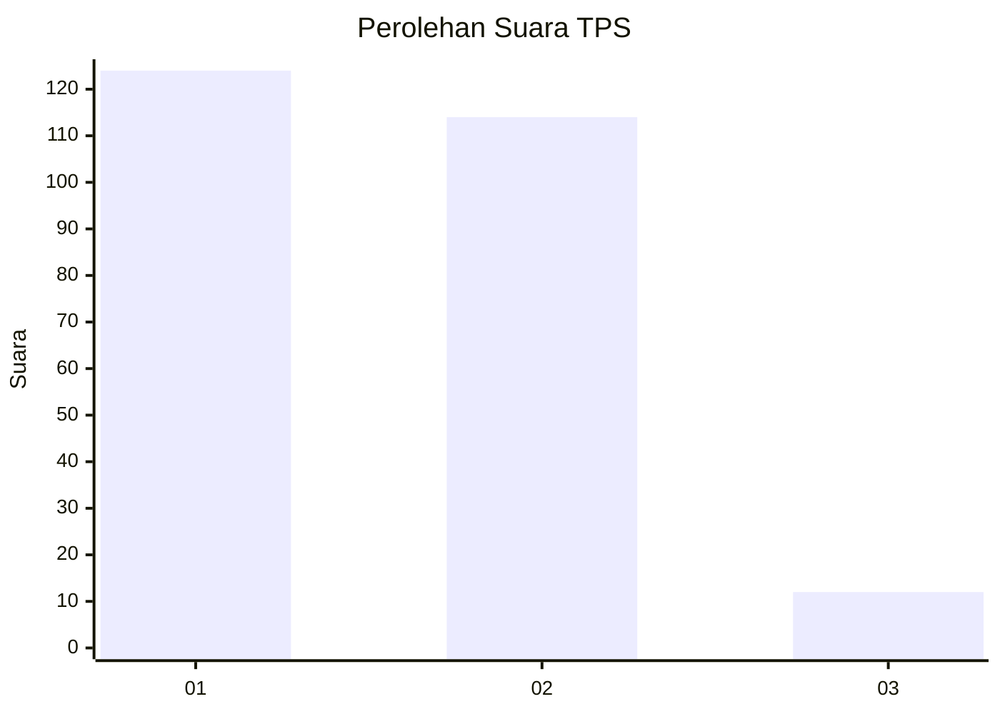
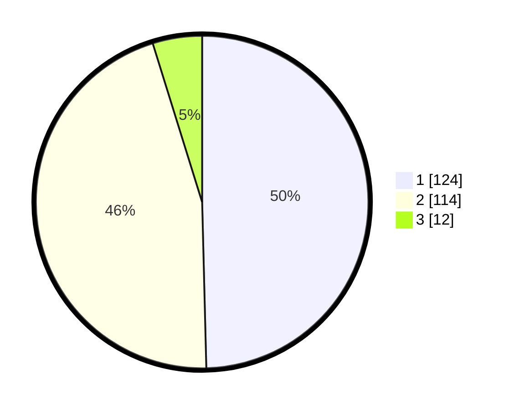

# Hasil

## Grafik

## Tabel

| No. | Nama Paslon    | Suara | Suara (raw) | Persentase |
|:--- |:-------------- | -----:| -----------:| ----------:|
| 1   | ANIES MUHAIMIN | 124   | [124][p-1]  | 49,60      |
| 2   | PRABOWO GIBRAN | 114   | [114][p-2]  | 45,60      |
| 3   | GANJAR MAHFUD  | 12    | [12][p-3]   | 4,80       |

[p-1]: https://github.com/gigit-pemilu/pemilu-2024-12-sumatera-utara/blob/main/pilpres/hitung-suara/sub/12-sumatera-utara/sub/05-langkat/sub/07-stabat/sub/1005-kwala-bingai/sub/010-tps/sub/paslon-1.txt
[p-2]: https://github.com/gigit-pemilu/pemilu-2024-12-sumatera-utara/blob/main/pilpres/hitung-suara/sub/12-sumatera-utara/sub/05-langkat/sub/07-stabat/sub/1005-kwala-bingai/sub/010-tps/sub/paslon-2.txt
[p-3]: https://github.com/gigit-pemilu/pemilu-2024-12-sumatera-utara/blob/main/pilpres/hitung-suara/sub/12-sumatera-utara/sub/05-langkat/sub/07-stabat/sub/1005-kwala-bingai/sub/010-tps/sub/paslon-3.txt

## Foto C Plano

https://sirekap-obj-formc.kpu.go.id/e5df/pemilu/ppwp/12/05/07/10/05/1205071005010-20240215-013109--8b74e8d6-a684-4d26-bd02-e19d4d915ec6.jpg

https://sirekap-obj-formc.kpu.go.id/e5df/pemilu/ppwp/12/05/07/10/05/1205071005010-20240215-013256--281137b5-f312-46aa-9605-7eb443ae3642.jpg

https://sirekap-obj-formc.kpu.go.id/e5df/pemilu/ppwp/12/05/07/10/05/1205071005010-20240215-013347--7bf0f8b0-46cc-4a1f-97dc-bfeb26f86330.jpg

## Metadata

| Key        | Value               |
| ---------- | ------------------- |
| Time Stamp | 2024-02-15 05:00:24 |

