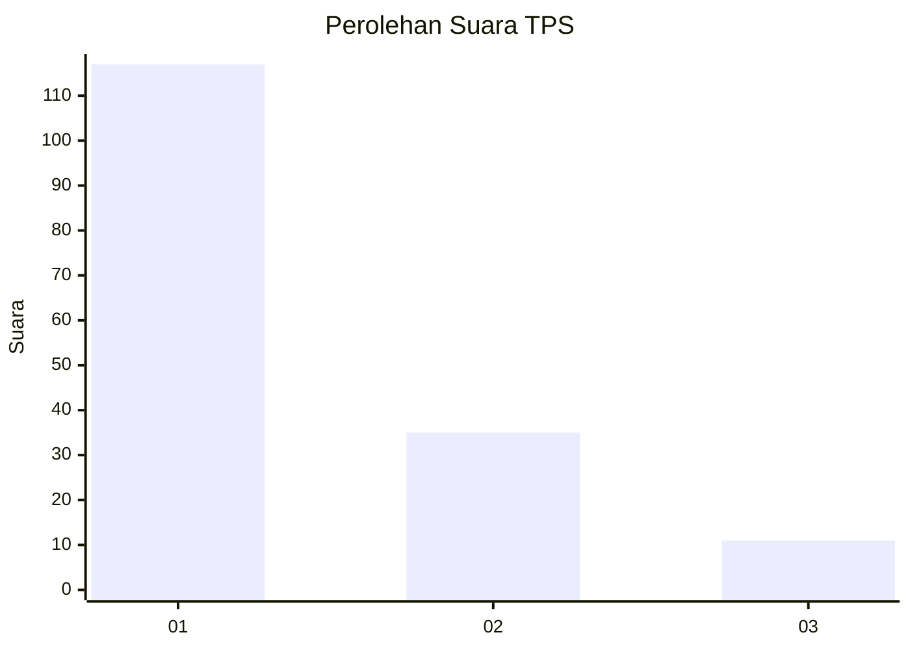
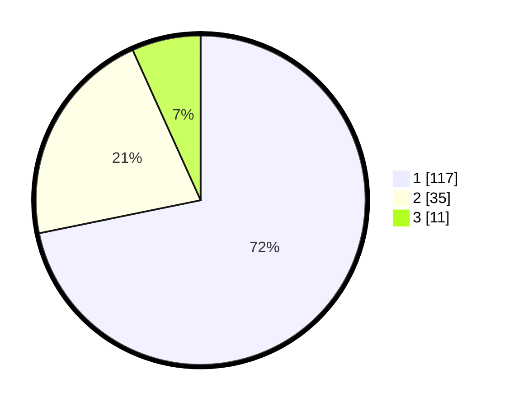

# Hasil

## Grafik

## Tabel

| No. | Nama Paslon    | Suara | Suara (raw) | Persentase |
|:--- |:-------------- | -----:| -----------:| ----------:|
| 1   | ANIES MUHAIMIN | 117   | [117][p-1]  | 71,78      |
| 2   | PRABOWO GIBRAN | 35    | [35][p-2]   | 21,47      |
| 3   | GANJAR MAHFUD  | 11    | [11][p-3]   | 6,75       |

[p-1]: https://github.com/gigit-pemilu/pemilu-2024-12-sumatera-utara/blob/main/pilpres/hitung-suara/sub/12-sumatera-utara/sub/05-langkat/sub/07-stabat/sub/1005-kwala-bingai/sub/016-tps/sub/paslon-1.txt
[p-2]: https://github.com/gigit-pemilu/pemilu-2024-12-sumatera-utara/blob/main/pilpres/hitung-suara/sub/12-sumatera-utara/sub/05-langkat/sub/07-stabat/sub/1005-kwala-bingai/sub/016-tps/sub/paslon-2.txt
[p-3]: https://github.com/gigit-pemilu/pemilu-2024-12-sumatera-utara/blob/main/pilpres/hitung-suara/sub/12-sumatera-utara/sub/05-langkat/sub/07-stabat/sub/1005-kwala-bingai/sub/016-tps/sub/paslon-3.txt

## Foto C Plano

https://sirekap-obj-formc.kpu.go.id/478d/pemilu/ppwp/12/05/07/10/05/1205071005016-20240214-220558--ee57ba45-f461-4a0d-824c-33b07e0691fe.jpg

https://sirekap-obj-formc.kpu.go.id/478d/pemilu/ppwp/12/05/07/10/05/1205071005016-20240214-221701--f8b571c3-4f96-4b07-8c8b-7034d6f4bf37.jpg

https://sirekap-obj-formc.kpu.go.id/478d/pemilu/ppwp/12/05/07/10/05/1205071005016-20240214-220923--703c00cf-1887-4d1f-815a-b83e510e7570.jpg

## Metadata

| Key        | Value               |
| ---------- | ------------------- |
| Time Stamp | 2024-02-16 01:00:27 |

