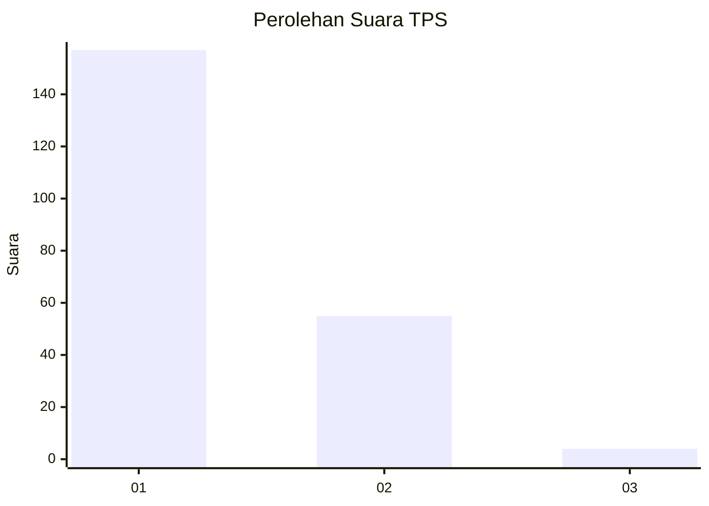
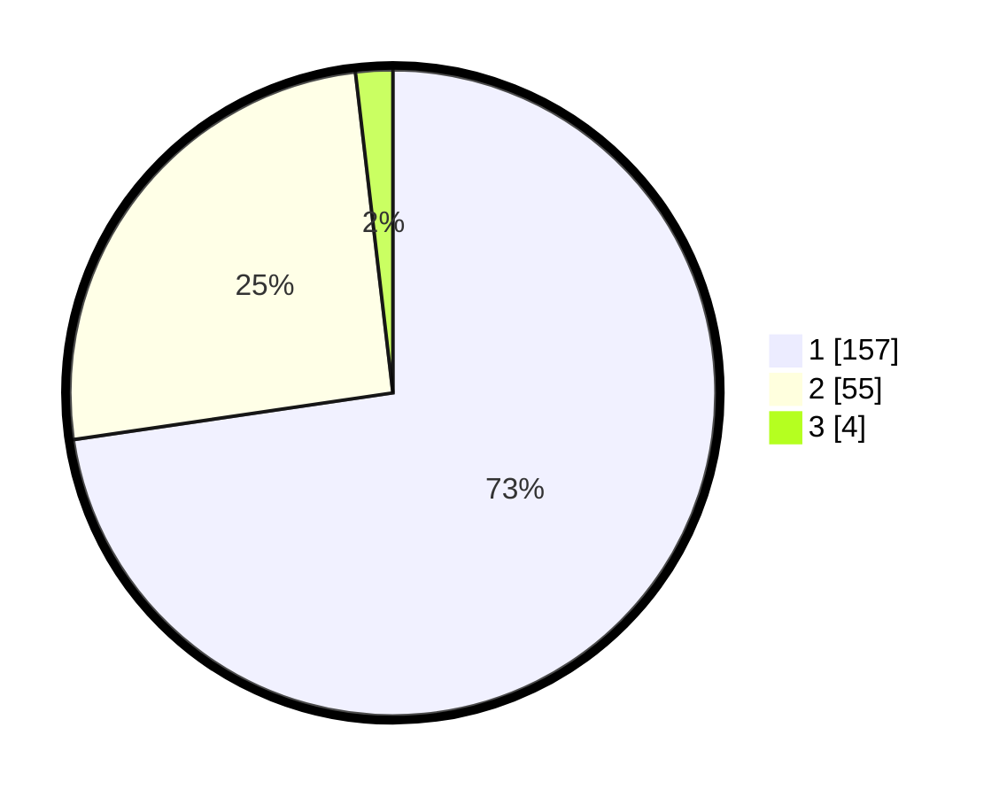

# Hasil

## Grafik

## Tabel

| No. | Nama Paslon    | Suara | Suara (raw) | Persentase |
|:--- |:-------------- | -----:| -----------:| ----------:|
| 1   | ANIES MUHAIMIN | 157   | [157][p-1]  | 72,69      |
| 2   | PRABOWO GIBRAN | 55    | [55][p-2]   | 25,46      |
| 3   | GANJAR MAHFUD  | 4     | [4][p-3]    | 1,85       |

[p-1]: https://github.com/gigit-pemilu/pemilu-2024-12-sumatera-utara/blob/main/pilpres/hitung-suara/sub/12-sumatera-utara/sub/05-langkat/sub/07-stabat/sub/1010-stabat-baru/sub/020-tps/sub/paslon-1.txt
[p-2]: https://github.com/gigit-pemilu/pemilu-2024-12-sumatera-utara/blob/main/pilpres/hitung-suara/sub/12-sumatera-utara/sub/05-langkat/sub/07-stabat/sub/1010-stabat-baru/sub/020-tps/sub/paslon-2.txt
[p-3]: https://github.com/gigit-pemilu/pemilu-2024-12-sumatera-utara/blob/main/pilpres/hitung-suara/sub/12-sumatera-utara/sub/05-langkat/sub/07-stabat/sub/1010-stabat-baru/sub/020-tps/sub/paslon-3.txt

## Foto C Plano

https://sirekap-obj-formc.kpu.go.id/80ff/pemilu/ppwp/12/05/07/10/10/1205071010020-20240214-214604--90507ede-4933-462e-ad9b-8d1d944de841.jpg

https://sirekap-obj-formc.kpu.go.id/80ff/pemilu/ppwp/12/05/07/10/10/1205071010020-20240214-214738--04d491bd-1417-41d3-bef1-2b47530f25ce.jpg

https://sirekap-obj-formc.kpu.go.id/80ff/pemilu/ppwp/12/05/07/10/10/1205071010020-20240214-210934--19a7bd3b-cb94-43bd-9b16-fb67714ceadc.jpg

## Metadata

| Key        | Value               |
| ---------- | ------------------- |
| Time Stamp | 2024-02-15 15:00:29 |

