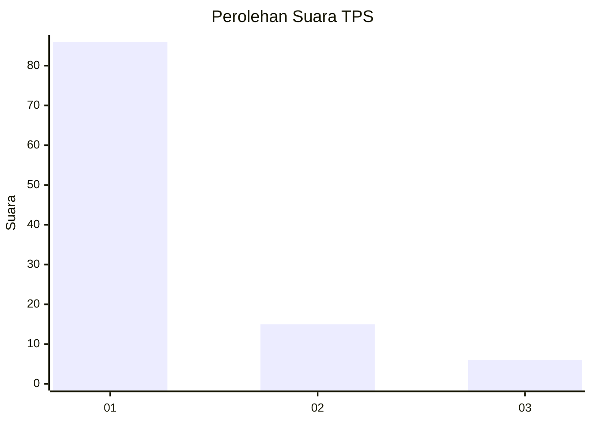
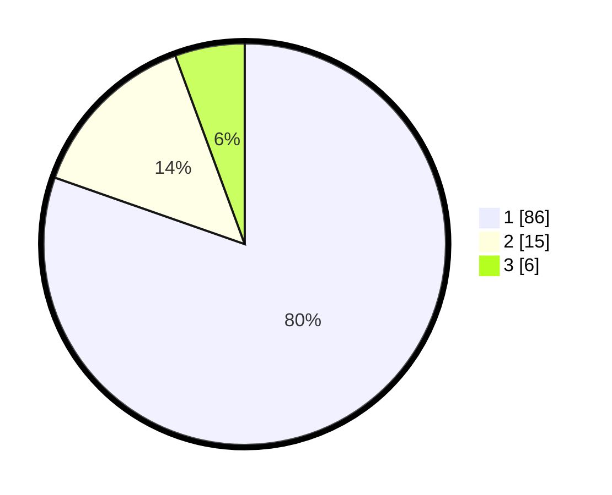

# Hasil

## Grafik

## Tabel

| No. | Nama Paslon    | Suara | Suara (raw) | Persentase |
|:--- |:-------------- | -----:| -----------:| ----------:|
| 1   | ANIES MUHAIMIN | 86    | [86][p-1]   | 80,37      |
| 2   | PRABOWO GIBRAN | 15    | [15][p-2]   | 14,02      |
| 3   | GANJAR MAHFUD  | 6     | [6][p-3]    | 5,61       |

[p-1]: https://github.com/gigit-pemilu/pemilu-2024/blob/main/pilpres/hitung-suara/sub/12-sumatera-utara/sub/05-langkat/sub/07-stabat/sub/1012-paya-mabar/sub/012-tps/sub/paslon-1.txt
[p-2]: https://github.com/gigit-pemilu/pemilu-2024/blob/main/pilpres/hitung-suara/sub/12-sumatera-utara/sub/05-langkat/sub/07-stabat/sub/1012-paya-mabar/sub/012-tps/sub/paslon-2.txt
[p-3]: https://github.com/gigit-pemilu/pemilu-2024/blob/main/pilpres/hitung-suara/sub/12-sumatera-utara/sub/05-langkat/sub/07-stabat/sub/1012-paya-mabar/sub/012-tps/sub/paslon-3.txt

## Foto C Plano

https://sirekap-obj-formc.kpu.go.id/84ac/pemilu/ppwp/12/05/07/10/12/1205071012012-20240214-221145--cd96a468-2d09-4229-8cbf-4a8bd7ce4f45.jpg

https://sirekap-obj-formc.kpu.go.id/84ac/pemilu/ppwp/12/05/07/10/12/1205071012012-20240214-221316--f1db3443-8e49-4621-af58-bbc1b8270e98.jpg

https://sirekap-obj-formc.kpu.go.id/84ac/pemilu/ppwp/12/05/07/10/12/1205071012012-20240214-221649--4b8fe09a-a25f-4900-828d-35feda99a829.jpg

## Metadata

| Key        | Value               |
| ---------- | ------------------- |
| Time Stamp | 2024-02-15 17:30:25 |

