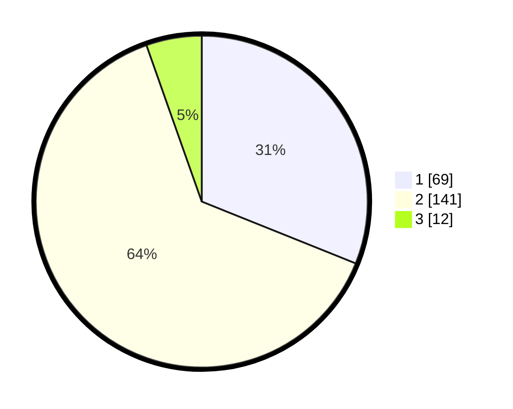

# Hasil

## Grafik

## Tabel

| No. | Nama Paslon    | Suara | Suara (raw) | Persentase |
|:--- |:-------------- | -----:| -----------:| ----------:|
| 1   | ANIES MUHAIMIN | 69    | [69][p-1]   | 31,08      |
| 2   | PRABOWO GIBRAN | 141   | [141][p-2]  | 63,51      |
| 3   | GANJAR MAHFUD  | 12    | [12][p-3]   | 5,41       |

[p-1]: https://github.com/gigit-pemilu/pemilu-2024/blob/main/pilpres/hitung-suara/sub/12-sumatera-utara/sub/05-langkat/sub/07-stabat/sub/2003-mangga/sub/001-tps/sub/paslon-1.txt
[p-2]: https://github.com/gigit-pemilu/pemilu-2024/blob/main/pilpres/hitung-suara/sub/12-sumatera-utara/sub/05-langkat/sub/07-stabat/sub/2003-mangga/sub/001-tps/sub/paslon-2.txt
[p-3]: https://github.com/gigit-pemilu/pemilu-2024/blob/main/pilpres/hitung-suara/sub/12-sumatera-utara/sub/05-langkat/sub/07-stabat/sub/2003-mangga/sub/001-tps/sub/paslon-3.txt

## Foto C Plano

https://sirekap-obj-formc.kpu.go.id/6b35/pemilu/ppwp/12/05/07/20/03/1205072003001-20240214-210525--ff4b2b8e-12d8-4675-ab0f-6982a3d57f90.jpg

https://sirekap-obj-formc.kpu.go.id/6b35/pemilu/ppwp/12/05/07/20/03/1205072003001-20240214-210657--8c23d3a4-0a44-4111-bbc9-ca975101cd77.jpg

https://sirekap-obj-formc.kpu.go.id/6b35/pemilu/ppwp/12/05/07/20/03/1205072003001-20240214-210833--b6b2e3c0-af21-40f9-b1f0-472eb9ddedf2.jpg

## Metadata

| Key        | Value               |
| ---------- | ------------------- |
| Time Stamp | 2024-02-15 00:56:54 |

