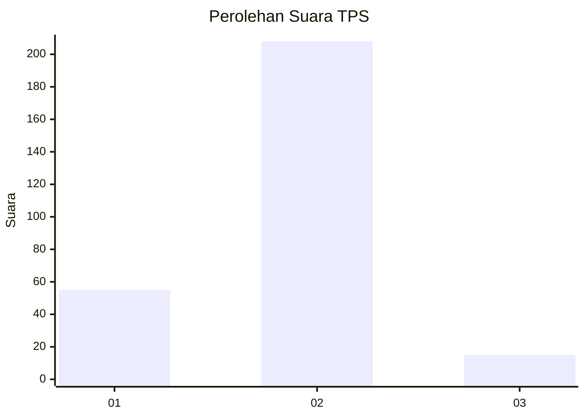
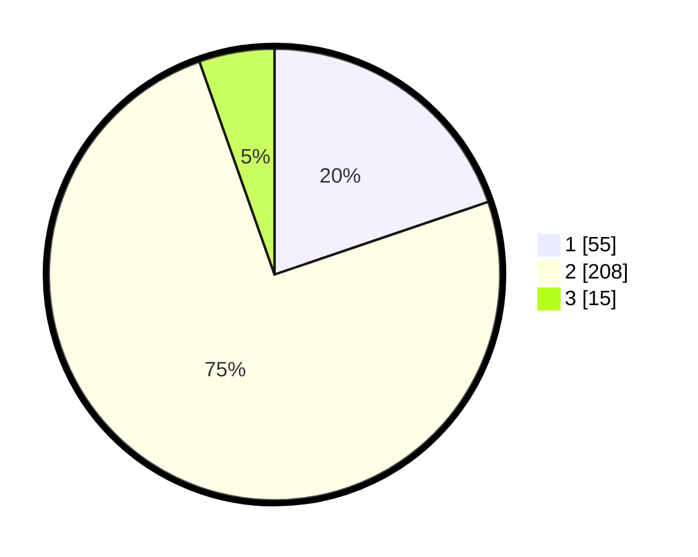

# Hasil

## Grafik

## Tabel

| No. | Nama Paslon    | Suara | Suara (raw) | Persentase |
|:--- |:-------------- | -----:| -----------:| ----------:|
| 1   | ANIES MUHAIMIN | 55    | [55][p-1]   | 19,78      |
| 2   | PRABOWO GIBRAN | 208   | [208][p-2]  | 74,82      |
| 3   | GANJAR MAHFUD  | 15    | [15][p-3]   | 5,40       |

[p-1]: https://github.com/gigit-pemilu/pemilu-2024-12-sumatera-utara/blob/main/pilpres/hitung-suara/sub/12-sumatera-utara/sub/05-langkat/sub/07-stabat/sub/2007-banyumas/sub/009-tps/sub/paslon-1.txt
[p-2]: https://github.com/gigit-pemilu/pemilu-2024-12-sumatera-utara/blob/main/pilpres/hitung-suara/sub/12-sumatera-utara/sub/05-langkat/sub/07-stabat/sub/2007-banyumas/sub/009-tps/sub/paslon-2.txt
[p-3]: https://github.com/gigit-pemilu/pemilu-2024-12-sumatera-utara/blob/main/pilpres/hitung-suara/sub/12-sumatera-utara/sub/05-langkat/sub/07-stabat/sub/2007-banyumas/sub/009-tps/sub/paslon-3.txt

## Foto C Plano

https://sirekap-obj-formc.kpu.go.id/a97b/pemilu/ppwp/12/05/07/20/07/1205072007009-20240215-000216--1e986983-eb23-423d-9add-268d0100c7c2.jpg

https://sirekap-obj-formc.kpu.go.id/a97b/pemilu/ppwp/12/05/07/20/07/1205072007009-20240215-000438--908dbc13-fc6c-4ca4-80be-8fce343d8b03.jpg

https://sirekap-obj-formc.kpu.go.id/a97b/pemilu/ppwp/12/05/07/20/07/1205072007009-20240215-000624--c6d6dd09-1da7-4368-af7a-c4778b93d196.jpg

## Metadata

| Key        | Value               |
| ---------- | ------------------- |
| Time Stamp | 2024-02-15 18:30:25 |

